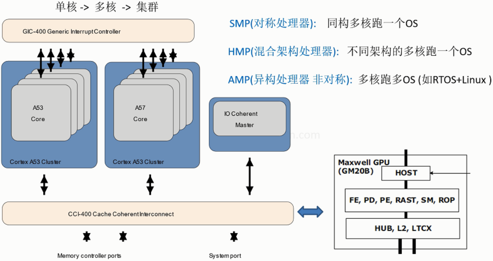

## 1、资料来源

ARM Cortex-A 系列 ARMv8-A 程序员指南 https://developer.arm.com/documentation/den0024/a 

Armv8-A 架构寄存器 https://developer.arm.com/documentation/ddi0595/2021-09?lang=en

Arm A64 指令集架构 https://developer.arm.com/documentation/ddi0596/2021-09/Base-Instructions

------


## 2、多核处理器的三种架构



------


## 3、内存管理单元MMU


内存管理单元（MMU，Memory Management Unit）是计算机系统中的一个硬件模块，负责管理和转换虚拟内存地址与物理内存地址之间的映射。MMU的主要作用是在程序访问内存时提供虚拟内存管理、内存保护、多任务处理支持以及缓存控制，从而提高系统的效率和安全性。

------


## 4、ARMv8寄存器

==寄存器手册== // https://developer.arm.com/documentation/ddi0595/2021-09?lang=en


ARMv8架构中的寄存器可以分为多种类型，包括通用寄存器、状态寄存器、特殊用途寄存器等。以下是ARMv8架构中寄存器的简要整理：

### 1)  **通用寄存器（General Purpose Registers）**
   - ARMv8架构定义了31个64位的通用寄存器，编号为`X0`到`X30`。
   - 这些寄存器可以作为64位（`X0`-`X30`）或32位（`W0`-`W30`）使用。当使用32位形式（`W`寄存器）时，寄存器的高32位会被忽略。
   - **特殊的通用寄存器**：
     - `X0`-`X7`：用于函数调用中的参数传递和返回值。
     - `X8`：可用于系统调用返回地址寄存器或作为临时寄存器。
     - `X29`：**帧指针寄存器**（Frame Pointer，FP），用于保持函数调用栈帧的基地址。
     - `X30`：**链接寄存器**（Link Register，LR），用于保存函数返回地址。
     - `X31`：**零寄存器/栈指针寄存器**，在不同上下文中有不同的作用：
       - 在作为`WZR/XZR`时，它表示常数值0。
       - 在作为`SP`时，它用于保存栈指针。

### 2) **程序计数器（PC，Program Counter）**
   - ARMv8架构中没有独立的PC寄存器，它隐式地指向当前执行的指令地址，不能直接通过指令访问，但在某些情况下，PC可以通过特定指令间接访问（如分支指令中设置跳转目标）。

### 3) **状态寄存器（Status Registers）**
   ARMv8架构定义了多个状态寄存器，主要用于控制处理器的状态和保存处理器的状态信息。

   - **CPSR（Current Program Status Register）**：保存当前程序的状态，分为以下几个主要部分：
     - **N、Z、C、V**：条件码标志位，分别表示负数标志、零标志、进位标志和溢出标志。
     - **中断屏蔽位**：用于控制中断的启用或禁用。
     - **处理器模式位**：表示处理器当前运行的模式（如用户模式、特权模式）。
   
   - **SPSR（Saved Program Status Register）**：当发生异常时，SPSR用于保存发生异常前的CPSR状态，以便异常处理结束后可以恢复。

### 4) **特殊用途寄存器（Special Purpose Registers）**
   ARMv8架构中还包括一些特定用途的寄存器，主要用于内存管理、调试和系统控制。

   - **TPIDR_EL0/TPIDR_EL1**：线程ID寄存器，用于存储线程标识符，帮助实现多线程环境下的上下文切换。
   - **FPCR（Floating Point Control Register）**：控制浮点运算的精度、舍入方式等。
   - **FPSR（Floating Point Status Register）**：保存浮点运算的状态，如异常标志、运算结果标志等。

### 5) **栈指针（SP，Stack Pointer）**
   - `SP`寄存器用于指向栈的顶部。ARMv8支持用户栈指针和异常栈指针，分别处理不同的任务。

ARMv8架构提供了丰富的寄存器集，包括31个通用寄存器（`X0`-`X30`），其中`X30`作为链接寄存器，`X29`作为帧指针，`X31`同时作为零寄存器和栈指针使用。此外，ARMv8通过状态寄存器（如CPSR、SPSR）管理处理器状态，通过特殊用途寄存器控制浮点运算、线程管理等。

------


## 5、ARMv8异常级别

类比v7下的几种工作模式，分成4种异常级别


ARMv8架构引入了四种**异常级别（Exception Levels, EL）**，用于控制系统的不同操作模式和特权级别。每个异常级别决定了处理器可以访问的资源、执行的指令权限以及对系统的控制权。

### 1. **EL0（Exception Level 0）**
   - **用户级别（User level）**，也称为**应用程序级别**。
   - 是权限最低的级别，用于运行普通的用户应用程序，不能直接访问硬件或系统级资源。
   - 应用程序只能通过系统调用（进入EL1）来请求内核级别的服务，如访问设备或内存管理。
   - 常见操作系统中的应用程序运行在此级别。

### 2. **EL1（Exception Level 1）**
   - **内核级别（Kernel level）**，也称为**操作系统级别**。
   - 具有较高的权限，通常用于操作系统内核或驱动程序的执行。
   - EL1负责管理系统资源，如内存管理单元（MMU）、中断控制器等，并处理从EL0发出的系统调用。
   - 操作系统的内核运行在这个级别，直接与硬件交互，提供对设备的控制和内存管理服务。

### 3. **EL2（Exception Level 2）**
   - **虚拟化管理级别（Hypervisor level）**。
   - 该级别引入虚拟化支持，用于运行虚拟机管理程序（Hypervisor），控制多个虚拟机的运行。
   - Hypervisor在EL2运行，负责管理和隔离多个EL1实例，每个EL1实例可以对应一个独立的操作系统（虚拟机）。
   - EL2可以虚拟化硬件资源并提供给不同的虚拟机，从而允许多个操作系统在同一物理平台上运行。

### 4. **EL3（Exception Level 3）**
   - **安全监控级别（Secure Monitor level）**，也称为**最高特权级别**。
   - 拥有最高权限，用于处理可信执行环境（Trusted Execution Environment, TEE）或安全模式的切换。
   - EL3主要用于管理安全世界（Secure World）和非安全世界（Non-secure World）之间的切换，通过ARM TrustZone技术实现。
   - EL3可以完全控制系统，管理进入安全模式或处理全局的异常事件，如系统复位、启动等。

==总结：==

- **EL0**：用户模式，运行应用程序，权限最低。
- **EL1**：操作系统内核模式，管理系统资源，处理EL0的系统调用。
- **EL2**：虚拟化管理模式，运行Hypervisor，管理多个虚拟机。
- **EL3**：安全监控模式，负责系统安全管理和TrustZone的安全世界与非安全世界切换，权限最高。

每个异常级别都用于处理不同的任务，并提供不同的访问控制和特权级别，以保证系统的安全性和稳定性。

------


## 6、ARMV8汇编指令

### 1）常用指令

```assembly
b.ne    label    //不等时跳转
cbz	w10, lf	 //w10值等于0的时候，跳转到lf	
ret              //子程序返回指令，返回地址默认保存在LR（X30），代替了mov pc,lr

ldr 	x0,=__main　 //大范围的地址读取：把标号__main（地址）读入x0
adr     x0,vector    //小范围的地址读取：把标号vector（地址）读入x0,标号距当前指令PC的偏移小于1M
stp	x29, x30, [sp, #-16]!   
    //入栈：把x29, x30 存储到sp-16指向的空间后,sp自减16 (因寄存器是8字节，栈是向下生长故是 -16）                              
    //类似前索引： *(sp-16) = x29,x30   sp=sp-16 （!使得sp能自更新）  把 x29,x30看成整体              
    //stp只支持2个寄存器，代替了复杂的stmfd  (64位汇编，取消了批量操作指令)     
ldp 	x29, x30, [sp],#16   //出栈: 把sp指向的空间内容载入到x29, x30后，sp加16
                             //类似后索引: x29,x30=*sp  sp=sp+16   

mrs	x0, sctlr_el1   //读sctlr_el1内容到x0  (注：系统寄存器，都通过mrs msr来操作)
msr  	sctlr_el1, x0   //写x0内容到 sctlr_el1
svc     #2	    //系统调用指令(触发一个同步异常,cpu则会陷入EL1)

.global  _start     //声明_start 为全局符号(让链接脚本能看到)
.quad  0x3FA0       //在存储器中分配8个字节，初值设为0x3FA0
.align  4           //2^4 =16 字节对齐
.macro  myAdd, x,y  //宏函数， 类似 myAdd(x, y) 
    add \x,\x,\y
.endm    
myAdd  x0,x2
```

### 2）函数

一个延时函数的例子如下：

```assembly
.globl	_start
_start:
    mov x0,#3
    bl  delay

reset_end:
    b reset_end

delay:	
    ldr	 x4,=0x03
loop_delay:
    sub     x4,x4,#1
    cmp     x4,#0
    cbz     x4,delay_end        
    b.ne    loop_delay
delay_end:      
    ret 
```

### 3）宏函数

一个切换异常级别的宏函数表示如下：

```assembly
.macro  switch_el, xreg, el1_label
        mrs 	\xreg, CurrentEL
        cmp 	\xreg, 0x4
        b.eq    \el1_label
.endm    

.globl	_start
_start:
    mov 	x0, #0x4
    switch_el x0, 1f
    mov  	x2,#2
reset_end:
    b  reset_end	
    
1:
    mov x2,#0x30
    b   reset_end
```

------


## 7、异常处理

### 1）异常类型

```assembly
SError //系统错误	
       //最常见的是异步数据中止（例如，由于脏数据从缓存行写回外部存储器而触发中止）
FIQ  //快速中断
     //group 0 or secure interrupts

IRQ  //正常优先级中断  
     //group 1 (normal) interrupts

同步异常 //是由于指令流的执行或尝试执行而产生的，并且返回地址提供了导致它的指令的详细信息，
         //如未定义指令，从内存读取数据异常
```

### 2）异常向量表


### 3）异常向量表的设置与跳转

```assembly
.globl	_start
_start:
    mrs   x1,SPSel
    mrs   x2,CurrentEL
    mov   x0,#0
    msr   SPSel,x0
    mov   x0, #0x5
    adr   x0,vectors
    msr   vbar_el1,x0
    svc   #0x02  //系统调用 ，
reset_end:
    b  reset_end

do_bad_sync:
   mov   x2,#1
   b    reset_end

do_bad_irq:
   mov   x2,#2
   b    reset_end

	.align	11  //2^11=2048  整个异常向量表 2K对齐  -> 通过对齐，实现向量表空间的预留
	            //16个异常 ，每个异常32条指令    16*32*4=2048 
               //16个异常，这里使用前8个
vectors:
    //===============sp0===============
    //---同步异常
    .align  7  //2^7     1000 0000 =0x80   字节对齐
    mov  x0,#1
    b    do_bad_sync
    //---irq异常
    .align  7  //2^7     1000 0000 =0x80
    mov  x0,#1
    b    do_bad_irq
    //---fiq异常
    .align  7  
    mov  x0,#1
    b    reset_end
    //---SError异常
    .align  7  
    mov  x0,#1
    b    reset_end
    //===============sp_elx===============
    //---同步异常
    .align  7  //2^7     1000 0000 =0x80   字节对齐
    mov  x0,#1
    b    do_bad_sync
    //---irq异常
    .align  7  //2^7     1000 0000 =0x80
    mov  x0,#1
    b    do_bad_irq
    //---fiq异常
    .align  7  
    mov  x0,#1
    b    reset_end
    //---SError异常
    .align  7  
    mov  x0,#1
    b    reset_end
```

关于`ADR`指令：

`MOV`（Move）指令用于将一个**立即数**或**寄存器的值**传送到另一个寄存器中，即

```assembly
MOV  <destination>, <source>
```

```assembly
MOV  x0, #5    // 将立即数5加载到x0寄存器
MOV  x1, x0    // 将x0寄存器的值复制到x1寄存器
```

- `MOV` 只能用于加载**立即数**或复制寄存器值，它不能用于计算内存地址。
- 当使用立即数时，立即数的大小受到限制，具体受ARM的编码格式限制（例如，ARMv8中通常可以表示16位的立即数）。
  

`ADR`（Address of Label）指令用于将一个**相对地址**（通常是标签/标号的地址）加载到寄存器中。它是为计算**当前程序计数器（PC）**相对的地址而设计的。

```assembly
ADR  <destination>, <label>
```

- **加载标签的地址**：可以将一个相对于当前PC的标签的地址加载到寄存器中，常用于跳转或定位程序中的代码段或数据段。
- `ADR` 使用当前指令的地址（即程序计数器PC）来计算目标标签相对于PC的偏移。

```assembly
ADR  x0, my_label  // 将标签my_label的地址加载到x0寄存器
```

在这个示例中，`my_label` 是一个代码段中的标号（可能是一个函数或数据的地址），`ADR` 会将该标号的地址加载到寄存器 `x0` 中。

| **指令** | **用途**                             | **操作对象**     | **范围限制**                   | **主要应用场景**                  |
| -------- | ------------------------------------ | ---------------- | ------------------------------ | --------------------------------- |
| `MOV`    | 将立即数或寄存器值复制到另一个寄存器 | 立即数或寄存器   | 立即数有限制（受指令编码限制） | 传递简单数据或复制寄存器值        |
| `ADR`    | 加载当前PC附近的相对地址             | 地址（相对于PC） | +/- 1MB（21位偏移）            | 加载局部标签或代码段/数据段的地址 |

==使用场景：==

- 如果需要将一个**数值**（立即数或寄存器中的值）加载到寄存器，使用 `MOV`。
- 如果需要将一个**标签（代码或数据的地址）**加载到寄存器，使用 `ADR`。

------


## 8、uboot启动源码分析


### 1）代码入口

path:   arch/arm/cpu/armv8/start.S

```assembly
.globl  _start //声明_start为全局标号
_start:
    b   reset  //上电(或复位)执行的第一条指令，
    .align 3  // 8字节对齐(2^3 )

.globl  _TEXT_BASE //声明_TEXT_BASE(代码段的基地址)为全局标号
_TEXT_BASE:
    .quad   CONFIG_SYS_TEXT_BASE	   /*分配8字节空间 存放CONFIG_SYS_TEXT_BASE    按ctrl+] 可跳转到定义处 , 按ctrl+o可返回 
  5    215  include/generated/autoconf.h <<CONFIG_SYS_TEXT_BASE>>
             #define CONFIG_SYS_TEXT_BASE 0x80080000   系统代码断的基地址
  */

reset:
    /* Allow the board to save important registers */
    b   save_boot_params 

#ifdef CONFIG_SYS_RESET_SCTRL  //条件编译（如果CONFIG_SYS_RESET_SCTRL 有定义，则把里面指令编译进来)
		 bl reset_sctrl  //调用reset_sctrl函数
#endif
    adr	x0, vectors   //读标号(地址)vectors到x0，小范围读取，vectors代表异常向量表的首地址 (按ctrl+]跳转到定义处) 
     /*
      * Could be EL3/EL2/EL1, Initial State:
      * Little Endian, MMU Disabled, i/dCache Disabled
      */
     switch_el x1, 3f, 2f, 1f /* 调用宏函数 switch_el 根据异常级别，跳到对应标号处 (光标移到switch_el上 -> 按ctrl+]跳转到定义处)
 可在官方寄存器列表中搜 CurrentEL 见 https://developer.arm.com/documentation/ddi0595/2021-09?lang=en  
 .macro  switch_el, xreg, el3_label, el2_label, el1_label
     mrs \xreg, CurrentEL    bit[3:2]: 00(EL0)  01(EL1) 10(EL2) 11(EL3)  
     cmp \xreg, 0xc
     b.eq    \el3_label
     cmp \xreg, 0x8
     b.eq    \el2_label
     cmp \xreg, 0x4
     b.eq    \el1_label
 .endm
arch/arm/include/asm/macro.h   
      */
3:  set_vbar vbar_el3, x0
    mrs x0, scr_el3
    orr x0, x0, #0xf            /* SCR_EL3.NS|IRQ|FIQ|EA */
    msr scr_el3, x0
    msr cptr_el3, xzr           /* Enable FP/SIMD */
    b   0f
2:  set_vbar    vbar_el2, x0
    mov x0, #0x33ff
    msr cptr_el2, x0            /* Enable FP/SIMD */
    b   0f
1:  set_vbar    vbar_el1, x0     //把X0值写入vbar_el1（完成设置异常向量表基地址）
	       //Armv8-A 架构寄存器 https://developer.arm.com/documentation/ddi0595/2021-09?lang=en中 可查看VBAR_EL1的详细描述
    mov x0, #3 << 20
    msr cpacr_el1, x0           /* Enable FP/SIMD */
0:

    /* Apply ARM core specific erratas */
    bl  apply_core_errata      // 光标移到 apply_core_errata上 -> 按n键，

    bl  lowlevel_init	 //低级别初始化(处理器特有的)

master_cpu:
    bl  _main	 //跳转到C语言的main函数(汇编阶段结束) 
               //注：在u-boot.map中找_main -> arch/arm/lib/built-in.o -> 在arch/arm/lib文件夹下搜索_main找到
               //     ->arch/arm/lib/crt0_64.S
               // 如果还找不到_main，可用qemu 放在，模拟运行调试跟踪
```

#### 1.1）链接脚本（u-boot.lds）

根据此脚本内容可以获取入口信息

```assembly
//u-boot.lds
OUTPUT_FORMAT("elf64-littleaarch64", "elf64-littleaarch64", "elf64-littleaarch64")
OUTPUT_ARCH(aarch64)
ENTRY(_start)  //入口地址
SECTIONS
{
 . = 0x00000000;
 . = ALIGN(8);
 .text :
 {
  *(.__image_copy_start)
  arch/arm/cpu/armv8/start.o (.text*)  //第一行代码所在文件
 }
 ......
}
```

#### 1.2）地址映射（u-boot.map）

获取可以从该文件中获取某些标号所在的所在的文件路径

```assembly
//u-boot.map
 arch/arm/cpu/armv8/start.o(.text*)
 .text          0x0000000080080000      0x1c0 arch/arm/cpu/armv8/start.o
                0x0000000080080000                _start
                0x0000000080080040                _TEXT_BASE
                0x0000000080080064                save_boot_params_ret
                0x0000000080080140                lowlevel_init
                0x000000008008016c                c_runtime_cpu_setup 	
                
 .text          0x0000000080081000      0x390 arch/arm/cpu/armv8/built-in.o
                0x0000000080081000                vectors
```

#### 1.3）复位系统配置（位于start.S）

```assembly
#ifdef CONFIG_SYS_RESET_SCTRL
reset_sctrl:
	//根据不同的异常级别，读取对应的sctlr寄存器
	switch_el x1, 3f, 2f, 1f
3:
	mrs	x0, sctlr_el3
	b	0f
2:
	mrs	x0, sctlr_el2
	b	0f
1:
	mrs	x0, sctlr_el1

0:
	ldr	x1, =0xfdfffffa
	and	x0, x0, x1    //相与后，清除bit0(关MMU)，bit2(关cache)，bit24(选择小端)
     //sctlr 系统控制寄存器(控制架构特性，例如 MMU、缓存和对齐检查)见官方文档 
      //或看PDF 寄存器手册，SysReg_xml_v88A-2021-09.pdf(推荐看英文pdf方式）  或搜 SCTLR 见 https://developer.arm.com/documentation/ddi0595/2021-09?lang=en 	
      //针对性的看  bit0 bit2 bit24
	switch_el x1, 6f, 5f, 4f
6:
	msr	sctlr_el3, x0
	b	7f
5:
	msr	sctlr_el2, x0
	b	7f
4:
	msr	sctlr_el1, x0

7:
	dsb	sy  //dsb是数据内存屏障，isb是指令内存屏障 -> 同步内存的访问顺序
	isb
	b	__asm_invalidate_tlb_all
	ret
#endif
```


🧬`dsb` 指令用于：

- **确保内存访问完成**：在执行后续指令之前，保证之前的所有内存访问（读写）都已经完成。
- **内存同步**：在多核处理器或多处理器系统中，确保所有核对内存的访问在执行屏障后，其他核能够看到一致的内存状态。
- **设备寄存器访问**：当和外设进行通信时，`dsb` 可以确保所有之前的存储操作已经写入到设备寄存器，从而保证正确性。

在 ARMv8 中，`dsb` 的基本格式如下：

```assembly
dsb option
```

`option` 是一个可选的参数，用来指定屏障的范围和类型。常见的 `option` 有：

- **`sy`（Full System）：** 表示系统范围内的完全屏障，即所有之前的内存访问（无论是加载还是存储）都必须完成。
- **`ish`（Inner Shareable）：** 指定所有与当前处理器共享内存域的内存访问都必须完成。
- **`osh`（Outer Shareable）：** 类似于 `ish`，但是作用于外部共享域。
- **`ishst`（Inner Shareable Store）：** 针对当前处理器共享域的存储（写入）访问，确保完成。
- **`oshst`（Outer Shareable Store）：** 针对外部共享域的存储访问，确保完成。

例如：
```assembly
dsb sy
```
这条指令会在系统范围内产生一个同步屏障，确保所有内存访问（加载和存储）都在执行后续指令之前完成。


🧬**`ISB`（Instruction Synchronization Barrier）** 是 ARM 体系结构中的一种指令屏障指令，用于控制指令流水线的执行顺序。它确保处理器在执行后续指令之前，已经完成了当前指令的所有操作，特别是在涉及系统状态或配置改变的情况下。这对于保证指令执行的正确性和处理器的同步非常重要。

在 ARM 汇编中，`ISB` 指令的基本格式如下：

```assembly
isb option
```

`option` 是一个可选的参数，用于指定屏障的范围，通常用于不同共享域和系统操作的同步，常见选项有：

- **`sy`（Full System）：** 表示作用于整个系统的同步。通常情况下，使用 `isb sy` 来确保所有的流水线重新同步。

例如：

```assembly
isb sy
```

这条指令会在系统范围内产生一个同步屏障，确保在这条指令之前的所有修改生效后，才会执行后续的指令。


#### 4）低级初始化（如gic中断控制器初始）

```assembly
WEAK(lowlevel_init)   //弱函数定义(即后面如果定义同名函数将覆盖它)
    mov x29, lr         /* Save LR */

#if defined(CONFIG_GICV2) || defined(CONFIG_GICV3)
    branch_if_slave x0, 1f   //是从机，则跳转1f  （ctrl+]跳转——
    ldr x0, =GICD_BASE  /*用x0存放中断控制器基地址(ctrl+]跳转，选tegra210  见arch/arm/include/asm/arch-tegra210/tegra.h)
     10 #define GICD_BASE       0x50041000  //Generic Int Cntrlr Distrib 
     11 #define GICC_BASE       0x50042000   //Generic Int Cntrlr CPU I/F 
     
     -> CPU芯片手册 Tegra_X1_TRM_DP07225001_v1.3p.pdf ->  1.2 Block Diagram -> vGIC-400 中断控制器
     ->  2.1 System Address Map
           ARM Interrupt Distributor 5004:1000
     ->   CHAPTER 3: INTERRUPT CONTROLLER  
     
        里有说到参考 CoreLink GIC-400 Generic Interrupt Controller Technical Reference Manua  
         DDI0471B_gic400_r0p1_trm.pdf 源于https://developer.arm.com/documentation/ddi0471/b
      l
      */
    bl  gic_init_secure //中断控制器的初始化( ctrl+]跳转不了，则vscode进入上级目录arch ->右键 文件夹中查找 )
1:
#endif
    adr x4, lowlevel_in_el2
    ldr x5, =ES_TO_AARCH64
    bl  armv8_switch_to_el2

lowlevel_in_el2:
2:
    mov lr, x29         /* Restore LR */
    ret
ENDPROC(lowlevel_init)
```


------

## 9、记录

### 1）qemu相关

- 源码编译安装时间很长，大约需要2个小时；期间需要安装较多的依赖，也比较浪费时间（等待网络）；
- 进行汇编语言调试时，注意文件名`start.S`中的大写，第一次用的小写，不能正常启动调试；
- 终端退出qume的快捷键为：`ctrl + a`，再按下`x` ；

```bash
//----启动qemu	
$ make  //编译，生成执行文件start 
$ qemu-system-aarch64 -machine virt -cpu cortex-a57 -nographic -kernel start -S -s

//-----vscode gdb 界面调试  
F5  //运行调试(它会自动链接gdbserver 1234，成功会看到停在第一条指令处)
F10 //单步执行(成功看到，调试光标有移动，和调试窗口的cpu寄存器值由变化表示成功)
```

### 2）vscode相关

- 使用windows中的vscode莫名出现SSH连接失败，解决不了，猜测是Remote SSH插件的问题；只能转战到虚拟机的vscode；
- 如果在汇编文件界面点击运行和调试不能出现gdb选项，则可以先在汇编文件所在目录下新建一个`.c`文件，此时对该文件进行配置，将会出现下图界面，再回到汇编文件，此时就可点击下图中的设置按钮进行添加配置，配置好`launch.json`文件即可；
- VIM相关命令见 Linux文件目录下的markdown

### 3）知识体系建立

- 代码整体理解      要明确代码入口，其次，明确源代码中的条件编译所涉及到的"条件"来自哪个文件
- 代码阅读方法      使用vscode结合vim进行代码阅读，实现不同代码（包括定义）的快速跳转（熟悉vim结合ctags的快捷指令）
- 查阅资料能力      找到相关资料，明确为什么要给某些寄存器配置对应的值（需要找到该寄存器每一位的含义）

## 10、总结

关于u-boot启动的总结，启动流程并非统一，根据配置文件的不同而不同，但包括的几个基本操作

- 首先，保存重要的启动参数

- 系统控制寄存器初始化，根据当前异常级 (EL) 初始化相应的控制寄存器，并设置相关的参数，如启用FP/SIMD指令集
- 应用ARM核心特定的错误修复，调用 `apply_core_errata` 函数，针对特定的ARM处理器（如Cortex-A53、Cortex-A57）应用已知的硬件错误修复
- 低级初始化，调用 `lowlevel_init`，进行处理器特定的初始化，例如GIC（通用中断控制器）的配置
- 多处理器启动，根据配置，处理器可能是主处理器或从处理器。主处理器调用 `_main`，而从处理器会通过中断等待并根据配置切换到适当的异常级别
- 栈和全局数据重定位，在某些情况下，系统需要对栈和全局数据进行重定位，以确保在新的内存地址中正确使用
- C运行时环境设置，最后，调用 `c_runtime_cpu_setup`，完成C运行时环境的设置，包括调整向量表位置，确保C代码可以正确运行

```assembly

#include <config.h>
#include <asm-offsets.h>
#include <asm/macro.h>
#include <linux/linkage.h>

/*


/*

ENTRY(_main)

/*
 * Set up initial C runtime environment and call board_init_f(0).
 */
#if defined(CONFIG_TPL_BUILD) && defined(CONFIG_TPL_NEEDS_SEPARATE_STACK)
	ldr	x0, =(CONFIG_TPL_STACK)
#elif defined(CONFIG_SPL_BUILD) && defined(CONFIG_SPL_STACK)
	ldr	x0, =(CONFIG_SPL_STACK)
#elif defined(CONFIG_INIT_SP_RELATIVE)
	adr	x0, __bss_start
	add	x0, x0, #CONFIG_SYS_INIT_SP_BSS_OFFSET
#else
	ldr	x0, =(CONFIG_SYS_INIT_SP_ADDR)
#endif
	/* 根据不同配置来设置栈指针（SP） */
	bic	sp, x0, #0xf	/* 16-byte alignment for ABI compliance */
	mov	x0, sp
	bl	board_init_f_alloc_reserve /*调用函数来分配内存*/
	mov	sp, x0
	/* set up gd here, outside any C code */
	mov	x18, x0
	bl	board_init_f_init_reserve

	mov	x0, #0
	bl	board_init_f

#if !defined(CONFIG_SPL_BUILD)
/*
 * Set up intermediate environment (new sp and gd) and call
 * relocate_code(addr_moni). Trick here is that we'll return
 * 'here' but relocated.
 */
	ldr	x0, [x18, #GD_START_ADDR_SP]	/* x0 <- gd->start_addr_sp */
	bic	sp, x0, #0xf	/* 16-byte alignment for ABI compliance */
	ldr	x18, [x18, #GD_NEW_GD]		/* x18 <- gd->new_gd */

	adr	lr, relocation_return
#if CONFIG_POSITION_INDEPENDENT
	/* Add in link-vs-runtime offset */
	adr	x0, _start		/* x0 <- Runtime value of _start */
	ldr	x9, _TEXT_BASE		/* x9 <- Linked value of _start */
	sub	x9, x9, x0		/* x9 <- Run-vs-link offset */
	add	lr, lr, x9
#endif
	/* Add in link-vs-relocation offset */
	ldr	x9, [x18, #GD_RELOC_OFF]	/* x9 <- gd->reloc_off */
	add	lr, lr, x9	/* new return address after relocation */
	ldr	x0, [x18, #GD_RELOCADDR]	/* x0 <- gd->relocaddr */
	b	relocate_code

relocation_return:

/*
 * Set up final (full) environment
 */
	bl	c_runtime_cpu_setup		/* still call old routine */
#endif /* !CONFIG_SPL_BUILD */
#if !defined(CONFIG_SPL_BUILD) || CONFIG_IS_ENABLED(FRAMEWORK)
#if defined(CONFIG_SPL_BUILD)
	bl	spl_relocate_stack_gd           /* may return NULL */
	/* set up gd here, outside any C code, if new stack is returned */
	cmp	x0, #0
	csel	x18, x0, x18, ne
	/*
	 * Perform 'sp = (x0 != NULL) ? x0 : sp' while working
	 * around the constraint that conditional moves can not
	 * have 'sp' as an operand
	 */
	mov	x1, sp
	cmp	x0, #0
	csel	x0, x0, x1, ne
	mov	sp, x0
#endif

/*
 * Clear BSS section
 */
	ldr	x0, =__bss_start		/* this is auto-relocated! */
	ldr	x1, =__bss_end			/* this is auto-relocated! */
clear_loop:
	str	xzr, [x0], #8
	cmp	x0, x1
	b.lo	clear_loop

	/* call board_init_r(gd_t *id, ulong dest_addr) */
	mov	x0, x18				/* gd_t */
	ldr	x1, [x18, #GD_RELOCADDR]	/* dest_addr */
	b	board_init_r			/* PC relative jump */

	/* NOTREACHED - board_init_r() does not return */
#endif

ENDPROC(_main)

```

这个代码文件是AArch64架构的U-Boot启动代码，负责设置C运行时环境，并调用板级初始化函数。下面结合前面的代码继续详细分析其启动过程。

1. **入口点 `_main`**：
   - `_main` 是从 `start.S` 文件中通过分支跳转进入的函数，它负责执行系统启动时的核心初始化步骤。

2. **初始环境设置**：
   - 首先，代码根据不同的配置来设置栈指针 (SP)，具体栈位置根据 `CONFIG_TPL_STACK`, `CONFIG_SPL_STACK`, 或者 `CONFIG_SYS_INIT_SP_ADDR` 决定。
   - `bic sp, x0, #0xf` 用于确保栈指针是 16 字节对齐的，这是 ABI (应用二进制接口) 的要求。
   - `bl board_init_f_alloc_reserve` 调用函数来分配内存，返回新栈指针并存储在 `sp` 中。`board_init_f_alloc_reserve` 函数负责为全局数据（GD）分配内存。

3. **全局数据（GD）初始化**：
   - `mov x18, x0` 将全局数据（GD）的基址保存到寄存器 `x18`，为后续使用做准备。
   - `bl board_init_f_init_reserve` 初始化 GD 的保留部分，用来存储在后续阶段中要用到的数据。
   - `mov x0, #0` 然后调用 `board_init_f`，该函数负责硬件的初步初始化，特别是在系统RAM（如 DRAM）可用之前完成的工作。

4. **中间环境设置** (不适用于 SPL)：
   - 如果不是 SPL 构建，程序继续进行中间环境的设置。主要步骤包括：
     - 调用 `relocate_code()` 进行代码重定位。U-Boot 将从其当前位置重定位到 `board_init_f` 计算的目标地址中运行。
     - 返回时，将根据新地址返回到之前的位置。重定位涉及将链接时的地址偏移修正为运行时地址（通过 `add lr, lr, x9`）。
   - 这个阶段设置了新的栈指针和GD位置。

5. **最终环境设置**：
   - 在调用 `relocate_code` 完成代码重定位之后，`bl c_runtime_cpu_setup` 负责执行一些与CPU相关的设置。通常用于处理特定处理器的启动配置，例如启用必要的硬件功能。
   
6. **清除 BSS 段**：
   - BSS 段是存放未初始化的全局变量的区域。代码通过一个循环将 BSS 段中的内容全部清零：
     - `ldr x0, =__bss_start` 和 `ldr x1, =__bss_end` 加载 BSS 段的起始和结束地址。
     - 在 `clear_loop` 循环中，使用 `str xzr, [x0], #8` 将8字节（64位）写入0，直到清除到 BSS 段的结束地址。

7. **调用 `board_init_r`**：
   - 最后一步，代码调用 `board_init_r(gd_t *id, ulong dest_addr)`，这是U-Boot启动过程的最后阶段，完成板级初始化并最终进入主程序。
   - `mov x0, x18` 将 GD 指针传递给 `board_init_r` 函数，`ldr x1, [x18, #GD_RELOCADDR]` 加载目标地址。
   - `b board_init_r` 是一个相对跳转，跳转到 `board_init_r` 函数，它不会返回。

- **`board_init_f`**：用于硬件的初步初始化，通常在系统RAM（如 DRAM）尚未可用时执行。
- **`relocate_code`**：执行代码重定位，将U-Boot的代码从当前运行位置移动到 `board_init_f` 计算的最终位置。
- **`c_runtime_cpu_setup`**：根据需要设置CPU相关的配置，启用缓存、初始化系统控制寄存器等。
- **`board_init_r`**：这是U-Boot启动过程的最后阶段，负责完成所有的板级初始化工作，然后进入U-Boot的主功能。

这个启动代码文件主要负责在U-Boot的初始化过程中设置运行时环境，包括栈、全局数据（GD）结构、BSS段的清零和CPU的设置。它通过调用不同的初始化函数，逐步建立起能够运行U-Boot的环境，最后跳转到 `board_init_r` 完成最终的启动过程。


在汇编代码中，`bl board_init_f_alloc_reserve` 是一个典型的分支跳转指令（Branch with Link），跳转到 C 函数 `board_init_f_alloc_reserve` 并将返回地址保存到链接寄存器（LR，通常是 `x30` 寄存器）。不过，您提到该函数在 C 代码中没有输入值（没有参数），这是由于**汇编和 C 函数调用规范**之间的工作机制。下面我将解释为什么没有显式输入值，但函数仍然能够处理所需的参数。

1. **ARM 调用约定（Procedure Call Standard for ARM (AAPCS)）**

在 AArch64 架构下（即 64 位 ARM），函数参数通常通过寄存器传递，而不是通过栈。前几个参数（最多 8 个）通过以下通用寄存器传递：
- 第一个参数使用 `x0`
- 第二个参数使用 `x1`
- 第三个参数使用 `x2`
- 依此类推，最多传递 8 个参数到 `x7`

2. **汇编代码和 C 函数的交互**

当 `bl board_init_f_alloc_reserve` 指令在汇编中调用时，汇编代码会**提前将参数放入合适的寄存器**，然后跳转到对应的 C 函数。在汇编中，寄存器 `x0` 通常用来存储第一个参数。因此，在调用 `board_init_f_alloc_reserve` 之前，汇编代码实际上已经准备好了传递给 C 函数的参数。

假设 `board_init_f_alloc_reserve` 函数的参数是 `ulong top`，那么调用 `bl board_init_f_alloc_reserve` 前，汇编代码会把 `top` 的值加载到寄存器 `x0` 中，C 函数中相应的 `top` 就会从 `x0` 寄存器中获得。

例如：
```asm
mov x0, <some_value>   // 将某个值加载到x0作为参数
bl board_init_f_alloc_reserve  // 调用C函数
```

在这个调用中，`x0` 中的值就是传递给 C 函数 `board_init_f_alloc_reserve` 的第一个参数。

3. **为什么看起来没有参数**

尽管在 `board_init_f_alloc_reserve` 的 C 代码定义中没有看到明显的参数传递（因为没有在汇编代码中直接写出类似 `bl board_init_f_alloc_reserve, x0` 这样的东西），但其实汇编代码在调用 `bl` 指令前已经通过寄存器传递了参数。这种机制属于 ARM 调用约定的一部分，在这种架构下，寄存器是默认用来传递参数的，开发者不需要显式地传递这些参数。

4. **例子：`board_init_f_alloc_reserve` 调用流程**

让我们看看汇编代码和 C 代码是如何协作的：
- **汇编代码**：
  ```asm
  mov x0, <top_value>    // 把需要的参数top的值存入寄存器x0
  bl board_init_f_alloc_reserve  // 调用函数，将控制权交给C函数
  ```
- **C 代码**：
  ```c
  ulong board_init_f_alloc_reserve(ulong top)
  {
      // top 实际上是从x0寄存器中获取的参数
      ...
  }
  ```

5. **总结**

- 在 ARM AArch64 调用约定中，函数参数是通过寄存器传递的。
- 汇编代码在调用 `bl board_init_f_alloc_reserve` 时，实际上通过寄存器（通常是 `x0`）传递了参数给 `board_init_f_alloc_reserve`。
- 尽管 C 代码没有显式输入值的表述，汇编代码已经通过寄存器提前准备好了参数。

因此，函数没有显式传入值，但在汇编和 C 函数之间，参数已经通过寄存器进行传递了。
