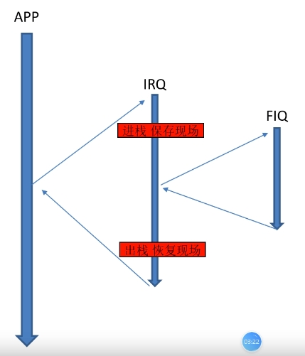
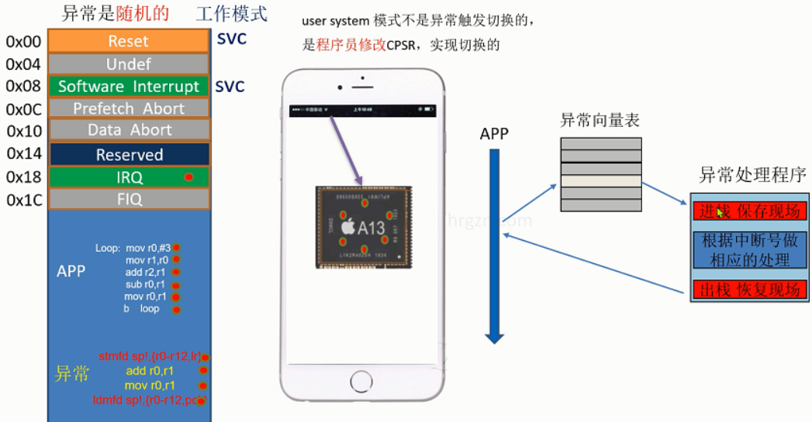

#### 1、异常处理-中断示意图



#### 2、异常向量表



```markdown
在ARM汇编中，异常向量表（Exception Vector Table）是一个特定的内存区域，用于存放各种异常（如中断、故障等）处理程序的入口地址。当处理器发生异常时，它会根据异常类型跳转到异常向量表中的相应地址执行异常处理代码。
异常向量表的作用包括：
1. **异常处理**：为各种类型的异常（如复位、未定义指令、软件中断、预取中断等）提供处理程序的入口点，确保系统能够正确响应和处理异常。
2. **中断响应**：在中断发生时，CPU会查找异常向量表，跳转到中断服务例程（ISR），从而能够及时处理中断请求。
3. **系统稳定性**：通过定义异常处理程序，可以有效地捕捉和处理错误，避免系统崩溃，提高系统的可靠性。
4. **程序控制**：允许开发者在特定情况下（如故障或重置）执行特定的初始化或清理代码，确保系统在异常状态下仍能维持一定的功能。
在ARM架构中，异常向量表通常位于内存的低地址部分，具体位置和大小依赖于系统配置。
```

#### 3、软中断的一个例子

```assembly
.text
	@---------vector table
	b   main  	@0x00 reset
	nop       	@0x04 undef         
	b sirq_hander	@0x08 soft irq
	nop       	@0x0c prefecth abort
	nop	      	@0x10 data abort
	nop		@0x14 reserved
	nop		@0x18 irq
	nop		@0x1C fiq
	
	@ handler vector table
sirq_hander:
        stmfd sp!,{r0-r12,lr}
        add  r2,#1

sirq_hander_end:
	ldmfd sp!,{r0-r12,pc}
        @----------app----
main: 
        ldr sp,=stack_buf
	mov r1,#1
	mov r2,#2
	swi 0x1      @注意中断号
	cmp r2,#2
	moveq r4,#4
	movne r4,#6
main_end:
	b  main_end
     
	.data

        .space 15*4
stack_buf:

	.end
```

在ARM汇编中，`STMFD`（Store Multiple Full Descending）和`LDMFD`（Load Multiple Full Descending）是用于处理寄存器堆栈操作的指令。它们主要用于保存和恢复多个寄存器的值，特别是在函数调用和中断处理时。

🚩`STMFD`（Store Multiple Full Descending）

- **功能**：将多个寄存器的值存储到内存中，采用全降序的方式。
- **语法**：`STMFD <register>, {<list of registers>}`
- **作用**：
  - 将指定的寄存器（`<list of registers>`）的值存储到内存中。
  - 存储时，栈指针（如`R13`或`SP`）的值会减小，以创建空间，数据从高地址向低地址存储。
  - 适合在函数调用前保存寄存器状态。

🚩`LDMFD`（Load Multiple Full Descending）

- **功能**：从内存中加载多个寄存器的值，采用全降序的方式。
- **语法**：`LDMFD <register>, {<list of registers>}`
- **作用**：
  - 从内存中恢复指定的寄存器（`<list of registers>`）的值。
  - 加载时，栈指针的值会增加，数据从低地址向高地址加载。
  - 适合在函数返回时恢复寄存器状态。

🌰示例

```assembly
; 假设 R13 是栈指针
STMFD R13!, {R0-R3}  ; 将 R0-R3 存储到栈中，并更新栈指针
LDMFD R13!, {R0-R3}  ; 从栈中加载 R0-R3 的值，并更新栈指针
```


#### 4、软中断完整

```assembly
.text
	@---------vector table
	b   main  	@0x00 reset
	nop       	@0x04 undef         
	ldr pc,_sirq_hander	@0x08 soft irq
	nop       	@0x0c prefecth abort
	nop	      	@0x10 data abort
	nop		 @0x14 reserved
	nop		 @0x18 irq
	nop		 @0x1C fiq
	
_sirq_hander:
	.word  sirq_hander
	
	@ handler vector table
sirq_hander:
    stmfd sp!,{r0-r12,lr}
	ldr r0,[lr,#-4]
	bic r0,#0xff000000
	cmp r0,#1
	addeq  r2,#1
	cmp r0,#2
	subeq  r2,#1

sirq_hander_end:
	ldmfd sp!,{r0-r12,pc}
    @----------app----
main: 
    ldr sp,=stack_buf
    mov r1,#1
    mov r2,#2
    swi 0x1   
    cmp r2,#2
    moveq r4,#4
    movne r4,#6
    swi 0x2
    mov r0,#3	
main_end:
    b  main_end
     

	.data

    .space 15*4
stack_buf:

	.end
```

⚠️注意：

🚩`ldr pc,_sirq_hander `，使用该代码避免了使用`b`跳转指令的32M限制；

🚩如何区分1号和2号软中断？

思路：只需要提取出swi指令后边的中断号，以此来区分即可；那么问题转化成如何取出该中断号，根据前面学习的汇编代码对应的机器码的低12位存储指令操作数，故我们需要得到`swi {操作数}`所对应的机器码，又因为进入中断程序后，系统自动将swi指令的下一条代码的地址送入`lr`寄存器，估`lr`寄存器减4就得到`swi`指令的地址，取该地址的内容，即得到该指令的机器码。（代码区存储指令的机器码）


