#### 1、硬件系统组成和运行原理

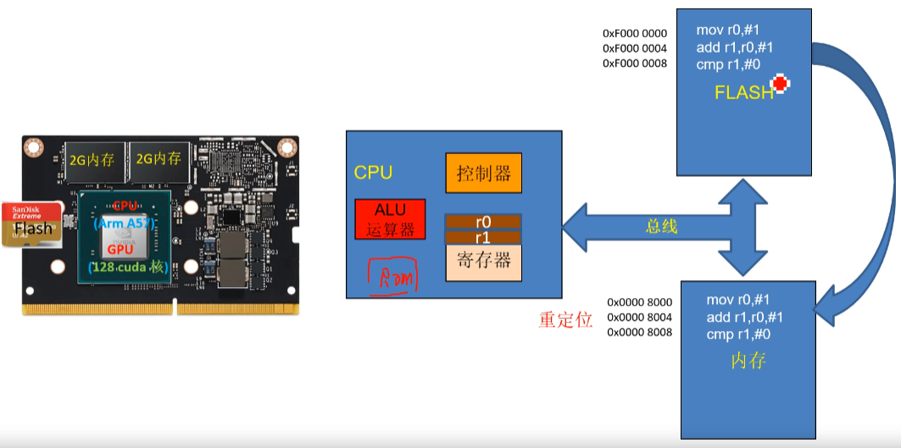

- CPU
- Flash
- RAM
- BUS

```
“CPU核心和GPU核心集成在同一芯片上”指的是将中央处理器（CPU）和图形处理器（GPU）的计算单元集成到一个单一的物理芯片中，通常称为**片上系统（SoC）**或**融合处理器（APU）**。这种设计能够减少数据传输延迟、降低功耗，并且优化了资源共享，特别适合移动设备、超便携设备或嵌入式系统中，提供更高效的性能和能效。
```

##### 1）CPU工作过程

CPU的工作过程可以概括为“取指、译码、执行”三个步骤。首先，CPU从内存中读取（取指）指令到指令寄存器；接着，通过译码单元将指令翻译为CPU能够理解的操作；最后，CPU执行这些指令，完成运算、数据传输或其他任务。执行的结果可能会存储在寄存器中或写回内存。这个过程不断循环，使得CPU能够快速处理复杂的指令和数据，实现整个系统的功能。

##### 2）总线作用

总线在计算机系统中起到**数据传输通道**的作用，负责在不同组件之间传递信息。它连接CPU、内存、输入输出设备等，使它们能够相互通信。总线通过共享通信信道传输指令、数据和控制信号。

根据功能，总线可以分为三类：

1. **数据总线**：传输数据，决定一次能够传输的数据量，通常以位宽表示。
2. **地址总线**：传递内存或设备的地址，用于定位数据存储的具体位置。
3. **控制总线**：传输控制信号，协调系统各部件的工作，如读写命令或中断信号。

总线的高效运行对系统的性能至关重要，它决定了设备之间的通信速度和数据流量。

##### 3）RAM

RAM（随机存取存储器，Random Access Memory）是一种用于存储计算机当前正在使用的数据和程序的高速存储器。与硬盘等非易失性存储器不同，RAM是**易失性**的，即当电源关闭时，存储在其中的数据会丢失。其特点是可以随机访问任意内存地址，速度非常快，因此被广泛用于作为计算机的**工作内存**，为CPU提供快速的数据读写支持。RAM的容量和速度直接影响计算机的性能和多任务处理能力。

#### 2、工作模式及寄存器框图

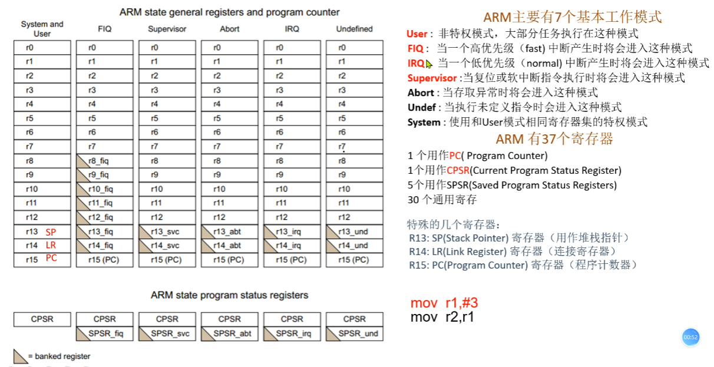

##### 1）工作模式

ARM处理器有多种工作模式，适用于不同的任务和系统需求。工作模式主要用于管理异常和中断处理、用户程序执行等。不同的工作模式可以访问特定的寄存器组和资源。ARM的主要工作模式包括：

1. ==**User模式**==：用于执行普通用户程序，是最常用的工作模式，具有最低的权限，不能直接访问系统级资源。
2. ==**FIQ（快速中断请求）模式**==：用于处理高速数据传输或时间关键任务，响应高优先级的中断，拥有专用的寄存器组以减少上下文切换时间。
3. ==**IRQ（中断请求）模式**==：用于处理一般的中断请求，响应普通中断。
4. ==**Supervisor模式**==：当操作系统需要执行特权操作时使用，如系统调用。它是系统启动后的默认模式。
5. **Abort模式**：当处理器检测到存储器访问故障时进入，通常用于处理异常情况。
6. **Undefined模式**：当处理器遇到无法识别的指令时进入，处理未定义指令的异常。
7. **System模式**：用于操作系统执行特权任务，类似于User模式，但拥有更高的权限。

##### 2）ARM寄存器

ARM处理器有37个寄存器，大多数为通用寄存器，分为用户模式寄存器和特权模式寄存器。寄存器分为三类：

1. **通用寄存器（R0-R12）**：用于数据处理和存储操作数，R0到R12是通用寄存器，在所有模式下大部分是相同的。
2. **特定用途寄存器**：
   - **R13（SP，堆栈指针）**：用于指向当前栈的顶部，存储子程序调用的返回地址或局部变量。
   - **R14（LR，链接寄存器）**：存储子程序返回地址，当调用子程序时将返回地址存储到此寄存器。
   - **R15（PC，程序计数器）**：存储当前执行指令的地址，同时用于下一条指令的地址。

3. **状态寄存器（CPSR和SPSR）**：
   - **CPSR（当前程序状态寄存器）**：存储当前处理器的状态，如条件标志（如零标志、进位标志等）、中断屏蔽标志和处理器模式。
   - **SPSR（保存的程序状态寄存器）**：用于异常发生时保存中断之前的CPSR状态，以便恢复正常执行。

==不同模式下，有些寄存器是“银行化”的，即每个模式拥有自己的版本，以减少上下文切换的开销，特别是在中断处理中。==

##### 3）CPSR寄存器

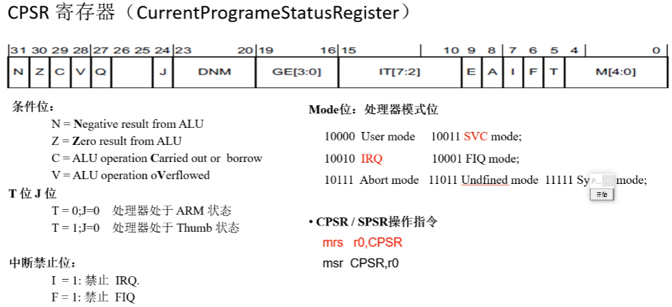

- 条件位，反应CPU运算结果的标志位   

- T 位 J 位， 反应处理器状态，分为ARM状态和Thumb

- Mode位，反应处理器状态

- I 位和 F 位，IRQ和FIQ中断的开关

  

#### 3、汇编指令初级

[嵌入式ARM汇编详解 - Aspirant-GQ - 博客园 (cnblogs.com)](https://www.cnblogs.com/quan0311/p/15025108.html#_344)

##### 1）搬移指令

```assembly
mov r13, #3 				@将3赋给r13寄存器
mrs r0, cpsr				@针对特殊寄存器的特别的搬移指令，这里是读指令
msr cpsr, r0				@针对特殊寄存器的特别的搬移指令，这里是写指令
and r0, r0, #0xFFFFFFE0		@‘与’操作，注意：AND将俩个操作数进行逻辑与操作，将结果写入目的寄存器中
orr r0, r0, #0x10			@‘或’操作，没啥好说的
mov r0,r1,LSL#2				@LSL为逻辑左移指令，将r1寄存器中的数逻辑左移两位后，将结果送至r0寄存器
mov r0,r1,LSR#1				@与上面的LSL类似，不过这里是右移
```

MRS : Move from Special Register

MSR : Move to Special Register

##### 2）指令是如何被存储，如何被解析的？

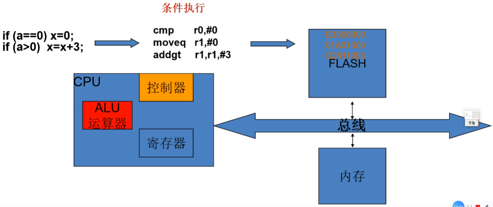

##### 3）指令的机器码

注意：*对于32位ARM机器而言，一句汇编代码转换成32位机器码，该机器码包含的信息有：条件位、操作码、源操作数、目的操作数，因此这也决定了目的操作数是有长度限制的*；

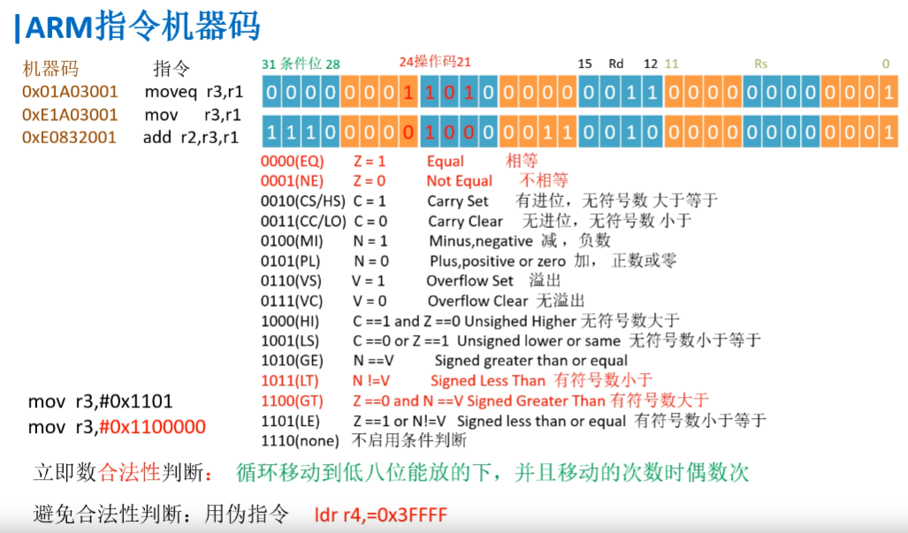

<div style="display: flex; justify-content: space-between;">
    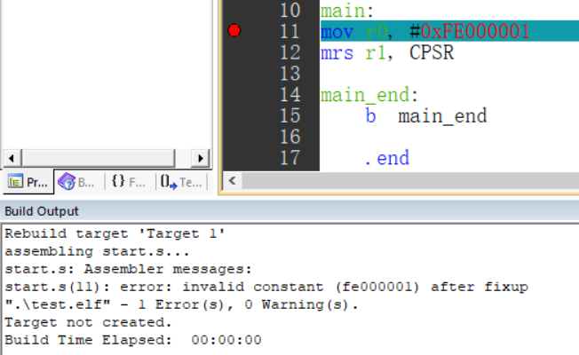
    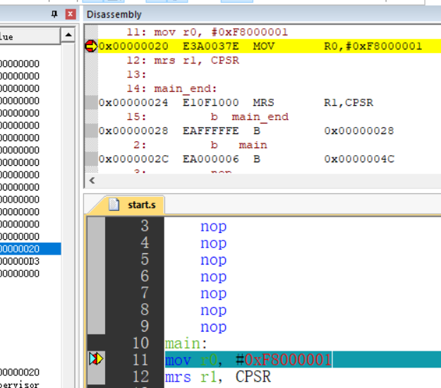
</div>

==上面的右图中，注意断点处对应的汇编代码为"E3A0037E"，其中的'7E'为1111 1000 ... 0001高6位循环左移后得到。==

##### 4）跳转指令

```assembly
b main  @跳转到main标号处执行（只能短跳转32M），不记录返回地址

bl break @跳转到标号break处执行，同时将当前地址保存在LR寄存器中,当跳转代码结束后，用mov pc,lr跳回来

beq addr @相等(指的是CPSR寄存器中的Z条件码为1)时，跳转到地址addr处
b.ne 也不记录返回地址

bne addr @不等时，跳转到地址addr,注意：这里地址通常是函数名

bleq addr @上面两种命令的集合体

blne addr
```

##### 5）逻辑指令

```assembly
and r0,r0,r1 	@r0和r1中的值相与，将结果送至r0

and r0,0xf0 	@去除r0寄存器中的低4位

or (),()    	@用法与and一样

bic r0,r0,#0x0B @定点清除寄存器中数据的某一位；0000 1011 ->清除r0中的第0、1、3位

tst r0, #0x20   @以源操作数来确定具体要测试哪几个bit，若目的操作数的对应bit是0，则将CPSR中的Z标志位				@置1


```

##### 6）算数指令

```assembly
add     r0,r1,r2       @默认是不影响CPSR的标志位的
add     r0,#1

sub     r0,r1,#3      类似  r0= r1 - 3
sub     r0,#1

sub     r0,r1,r2,LSL#1 
```

[ARM Cortex-A Series Programmer's Guide for ARMv7-A](https://developer.arm.com/documentation/den0013/d/Introduction/Embedded-systems)


#### 4、汇编指令高级

##### 1）Load/store架构

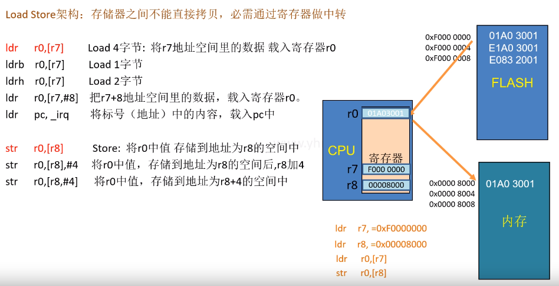


##### 2）

代码示例，简单，略


##### 3）前索引、后索引

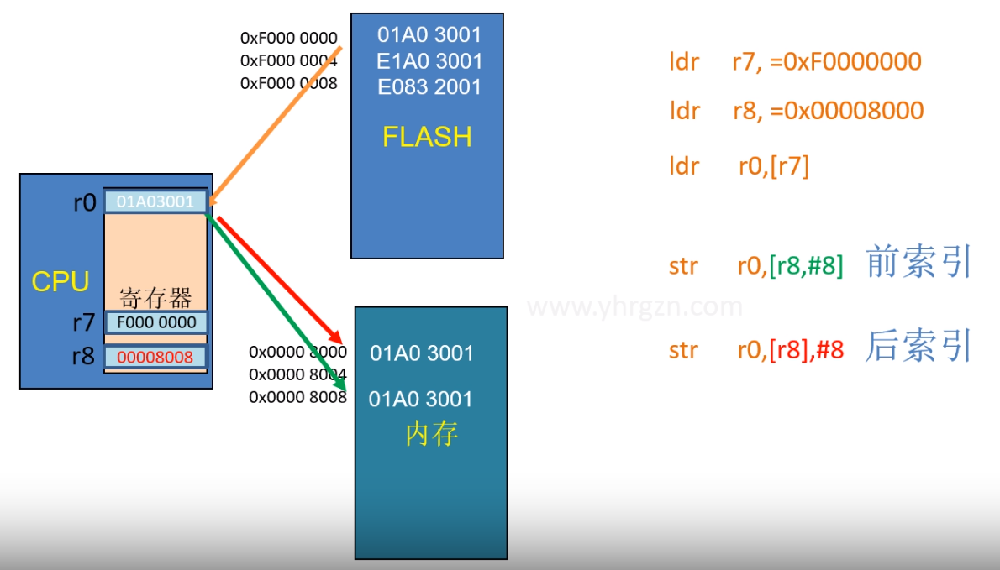

```assembly
str r0, [r8, #8] @前索引，将r0寄存器中的内容存到新的地址：「r8内容+8」
str r0, [r8],#8  @后索引，将r0寄存器中的内容存到新的地址：「r8的内容」,接着r8寄存器自加8
				@后索引可用于循环（见下面4中的代码）
```

##### 4）load/store实现数据拷贝

```assembly
//用汇编实现C内容
main()
{
	int i=0;
	const  char buf[]={1,2,3};
	char destBuf[8];
	for(i=0,i<3,i++)
	{
		destBuf[i] = buf[i];
	}
}

//汇编代码：
//代码段
.text
	b   main  
	nop
	nop
	nop
	nop
	nop
	nop
	nop
main: 
         mov r4,#0
	ldr r7,=buf
	ldr r8,=destBuf
loop:
        cmp  r4,#3
	beq  main_end
	
	ldrb  r0,[r7],#1 @后索引，下同
	strb  r0,[r8],#1
    
	add r4,#1
	b  loop
	
main_end:
	b  main_end
buf:
	.byte 1,2,3
//数据段    
	.data
destBuf:
	.space 8

	.end
```

##### 5）GNU ARM汇编伪指令

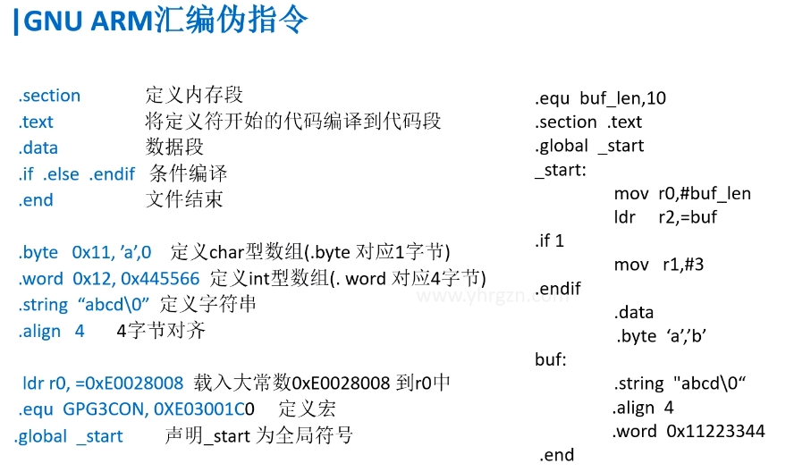

##### 6）批量操作指令

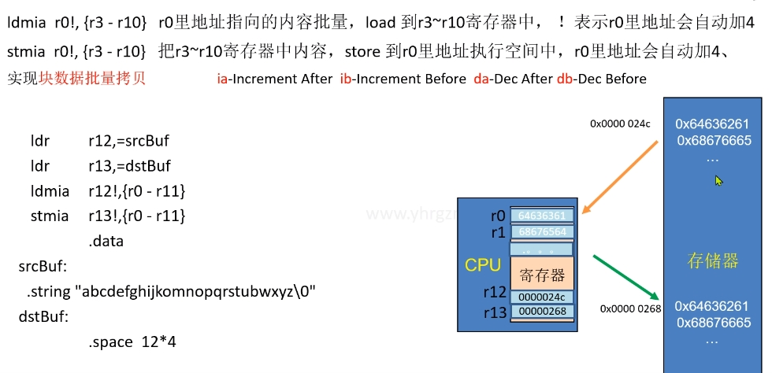

==实现块数据批量拷贝==

```assembly
ldr r12,=srcbuf
ldr r13,=destbuf
ldmia r12!,{r0-r11}
stmia r13!,{r0-r11}

		.data
srcbuf:
	.string "ahfjksdajkldbhfjka\0"
destbuf:
	.space 12*4
```

##### 7）堆栈操作指令

```assembly
stmfd sp!,{r0-r12,lr} 	@将寄存器r0-r12、lr中的值入栈（用于中断保护现场），注：lr中存储返回地址
ldmfd sp!,{r0-12,pc}^	@出栈，将栈中的值逐个弹出到寄存器r0-r12、pc中（用于中断恢复现场）
						@!表示sp会自动增减，^表示会恢复spsr到cpsr
						
```

