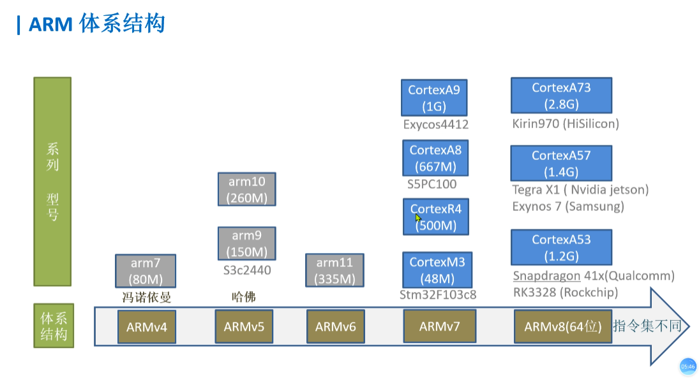

what:

ARM开发：基于ARM核 硬件的 编程开发

why:

熟悉ARM体系架构；

芯片与硬件控制的底层逻辑；

看电路图 芯片手册 编程控制硬件

how:

重点：看电路图  芯片手册  编程控制硬件

难点：硬件不熟悉，电路图看不懂  芯片手册庞大全英文

------

**ARM 体系结构**

- 不同体系结构芯片的指令集不同；

- 同一体系结构而言，分低端、高端产品（CPU频率）

  

------

经典的CPU架构通常指的是两种广泛应用的架构：**冯·诺依曼架构**和**哈佛架构**，以及流行的**CISC**和**RISC**指令集架构。

1. **冯·诺依曼架构**：
   - 提出者是数学家约翰·冯·诺依曼。
   - 特点：指令和数据存储在同一个内存中，CPU通过一个总线访问存储器。这种架构的瓶颈在于CPU和内存之间的数据传输受限，称为“冯·诺依曼瓶颈”。
   - 这是大多数现代通用计算机的基础架构。

2. **哈佛架构**：
   - 与冯·诺依曼架构不同，指令和数据被存储在不同的内存空间中，并通过独立的总线进行访问。
   - 这种架构允许CPU同时读取指令和数据，提高了执行效率，通常用于嵌入式系统和DSP（数字信号处理器）。

3. **CISC架构（复杂指令集计算，Complex Instruction Set Computing）**：
   - 特点：指令集复杂，每条指令执行的功能较多，往往需要多周期才能完成一条指令。
   - 优点是减少了程序指令的数量，因为每条指令可以执行复杂的操作。
   - 典型代表是x86架构，广泛应用于桌面电脑和服务器。

4. **RISC架构（精简指令集计算，Reduced Instruction Set Computing）**：
   - 特点：指令集精简，每条指令执行的功能简单且一致，通常一条指令只需要一个周期即可完成。
   - 优点是指令执行速度快，设计相对简单，易于优化和提高并行处理能力。
   - 典型代表是ARM架构，广泛应用于移动设备和嵌入式系统。

这几种架构在现代计算机设计中经常相互结合，以实现更好的性能、功耗和灵活性。

[ARM Cortex-A Series Programmer's Guide for ARMv7-A](https://developer.arm.com/documentation/den0013/d/Introduction/Embedded-systems)
