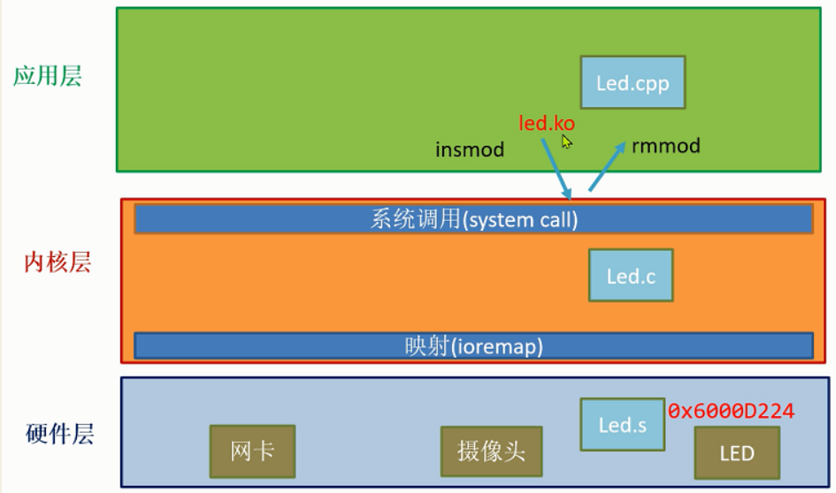

#### 1、环境搭建

#####  1.1 uboot的tftp下载

首先，给主机（虚拟机）安装tftp服务，使用命令如下：

```
$ sudo apt-get install xinetd tftpd tftp	
$ sudo vim /etc/xinetd.d/tftp /*添加下面内容, 
service tftp
{
protocol        = udp
port            = 69
socket_type     = dgram
wait            = yes
user            = nobody
server          = /usr/sbin/in.tftpd
server_args     = /tftpboot
disable         = no
}
 
注意： win10下内容拷贝不过来 需要去掉.vimrc " 启用鼠标 部分内容如 if has('mouse') set mouse=a endif

 */

$ sudo mkdir /tftpboot
$ sudo chmod -R 777 /tftpboot
$ sudo chown -R nobody /tftpboot 
$ vim /tfpboot/test //创建测试文件
$ sudo service xinetd restart  //新系统的重启服务
$ sudo /etc/init.d/xinetd restart  	//老系统的重启服务

$ tftp localhost  //自环测试
tftp> get  test
Received 7 bytes in 0.0 seconds  //有下载到文件，表示tftp服务安装成功
tftp> q //退出
```

##### 1.2 板子的有限网卡的ip地址设置

```bash
$ sudo ifconfig eth0 192.168.9.110 up  //设置有限网卡的ip地址(默认eth0是有些网卡)
$ ifconifg   //看到 eth0 设为 192.168.9.110 表示设置成功
$ ping 192.168.9.120 /*如果有回下面信息表示板子与电脑网络连接成功
    PING 192.168.9.120 (192.168.9.120) 56(84) bytes of data.
    64 bytes from 192.168.9.120: icmp_seq=1 ttl=128 time=1.67 ms
    64 bytes from 192.168.9.120: icmp_seq=2 ttl=128 time=1.90 ms
   	*/
```

虚拟机设置：

```
WorkStation -> 编辑 -> 虚拟网络编辑器 -> 更改设置 -> 桥接模式 -> 选usb有线网卡 -> 确定退出
WorkStation -> 虚拟机 -> 设置 -> 自定义 -> 选Vnet0 //需和前一个一致
ubuntu -> 右键右上角的网络图标 -> 设置 -> 点+ 号新加网卡 -> 身份 名称设为 board -> 
选ipv4 -> 手动 -> 地址 设为192.168.9.119  子网掩码 255.255.255.255.0  网关：192.168.9.1 -> 确定退出
$ ifconfig //如果看到有 192.168.9.119 的网卡，表示设置成功
```

其他问题见：/notes/避坑要点记录/板子不能与笔记本ping通.md

##### 1.3 tftp下载文件到板子上

这部分目的是：使板子停在启动的u-boot阶段，并在这个阶段建立与主机之间的以太网连接，遇到的问题见路径：/notes/避坑要点记录/U-boot阶段检测不到有线连接.md

```bash
# pci enum;pci  /* 激活pci设备(否则ping时报：No ethernet found.)
Scanning PCI devices on bus 0
BusDevFun  VendorId   DeviceId   Device Class       Sub-Class
_____________________________________________________________
00.01.00   0x10de     0x0fae     Bridge device           0x04
00.02.00   0x10de     0x0faf     Bridge device           0x04	
  */	
# setenv serverip  192.168.9.119 
# setenv ipaddr 192.168.9.9
# ping 192.168.9.120 /*先ping通win10
  Using eth_rtl8169 device
  host 192.168.9.120 is alive
	*/
# ping  192.168.9.119   /*再ping通虚拟机(如果不通，看一下前面 主机关联有线网卡设定静态ip）
   Using eth_rtl8169 device
   host 192.168.9.119 is alive
    */
# saveeenv
```

##### 1.4 交叉编译

利用交叉编译工具，实现在虚拟机（`x86,linux`）上面完成`arm`汇编程序的编译，接着将编译得到的`.bin`文件通过`tftp`传输到板子中（此时板子处于u-boot阶段），从而可以实现在u-boot阶段（等价于硬件层，还没到内核层）对某些硬件的控制；

```bash
$ make
$ cp led.bin  /tftpboot

//板子重启 停在u-boot处
$ pci enum;pci
$ tftp led.bin
$ go 84000000  //运行程序
               //如果是异常重启，可能是顺序执行到非法区域，或某指令写非法地址
```


#### 2、官方文件来源及查找

```
源头 //从官方入手，收集足够资料，全部先看一遍，做到心中有底
     //侦探破案的第一步，收集足够的线索和证据
     //注：jetson它提供的文档比较散，要化很多时间去找，有些信息，还是论坛里给的提示，
官方文档中心 //https://developer.nvidia.com/embedded/downloads	
-> 选jetson //过滤调无关的后, 把列表相关文档全部先走一遍，做到心中有底  
-> Jetson Nano Product Design Guide //1.产品设计指导(入口)
      //-> 1.1 References  列出了相关的文档
 
-> Jetson Nano Developer Kit Carrier Board Specification  //2.1板子标注说明  
-> Jetson Nano Module Data Sheet  //2.2板子的芯片手册      
-> Jetson Nano Developer Kit Carrier Board Specification //2.3板子的电路图
     			//Maxwell GPU + ARM Cortex-A57 + 4GB LPDDR4 + 16GB eMMC
     			//与电路图中管脚编号一致，但和板子上标注不一致。
-> Tegra X1 (SoC) Technical Reference Manual //3 CPU(soc)的芯片手册    				             
-> Jetson Nano Pin and Function Names Guide Application Note //4.1引脚的控制
-> Jetson Nano Developer Kit Pinmux  //4.2 40PIN外接管脚的转换表    
-> Jetson Nano Pinmux   //4.3 管脚复用的映射表 

官方论坛  //https://forums.developer.nvidia.com/	
-> Jetson & Embed system -> Jetson Nano 
-> 搜索关键字 如datasheet  //根据你目标搜关键字，列出了很多相关文档，都查看一下

ARM官网 //https://developer.arm.com/ip-products/processors/cortex-a/cortex-a57 
-> 下载 DDI0488H_cortex_a57_mpcore_trm.pdf //cortex_a57 芯片手册
```

- 产品说明：*本文档包含建议和指导方针，供工程师遵循，以创建优化产品，从NVIDIA®Jetson Nano™System-on-Module （SoM）支持的通用接口实现最佳性能。*
- 板子说明：板载说明，芯片手册，板子电路图
- CPU说明：cpu芯片手册，arm核芯片手册
- 管脚控制：pinmux，外接管脚转换表，管脚复用的映射表，，40pin控制源码示例


#### 3、电路图

要能看懂简单的电路图，进而达到控制的目的


#### 4、芯片手册

结合英伟达官方给出的资料，以及ARM官网的资料，进行梳理

##### 4.1 CPU框图

框图分析可见[CPU框图分析](./芯片手册概览.pdf)  ,(ctrl+鼠标左击打开)

##### 4.2 地址映射

这里指的是硬件地址，分两部分：系统各个外设等的基址+不同外设分组后的偏移地址；

按照资料（[Tegra_X1_TRM_v1.3](./Tegra_X1_TRM_DP07225001_v1.3p.pdf)）P19 及P247等，通过对这些硬件地址的内容进行读写操作，可实现对硬件的操作，

这时使用汇编代码，在硬件层结合寄存器操作，需要在虚拟机上（x86平台）编译出将要被运行在arm平台上的可执行文件，这一编译过程称作交叉编译。编译完成后，考虑如何在硬件平台运行该代码，

由于板子启动后先进入u-boot，接着进入内核，最后到应用层，姑该硬件层代码必须被执行于板子启动的u-boot阶段；注意：这一阶段板子只是部分初始化，tftp传输的相关操作见第一部分（环境搭建）。

##### 4.3 时钟

配置相关寄存器，以达到对时钟的 选择、 使能 、分频的操作

（暂时没有涉及，待后面搞到再补充）

##### 4.4 PCIE

PCI Express（PCIe）是一种高速度、低延迟的串行计算机扩展总线标准，广泛用于连接主板上的各个组件，如图形卡、固态硬盘（SSD）、网络接口卡等.

```
PCIE //Peripheral Component Interconnect Express 周边设备高速互联
     //金手指 高速端到端传输(达5GT/S = 500M byte/s)
     //速度: gen1代(2.5GT/S) ,gen2代(5GT/s = 5000/10 M byte/s)
     //4根主线: 发送(Tx+ Tx- )和接收(Rx+  Rx-)  两对差分线每通道 
     //协议： 串行，全双工，端到端
```

#### 5、GPIO点灯（硬件层）

##### 5.1 如何找控制板子上某一引脚输出高低电平的相关寄存器

1、首先，观察板子上面的丝印，然后在官方给的[管脚复用表](./4.2 40PIN外接管脚的转换表NV_Jetson_Nano_DeveloperKit_Users_Pinmux_Configuration.xlsm)中找到其作为GPIO时的记号，

比如`I2S0_SCLK`对应`GPIO3_PJ.07`，对应的含义是：第3组GPIO中，J端口中的第8（从0开始标号）个管脚（若要使其变成高电平，c代码中可表示为：`1<<7`）；

根据上述含义，接下来只要寻找到第三组GPIO的基地址，对应的J端口的偏移地址即可。

##### 5.2 查表获得需要进行配置的寄存器的地址

根据上面分析，下面针对该地址，配置以下寄存器：

```javascript
9.13.1 GPIO_CNF_0   
15 DISABLE  //LOCK_7: Lock access to pin 7 CNF, OE and OUT
	    //0 = DISABLE 1 = ENABLE
7 0x0       //BIT_7: Configures each pin to be in either GPIO or SFIO mode
            //0 = SPIO  1 = GPIO

-> 0x6000D204 = 0x8080 //把pin12（GPIO3_PJ.07）配置为GPIO模式

9.13.2 GPIO_OE_0
7 0x0      //BIT_7: GPIO mode (GPIO_CNF.x=1) must be true for this condition to be valid.
           //0 = TRI_STATE 1 = DRIVEN
-> 0x6000D214 =0x80  //使能output

9.13.3 GPIO_OUT_0
7 0x0      //BIT_7: GPIO_CNF.x=1 (in GPIO mode) AND GPIO_OE.x=1 (GPIO output enabled) must be true for this to be a valid state
           //0 = LOW 1 = HIGH    
-> 0x6000D224 =0x80  //输出高电平
```

#### 6、GPIO点灯（在内核层）

##### 6.1 分层映射

下图展示了三层架构，应用层通过系统调用来访问内核层，内核层通过硬件层的地址映射来间接访问硬件层，如此分层可以避免应用开发时直接对硬件访问造成的系统崩溃；

另外，为了避免往内核烧写镜像的麻烦，通过安装/卸载驱动模块，使得应用层的代码可以作为模块运行在内核层；



##### 6.2 简单示例

$ sudo insmod led.ko  插入驱动模块

$ dmesg  查看内核输出日志

$ sudo rmmod led  卸载驱动模块

```c
#include <linux/module.h> 

int led_init(void)
{
   printk("led init ok\n");
   return 0; //放回0：表示成功
}

void led_exit(void)
{
   printk("led exit ok\n");   
}
module_init(led_init);  //声明 led_init 是内核模块加载入口 insmod led.ko 时会触发调用 
module_exit(led_exit); //声明led_exit是内核模块的卸载入口 rmmod led  时会触发调用
```

```makefile
ifeq ($(KERNELRELEASE),)
KVERSION = $(shell uname -r)
all:
	$(MAKE) -C /lib/modules/$(KVERSION)/build M=$(shell pwd) modules
clean:
	$(MAKE) -C /lib/modules/$(KVERSION)/build M=$(shell pwd) clean
else
	obj-m :=led.o
endif	
```

##### 6.3 通过命令行实现在应用层的点灯

```bash
$ echo 79 > /sys/class/gpio/export   //导出79号gpio 引脚，使得可在应用层访问
$ echo out > /sys/class/gpio/gpio79/direction  //设置 为输出
$ echo 1 > /sys/class/gpio/gpio79/value //输出高电平 开灯
$ echo 0 > /sys/class/gpio/gpio79/value  //输出低电平， 关灯
```

结合下面代码可查看相关寄存器的值的变化

```c
//源码led.c
#include<linux/module.h>  //模块的头文件 (for module_init MODULE_LICENSE)
#include <asm/io.h>   	  //io操作的头文件(for  ioremap readl)

#define GPIO_OUT 0x6000D224 //GPIO3_PJ7的输出寄存器的地址（1：高电平 0：低电平）

unsigned char *out;	
int led_init(void)
{
    out = ioremap(GPIO_OUT , 4); //从物理地址GPIO_OUT 开始，映射4字节长度的空间到内核空间
    if (out == NULL) {  //如果映射失败，会返回空指针
	printk("ioremap GPIO_OUT error\n");
	return  -1;  //返回负数：表示失败
    }  	
    printk(" out =%x\n",readl(out)); //读out 指向空间的4字节数据(readw 2字节 readb 1字节)
    printk("led init ok\n");
    return 0;  //返回0： 表示成功
}

void led_exit(void)
{
    iounmap(out); //取消映射	
    printk("led exit\n");
}
module_init(led_init); //插入模块入口
module_exit(led_exit); //卸载模块的入口
MODULE_LICENSE("GPL v2"); //遵循的开源声明
```

具体操作如下：

```bash
$ sudo insmod led.ko  //插入驱动模块，查看信息
$ dmesg  //查看内核输出日志
$ echo 79 > /sys/class/gpio/export   //导出79号gpio 引脚，使得可在应用层访问
$ echo out > /sys/class/gpio/gpio79/direction  //设置 为输出
$ echo 1 > /sys/class/gpio/gpio79/value //输出高电平 开灯
$ sudo rmmod led 
$ dmesg  
$ echo 0 > /sys/class/gpio/gpio79/value  //输出低电平， 关灯
$ sudo insmod led.ko 
$ dmesg 
```

##### 6.4 查看所有相关寄存器的值的变化

考虑到一开始的硬件层点灯没有实现，怀疑是不是有哪些寄存器的值配置错误，或是有些寄存器没有配置？

要搞清上面的问题，需要追踪能够实现点灯的应用层代码，通过自己编写的可以查看管脚相关寄存器的模块插入到内核中，来观察当灯的状态发生变化时，这些寄存器的值的变化，从而反过来帮助我们更好的编写硬件层代码。

相关代码如下：

led.c

```c
//led.c	
#include<linux/module.h>  //模块的头文件 (for module_init MODULE_LICENSE)
#include <asm/io.h>   //io操作的头文件(for  ioremap readl)

#define GPIO3  	0x6000D200 // 第3个Bank GPIO 的基地址
//---偏移量
#define CNF	0x04  //配置寄存器 (0:GPIO  1:SFIO)
#define OE   	0x14  //输出使能寄存器 (1:使能 0:关闭)
#define OUT  	0x24  //输出寄存器（1：高电平 0：低电平）
#define MSK_CNF 0x84  //配置屏蔽寄存器(高位1:屏蔽 高位0:不屏蔽   低位1:GPIO模式 低位0:SFIO模式)
#define MSK_OE  0x94  //输出使能屏蔽寄存器(高位1:禁止写   低位1:使能)
#define MSK_OUT 0xA4  //输出屏蔽寄存器(高位1:禁止写   低位1:高电平)

unsigned char *gpio_base;	

void show_reg(void)  //查看相关寄存器的内容
{
  printk(" cnf =%x\n",readl(gpio_base+CNF)); //通过基地址加偏移量，来访问对应的配置寄存器
  printk(" oe =%x\n",readl(gpio_base+OE));  
  printk(" out =%x\n",readl(gpio_base+OUT));   
  printk("mask cnf =%x\n",readl(gpio_base+MSK_CNF));
  printk("mask oe =%x\n",readl(gpio_base+MSK_OE));  
  printk("mask out =%x\n",readl(gpio_base+MSK_OUT));    	 
}
int led_init(void)
{
  gpio_base = ioremap(GPIO3, 0xFF); //从物理地址GPIO3开始，映射 0xFF字节长度的空间到内核空间
  if (gpio_base == NULL) {
    printk("ioremap gpio_base error\n");
    return  -1;
  }  		
  show_reg();
  printk("led init ok \n");
  return 0;
}

void led_exit(void)
{
  show_reg();
  iounmap(gpio_base); //取消映射
  printk("led exit \n");
}
module_init(led_init);
module_exit(led_exit);
MODULE_LICENSE("GPL v2");
```

命令行操作如下：

```bash
$ sudo insmod led.ko  //插入驱动模块吗，查看信息
$ dmesg  //查看内核输出日志(全是零)
$ echo 79 > /sys/class/gpio/export   //导出79号gpio 引脚，使得可在应用层访问
$ echo out > /sys/class/gpio/gpio79/direction  //设置 为输出
$ echo 1 > /sys/class/gpio/gpio79/value //输出高电平 开灯
$ sudo rmmod led //卸载模块时，查看信息
$ dmesg  //查看内核输出日志(发现值都变为了0x80)
$ echo 0 > /sys/class/gpio/gpio79/value  //输出低电平， 关灯
$ sudo insmod led.ko 
$ dmesg //发现 out 变为0
```

#### 7、排查思路

网络搜

仔细看芯片手册

应用层可行方案的跟踪

**点亮LED的裸机C语言程序示例：**

1、首先是汇编语言，给出了程序入口：

```assembly
//start.S
.text
.global _start
_start:
    b		reset 

reset: 
    b		main

.end
```

2、C程序给出完成点灯所需要的相关寄存器配置：

Q：这里寄存器为什么这么配置？

A：一部分是通过查阅芯片手册，另一部分则通过跟踪可以实现点灯的命令行程序所实现的一些地址的值的变化来反推，两部分结合最终实现以下配置；

Q：下面宏定义中，使用 `volatile` 关键字的原因是什么？

A：编译器在优化代码时通常会假设变量的值不会被外部因素改变，但使用 `volatile` 可以禁止这种优化，从而确保每次读取或写入 `CNF` 时都会直接访问对应的内存地址，而不是使用可能已被缓存的值；

Q：在对某些管脚赋值时，为什么要采用与/或操作？

A：只操作指定位，避免对其他位造成影响，此外，这里使用了移位操作也可避免计算16进制的复杂；

```c
//main.c
#define CNF	(*(volatile  int*)0x6000D204)   //配置寄存器 (0:GPIO  1:SFIO)
#define OE   	(*(volatile  int*)0x6000D214)   //输出使能寄存器 (1:使能 0:关闭)
#define OUT     (*(volatile  int*)0x6000D224)   //输出寄存器（1：高电平 0：低电平）

#define MSK_CNF (*(volatile  int*)0x6000D284) //配置屏蔽寄存器(高位1:屏蔽 高位0:不屏蔽   低位1:GPIO模式 低位0:SFIO模式)
#define MSK_OE  (*(volatile  int*)0x6000D294) //输出使能屏蔽寄存器(高位1:禁止写   低位1:使能)
#define MSK_OUT (*(volatile  int*)0x6000D2A4) //输出屏蔽寄存器(高位1:禁止写   低位1:高电平)

#define DAP4_SCLK_PJ7 (*(volatile  int*)0x70003150)//管脚复用

//开灯
void led_on(void)
{
  //管脚复用
  DAP4_SCLK_PJ7 = DAP4_SCLK_PJ7&(~(1 << 4));
  //取消GPIO3_PJ7 引脚的屏蔽
  MSK_CNF = (MSK_CNF)|(1<<7); //取消对GPIO模下引脚的屏蔽 
  MSK_OE = (MSK_OE)|(1<<7); //取消引脚 使能屏蔽
  //配置GPIO3_PJ7 引脚  输出高电平
  CNF = (CNF)|(1<<7);  //配置引脚为 GPIO模式
  OE = (OE)|(1<<7);    //使能引脚
  OUT = (OUT)|(1<<7);  //引脚输出高电平，点亮灯
}

int main(void) 
{ 
  led_on();

  while(1)
  {
  }
  return 0;
}
```

3、Makefile文件给出了程序编译、链接流程

```makefile
//Makefile
CROSS = aarch64-linux-gnu-  # 定义交叉编译器的前缀
CC=$(CROSS)gcc 				# 使用交叉编译器 gcc
LD=$(CROSS)ld				# 使用交叉链接器 ld
OBJCOPY=$(CROSS)objcopy		# 使用对象复制工具 objcopy
OBJDUMP=$(CROSS)objdump		# 使用对象反汇编工具 objdump
# 定义目标 "all"，表示要执行的默认操作
all:
	# 使用 gcc 编译 start.S 源文件，生成 start.o 目标文件
	$(CC) -fno-builtin -nostdinc -c -o start.o start.S
	# 使用 gcc 编译 main.c 源文件，生成 main.o 目标文件
	$(CC) -fno-builtin -nostdinc -c -o main.o main.c
	# 使用 ld 链接 start.o 和 main.o 目标文件，生成 led.elf 可执行文件，使用 map.lds 作为链接脚本
	$(LD) start.o main.o -Tmap.lds -o led.elf
	# 使用 objcopy 将 led.elf 转换为二进制格式的 led.bin 文件
	$(OBJCOPY) -O binary  led.elf led.bin
	# 使用 objdump 反汇编 led.elf，并将结果输出到 led.dis 文件
	$(OBJDUMP) -D led.elf > led.dis
# 定义清理目标 "clean"，用于删除生成的文件
clean:
	rm -f *.bak *.o *.elf *.bin *.dis
```

4、对makefile中涉及到的链接脚本的补充

```assembly
//map.lds
OUTPUT_FORMAT("elf64-littleaarch64", "elf64-littleaarch64", "elf64-littleaarch64")		# 指定输出文件的格式为 ELF 64 位小端 AArch64
OUTPUT_ARCH(aarch64) # 指定目标架构为 AArch64（64 位 ARM 架构）
ENTRY(_start)		 # 指定程序的入口点为 _start，程序执行从该地址开始
SECTIONS
{		#定义链接的各个段#
    . = 0x84000000 ;  /*指定链接的起始地址   */
    . = ALIGN(4);
    .text      :
    {
      start.o(.text) #从 start.o 文件中将 .text 段的内容包含到此处
      *(.text)		 #将所有其他文件的 .text 段内容也包含到此处
    }
    . = ALIGN(4);
    .data : 
    { *(.data) } 	#将所有文件的 .data 段内容包含到此处
    . = ALIGN(4);
    .bss :
    { *(.bss) }		#将所有文件的 .bss 段内容包含到此处
}
```

