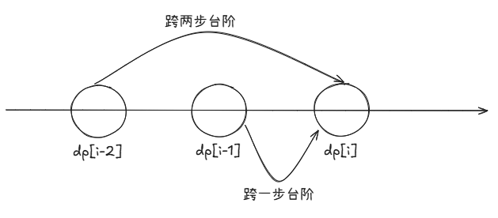

给你一个整数数组 `cost` ，其中 `cost[i]` 是从楼梯第 `i` 个台阶向上爬需要支付的费用。一旦你支付此费用，即可选择向上爬一个或者两个台阶。

你可以选择从下标为 `0` 或下标为 `1` 的台阶开始爬楼梯。

请你计算并返回达到楼梯顶部的最低花费。

**示例 1：**

```
输入：cost = [10,15,20]
输出：15
解释：你将从下标为 1 的台阶开始。
- 支付 15 ，向上爬两个台阶，到达楼梯顶部。
总花费为 15 。
```

**示例 2：**

```
输入：cost = [1,100,1,1,1,100,1,1,100,1]
输出：6
解释：你将从下标为 0 的台阶开始。
- 支付 1 ，向上爬两个台阶，到达下标为 2 的台阶。
- 支付 1 ，向上爬两个台阶，到达下标为 4 的台阶。
- 支付 1 ，向上爬两个台阶，到达下标为 6 的台阶。
- 支付 1 ，向上爬一个台阶，到达下标为 7 的台阶。
- 支付 1 ，向上爬两个台阶，到达下标为 9 的台阶。
- 支付 1 ，向上爬一个台阶，到达楼梯顶部。
总花费为 6 。
```

**使用动态规划解决**

1️⃣首先确定`dp[i]`数组的含义：`i`表示 台阶数，`dp[i]`表示到达这个台阶所花费的最小体力值；

2️⃣确定递推关系：可以结合下图理解状态转移关系（重点理解任意台阶的最小花费数和前两个最小花费数之间的关系）



所以我们有：`dp[i] = min( dp[i-1] + cost[i-1] , dp[i-2] + cost[i-2] )`

3️⃣确定初始条件：考虑到出发点可以选择第0个和第1个台阶，估可得 `dp[0] = dp[1] = 0`；

4️⃣递推顺序：显然从前往后推；

5️⃣验证：手推dp数组正确；

代码如下：

```c++
class Solution {
public:
    int minCostClimbingStairs(vector<int>& cost) {
        vector<int> dp(cost.size() + 1, 0);
        int res = 0;
        dp[0] = 0, dp[1] = 0;
        for(int i = 2; i <= cost.size(); i++){
            dp[i] = std::min(dp[i-1]+cost[i-1], dp[i-2]+cost[i-2]);
        }
        return dp[cost.size()];
    }
};
```

