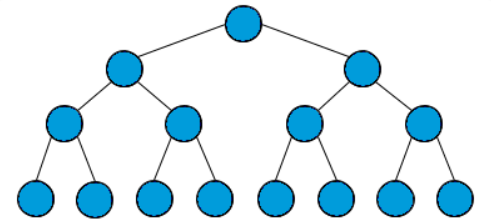
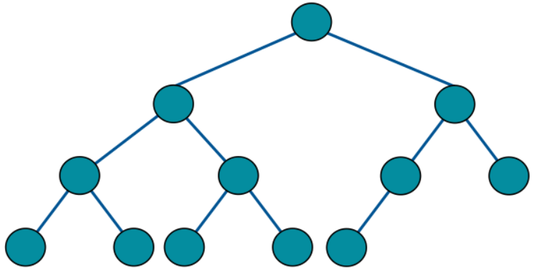
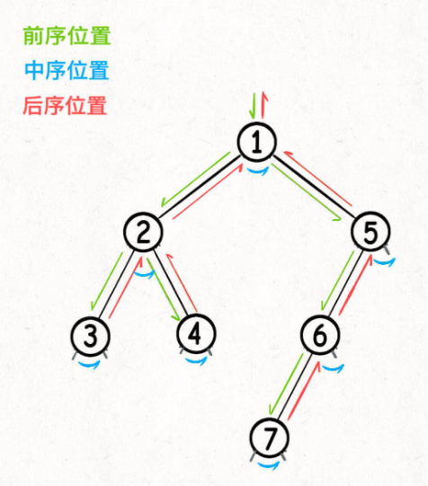
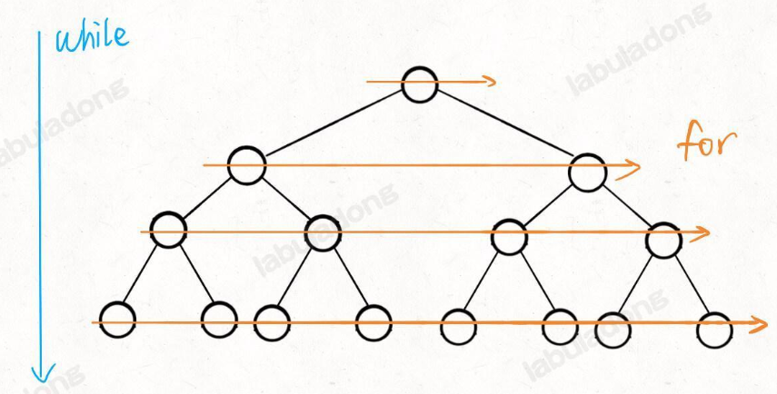

### 4/17

> 几种常见的二叉树

```
    1
   / \
  2   3
 /   / \
4   5   6
   /     \
  7       8
```

上面就是一棵**普通的二叉树**，几个术语你要了解一下：

1、每个节点下方直接相连的节点称为**子节点**，上方直接相连的节点称为**父节点**。比方说节点 `3` 的父节点是 `1`，左子节点是 `5`，右子节点是 `6`；节点 `5` 的父节点是 `3`，左子节点是 `7`，没有右子节点。

2、以子节点为根的树称为**子树**。比方说节点 `3` 的左子树是节点 `5` 和 `7` 组成的树，右子树是节点 `6` 和 `8` 组成的树。

3、我们称最上方那个没有父节点的节点 `1` 为**根节点**，称最下层没有子节点的节点 `4`、`7`、`8` 为**叶子节点**。

4、我们称从根节点到最下方叶子节点经过的节点个数为二叉树的最大深度/高度，上面这棵树的最大深度是 `4`，即从根节点 `1` 到叶子节点 `7` 或 `8` 的路径上的节点个数。


**满二叉树**

(每层的节点都是满的)




**完全二叉树**

（二叉树的每一层的节点都紧凑靠左排列，且除了最后一层，其他每层都必须是满的）



*完全二叉树的左右子树中，至少有一棵是满二叉树*

**二叉搜索树**（Binary Search Tree，简称 BST，非常常用）

（对于树中的每个节点，其**左子树的每个节点**的值都要小于这个节点的值，**右子树的每个节点**的值都要大于这个节点的值。你可以简单记为「左小右大」）

```
    7
   / \
  4   9
 / \    \
1   5   10
```

节点 `7` 的左子树所有节点的值都小于 `7`，右子树所有节点的值都大于 `7`；节点 `4` 的左子树所有节点的值都小于 `4`，右子树所有节点的值都大于 `4`，以此类推；

**平衡二叉树** (Balanced Binary Tree)

 **「每个节点」的左右子树的高度差不超过 1** ( **高度** 是指从根节点到最深叶子节点的路径长度（边的数量）)

比如下面这棵二叉树树，根节点 `1` 的左子树高度是 2，右子树高度是 3；节点 `2` 的左子树高度是 1，右子树高度是 0；节点 `3` 的左子树高度是 2，右子树高度是 1，以此类推，每个节点的左右子树高度差都不超过 1，所以这是一棵平衡二叉树：

```
    1
   / \
  2   3
 /   / \
4   5   6
     \
      7
```

**假设平衡二叉树中共有 N 个节点，那么平衡二叉树的高度是 O(log⁡N)**

> 使用链表实现二叉树结构

```c++
class TreeNode {
public:
    int val;
    TreeNode* left;
    TreeNode* right;
    TreeNode(int x) : val(x), left(nullptr), right(nullptr) {}
};

// 你可以这样构建一棵二叉树：
TreeNode* root = new TreeNode(1);
root->left = new TreeNode(2);
root->right = new TreeNode(3);
root->left->left = new TreeNode(4);
root->right->left = new TreeNode(5);
root->right->right = new TreeNode(6);

// 构建出来的二叉树是这样的：
//     1
//    / \
//   2   3
//  /   / \
// 4   5   6
```


### 4/17

> 二叉树的递归/层序遍历

递归遍历二叉树节点的顺序是固定的，但是有三个关键位置，在不同位置插入代码，会产生不同的效果。==前中后序==

层序遍历二叉树节点的顺序也是固定的，但是有三种不同的写法，对应不同的场景。==层序==

#### 递归遍历

基本框架：（不管是前中后序，基本遍历框架不变）

【深入理解：这个遍历框架，本质上和遍历数组或者链表没有本质区别，就是一个能够遍历所有节点的函数】

```c
// 基本的二叉树节点
class TreeNode {
public:
    int val;
    TreeNode* left;
    TreeNode* right;

    TreeNode(int x) : val(x), left(nullptr), right(nullptr) {}
};

// 二叉树的递归遍历框架
void traverse(TreeNode* root) {
    if (root == nullptr) {
        return;
    }
    traverse(root->left);
    traverse(root->right);
}
```

==所谓的前中后序遍历，其实就是在二叉树遍历框架的不同位置写代码==（root指针的移动顺序永远不变）

**前序位置的代码会在进入节点时立即执行；中序位置的代码会在左子树遍历完成后，遍历右子树之前执行；后序位置的代码会在左右子树遍历完成后执行**



```c
#include <iostream>
#include <vector>
#include <new>

class TreeNode{
public: 
    int val;
    TreeNode* left;
    TreeNode* right;
    TreeNode(int x): val(x), left(nullptr), right(nullptr){}
};


void preOrder(TreeNode* node) {
    if (node == nullptr) return;
    std::cout << node->val << " ";
    preOrder(node->left);
    preOrder(node->right);
}
void inOrder(TreeNode* node) {
    if (node == nullptr) return;
    inOrder(node->left);
    std::cout << node->val << " ";
    inOrder(node->right);

}

void postOrder(TreeNode* node) {
    if (node == nullptr) return;
    postOrder(node->left);
    postOrder(node->right);
    std::cout << node->val << " ";
}

int main() {
    TreeNode* root = new TreeNode(0); // 创建根节点
    root->left = new TreeNode(1); // 创建左子节点
    root->right = new TreeNode(2); // 创建右子节点
    root->left->left = new TreeNode(3); // 创建左子节点的左子节点
    root->left->right = new TreeNode(4); // 创建左子节点的右子节点
    root->right->left = new TreeNode(5); // 创建右子节点的左子节点
    root->right->right = new TreeNode(6); // 创建右子节点的右子节点

    std::cout << "Pre-order Traversal: ";
    preOrder(root);
    std::cout << std::endl;

    std::cout << "In-order Traversal: ";
    inOrder(root);
    std::cout << std::endl;

    std::cout << "Post-order Traversal: ";
    postOrder(root);
    std::cout << std::endl;

    return 0;
}

```

------

#### 层序遍历(BFS)

一层一层地遍历二叉树:



```c
void levelOrderTraverse(TreeNode* root) {
    if (root == nullptr) {
        return;
    }
    queue<TreeNode*> q;
    q.push(root);
    // 记录当前遍历到的层数（根节点视为第 1 层）
    int depth = 1;

    while (!q.empty()) {
        int sz = q.size();
        for (int i = 0; i < sz; i++) {
            TreeNode* cur = q.front();
            q.pop();
            // 访问 cur 节点，同时知道它所在的层数
            cout << "depth = " << depth << ", val = " << cur->val << endl;

            // 把 cur 的左右子节点加入队列
            if (cur->left != nullptr) {
                q.push(cur->left);
            }
            if (cur->right != nullptr) {
                q.push(cur->right);
            }
        }
        depth++;
    }
}
```

