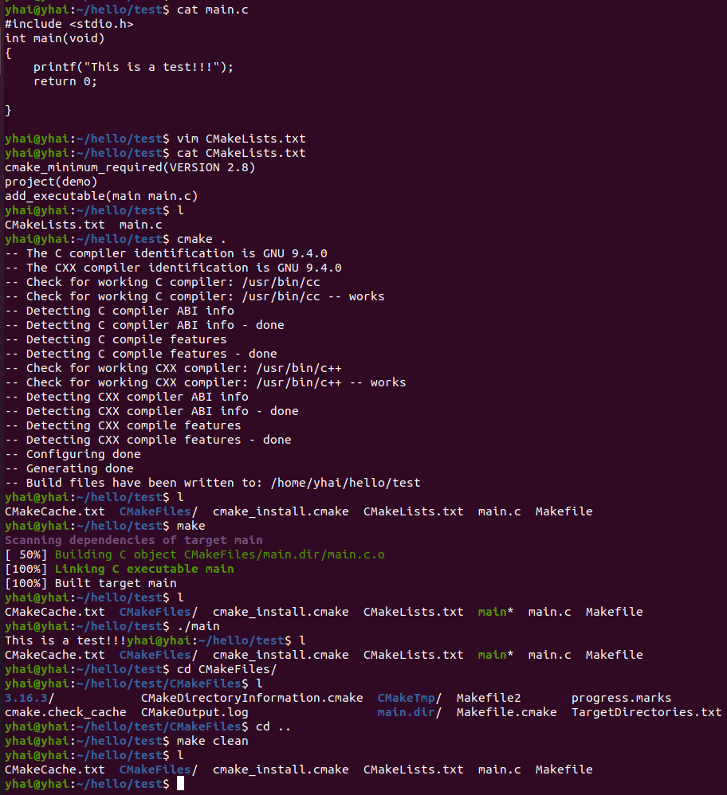

#### 这是一个最简示例

```cmake
//环境安装
$ sudo apt install cmake  //安装
  cmake 已经是最新版 (3.10.2-1ubuntu2.18.04.2)//默认jetson nano已安装
$ cmake -version  //查看版本
  cmake version 3.10.2	

//main.c
#include <stdio.h>

int main(void)
{
   printf("Hello World\n");
   return 0;
}	
//CMakeLists.txt
cmake_minimum_required (VERSION 2.8) #// cmake的最低版本要求是2.8，我们安装的是3.10.2
project (demo) #//工程名
add_executable(main main.c)	 #//由源文件main.c 生成执行文件main

//编译运行
$ cmake . //在当前目录，自动构建本平台编译需要的文件
          //自动生成文件有 CMakeCache.txt  CMakeFiles  cmake_install.cmake Makefile
$ make    //编译文件(用已自动生成的Makefile文件)
$ ./main  //运行执行程序
$ make clean //清楚编译中的生成文件(如 main.o main)
```

