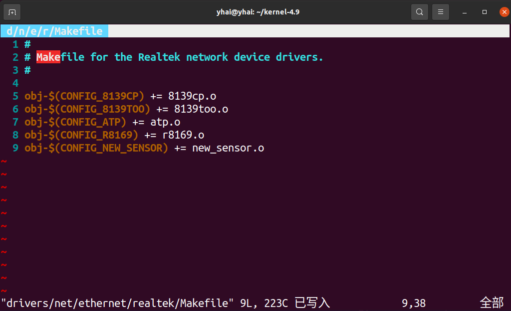
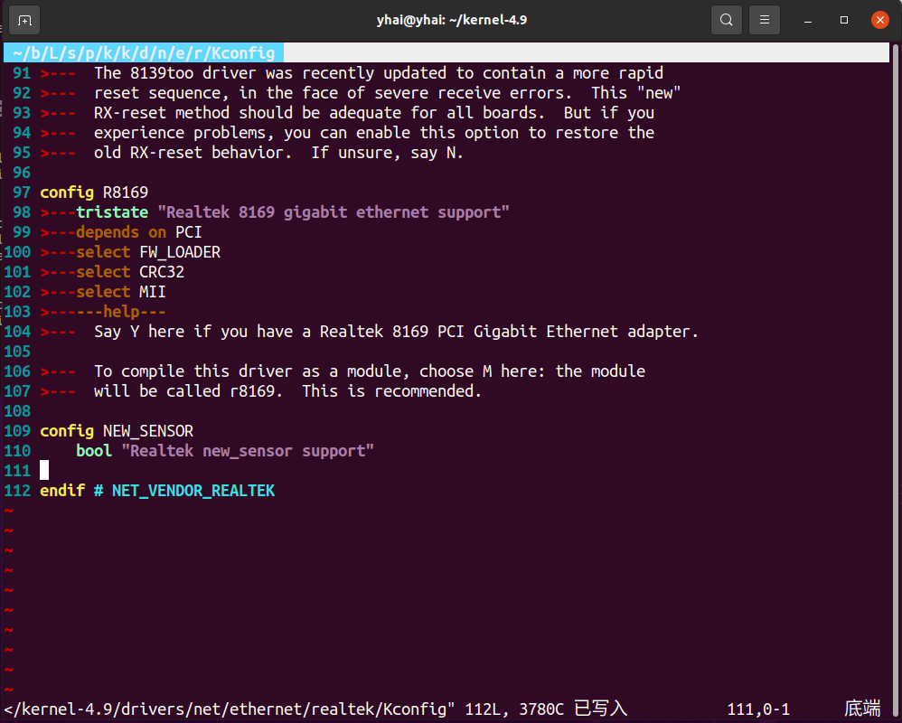
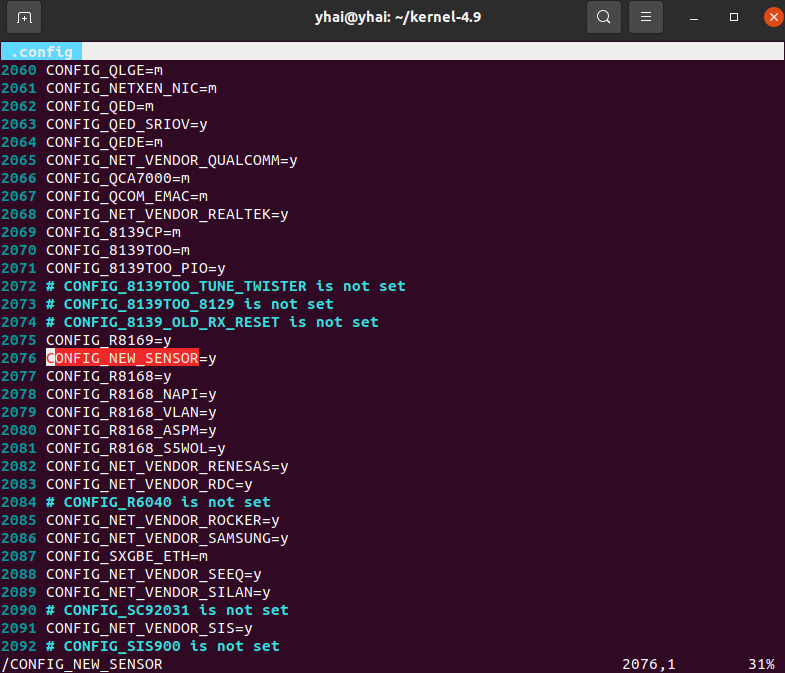

------

> 如何通过修改Makefile以及Kconfig 文件，向原项目中添加新驱动（非侵入式）的一个简单例子

1、首先，假设现在我们要将一个`realtek`的某个网卡驱动添加进项目代码中，我们先将该`.c`文件移动到目录`drivers/net/ethernet/realtek/`下，然后分别修改Makefile和Kconfig 文件如下（NEW_SENSOR为新增文件）：

2、执行命令`make menuconfig`，此时在弹出的菜单中进入到如下路径，并打开对该驱动的支持如下图所示：

3、查看`.config`文件，检查该驱动的配置是否被添加上，下图显示已经成功添加：

4、总结

大型项目的编译往往由最顶层Makefile和子目录下面的众多Makefile管理，底层的Makefile一般比较简单（通过配置菜单界面生成的.config文件中的变量，来决定哪些文件参加编译），通过修改底层目录的Makefile和Kconfig文件，可以添加第三方驱动。