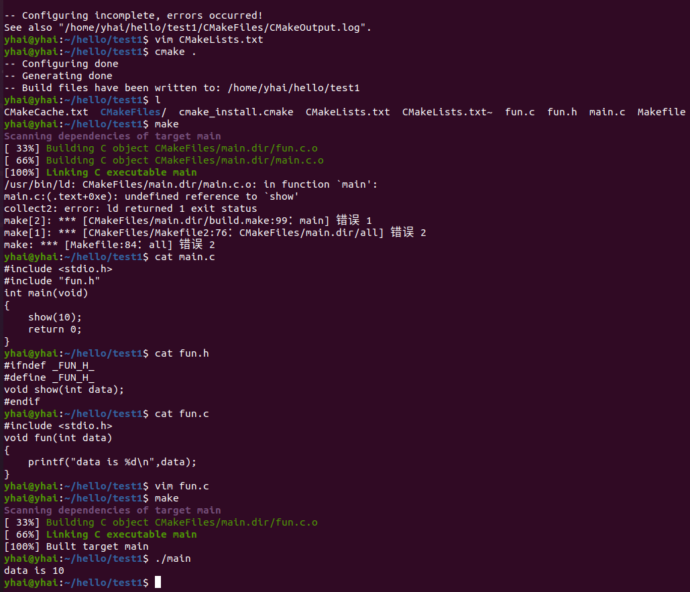

#### 涉及多文件时，如何编辑CMake中的命令

```c
//main.c
#include <stdio.h>
#include "fun.h"
int main(void)
{ 
  show(10);
  return 0;
}	
//fun.h
#ifndef _FUN_H_
#define _FUN_H_
void show(int data);
#endif	

//fun.c
#include <stdio.h>
#include "fun.h"
void show(int data)
{
   printf("data is %d\n", data);
}
```

以上为三个不同文件，相互关联

以下为CMake命令：

```cmake
//CMakeLists.txt 版本1 -> 直接指定源文件
cmake_minimum_required (VERSION 2.8) #// cmake的最低版本要求是2.8，我们安装的是3.10.2
project (demo) #//工程名
add_executable(main main.c fun.c) #//根据源文件main.c fun.c 生成执行文件main

//CMakeLists.txt 版本2 -> 用变量 存放编译需要的源文件
cmake_minimum_required (VERSION 2.8) #// cmake的最低版本要求是2.8，我们安装的是3.10.2
project (demo) #//工程名
set( SRC_LIST  #//用变量，存放的文件列表
	 ./main.c
	 ./fun.c
   )
add_executable(main ${SRC_LIST}) #//根据SRC_LIST中的源文件 生成执行文件main

//CMakeLists.txt 版本3 -> 源文件很多时，不用逐个写
cmake_minimum_required (VERSION 2.8) #// cmake的最低版本要求是2.8，我们安装的是3.10.2
project (demo) #//工程名
aux_source_directory(. SRC_LIST) #//把当前目录下的源文件列表，存放到变量SRC_LIST里
add_executable(main ${SRC_LIST}) #//根据SRC_LIST中的源文件 生成执行文件main
```

