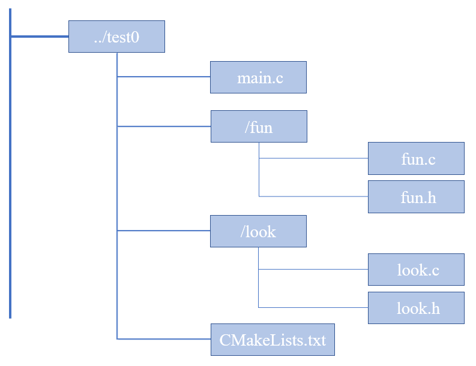

#### 当源文件在不同目录下，如何去写 CMakeLists.txt

1、案列文件目录结构图



2、各文件中代码

**main.c**

```c
//main.c
#include <stdio.h>
#include "fun.h"
#include "look.h"
int main(void)
{
  show(10);
  look();
  return 0;
}
```

**fun.c ,fun.h**

```c
//fun.h
#ifndef _FUN_H_
#define _FUN_H_
void show(int data);
#endif

//fun.c
#include <stdio.h>
#include "fun.h"

void show(int data)
{
   printf("data is %d\n", data);
}	
```

**look.c ,look.h**

```c
//look.h
#ifndef _LOOK_H_
#define _LOOK_H_

void look();

#endif	

//look.c
#include <stdio.h>
#include "look.h"

void look(void)
{
   printf("look go\n");
}
```

**CMakeLists.txt**

```cmake
//CMakeLists.txt 
cmake_minimum_required (VERSION 2.8) #// cmake的最低版本要求是2.8，我们安装的是3.10.2
project (demo) #//工程名

include_directories (fun look)  #//指定头文件的搜索路径（先fun目录，再look目录)

aux_source_directory (fun SRC_LIST_FUN)   #//把fun目录下的源文件列表，存放到变量SRC_LIST_FUN里
aux_source_directory (look SRC_LIST_LOOK) #//把look目录下的源文件列表，存放到变量SRC_LIST_LOOK里
add_executable (main main.c ${SRC_LIST_FUN} ${SRC_LIST_LOOK})
```

