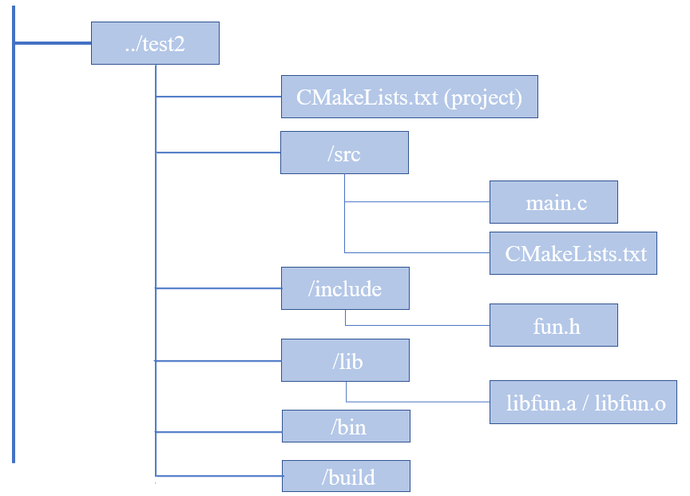

#### 关于如何使用上一步已经生成好的库

1、文件结构示意



2、相关文件内容

**根目录CMakeLists.txt **

```cmake
cmake_minimum_required (VERSION 2.8)
project (demo)
add_subdirectory (src)
```

**main.c**

```c
#include <stdio.h>
#include "fun.h"
int main(void)
{
   show(10);
   return 0;
}
```

**/src 目录中的CMakeLists.txt **

```cmake
aux_source_directory (. SRC_LIST)
include_directories (../include)
link_directories (${PROJECT_SOURCE_DIR}/lib) #//添加非标准的共享库搜索路径
add_executable (main ${SRC_LIST})
target_link_libraries (main fun)  #//连接库(默认链接动态库，无则链接静态库,也可指明链接fun.a)
set (EXECUTABLE_OUTPUT_PATH ${PROJECT_SOURCE_DIR}/bin)#设置输出路径为/bin
```

**fun.h**

```c
#ifndef _FUN_H_
#define _FUN_H_
void show(int data);
#endif	
```

//构建运行

 $ cd build 

$ cmake ..   //进到build 目录后再cmake构建，避免生成中间文件，污染了工程 

$ make 

$ cd ../bin  //执行文件是输出到 bin下   

$ ./main 

------


**以下为GPT回答的一个类似流程**

使用 CMake 生成的库文件通常涉及两个阶段：将库包含到你的项目中，以及在你的应用程序中链接和使用这个库。以下是如何在另一个项目中使用你已经用 CMake 生成的库文件的步骤：

### 1. **将库文件包含到你的项目中**

假设你已经在 `MyLibraryProject` 项目中生成了一个库（无论是静态还是动态库），并且你想在另一个项目中使用它。

#### a. **复制库文件和头文件**

将库的头文件复制到新项目的 `include` 目录中，将库文件（`.a` 或 `.so`/`.dll`）复制到新项目的 `lib` 目录中。你的项目目录可能看起来像这样：

```
NewProject/
├── CMakeLists.txt
├── include/
│   └── mylib.h      # 从MyLibraryProject复制来的头文件
├── lib/
│   └── libMyLibrary.a  # 从MyLibraryProject复制来的库文件
└── src/
    └── main.cpp     # 你的应用程序源文件
```

#### b. **更新 `CMakeLists.txt` 文件**

在新项目的 `CMakeLists.txt` 文件中，你需要添加对头文件和库文件的引用。

```cmake
cmake_minimum_required(VERSION 3.10)
project(NewProject)

# 添加头文件目录
include_directories(include)

# 添加源文件
add_executable(myApp src/main.cpp)

# 添加库目录
link_directories(lib)

# 链接库到你的应用程序
target_link_libraries(myApp MyLibrary)
```

### 2. **在代码中使用库**

在你的 `main.cpp` 或其他源文件中，你可以包含库的头文件并使用它提供的功能。

```cpp
#include "mylib.h"

int main() {
    // 使用库中的函数或类
    myLibraryFunction();
    return 0;
}
```

### 3. **编译和运行你的新项目**

一旦你设置好了新项目的 `CMakeLists.txt` 和源代码，就可以像之前在库项目中那样构建和运行它：

```bash
mkdir build
cd build
cmake ..
make
./myApp
```

### 注意事项

- **动态库的依赖**: 如果你使用的是动态库（`.so` 或 `.dll`），确保在运行时库文件位于系统的库搜索路径中，或者使用如 `LD_LIBRARY_PATH`（Linux）或 `Path`（Windows）环境变量指定库文件的位置。
- **版本兼容性**: 确保应用程序使用的编译器和设置与库文件的生成兼容。编译器的不匹配可能导致链接错误或运行时错误。

使用这种方法，你可以将任何 CMake 生成的库文件集成到新的或现有的项目中。