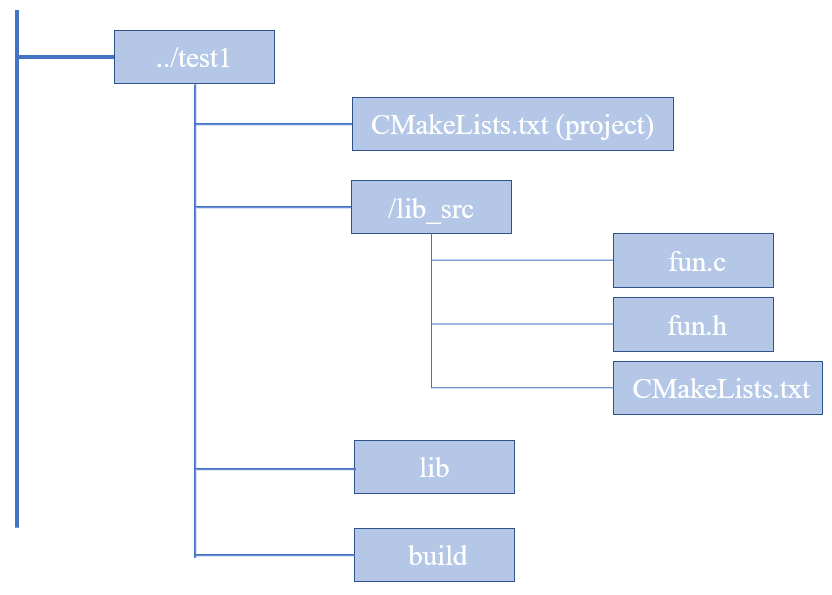

#### 如何使用`Cmake`生成库文件

1、文件结构示意图




2、相关文件内容

**fun.c    fun.h**

```c
#include <stdio.h>
#include "fun.h"
void show(int data)
{
  printf("data is %d\n", data);
}

#ifndef _FUN_H_
#define _FUN_H_
void show(int data);
#endif
```

**根目录下的 CMakeLists.txt**

```cmake
cmake_minimum_required (VERSION 2.8)
project (demo)
add_subdirectory (lib_src)
```

**库源码目录中的CMakeLists.txt**

```cmake
aux_source_directory (. SRC_LIST)
add_library (fun_shared SHARED ${SRC_LIST}) #//根据SRC_LIST的源文件，生成动态库fun_shared，
add_library (fun_static STATIC ${SRC_LIST}) #//根据SRC_LIST的源文件，生成静态库fun_static，
set_target_properties (fun_shared PROPERTIES OUTPUT_NAME "fun") #//设置库的属性（如输出库名 版本号等)
set_target_properties (fun_static PROPERTIES OUTPUT_NAME "fun")
#//指定生成的库文件，存放在工程根目录下的lib目录
set (LIBRARY_OUTPUT_PATH ${PROJECT_SOURCE_DIR}/lib)
```

接着在终端中构建并生成库文件

$ cd build 

$ cmake ..   //进到build 目录后再cmake构建，避免生成中间文件，污染了工程 

$ make 

$ ls ../lib  //生成的库文件，在lib目录下	   libfun.a  libfun.so

------


**以下为GPT回答的一个类似流程**

在 CMake 中生成库文件涉及几个步骤。你可以创建静态库（`.a`文件，Unix系统）或动态库（`.so`文件，Unix系统；`.dll`文件，Windows系统）。以下是一个简单的指南，说明如何使用 CMake 创建这些类型的库：

#### 1. 创建 `CMakeLists.txt` 文件

首先，你需要在项目的根目录下创建一个 `CMakeLists.txt` 文件。这个文件将包含所有必要的配置指令来指示 CMake 如何构建你的项目。

#### 2. 指定最小 CMake 版本

在 `CMakeLists.txt` 文件的开头，指定支持的最低 CMake 版本：

```cmake
cmake_minimum_required(VERSION 3.10)
```

#### 3. 设置项目名

接下来，设置你的项目名称：

```cmake
project(MyLibrary)
```

#### 4. 包含头文件目录

如果你的库需要头文件，使用 `include_directories` 指定它们的位置：

```cmake
include_directories(include)
```

这假设你的头文件存放在项目目录下的 `include` 目录。

#### 5. 搜集源文件

使用 `aux_source_directory` 或手动指定源文件列表：

```cmake
aux_source_directory(src SRC_LIST)
# 或者
set(SRC_LIST src/file1.cpp src/file2.cpp)
```

#### 6. 添加库

使用 `add_library` 指令来创建库。这个指令可以用于生成静态库或动态库：

- **静态库**:
  
  ```cmake
  add_library(MyStaticLibrary STATIC ${SRC_LIST})
  ```
  
- **动态库**:
  
  ```cmake
  add_library(MySharedLibrary SHARED ${SRC_LIST})
  ```

#### 7. 设置库输出路径（可选）

你可以设置输出路径，确保生成的库文件存放在特定位置：

```cmake
set(LIBRARY_OUTPUT_PATH ${PROJECT_SOURCE_DIR}/lib)
```

#### 8. 配置安装规则（可选）

如果你希望安装库和头文件，可以添加安装规则：

```cmake
install(TARGETS MyStaticLibrary DESTINATION lib)
install(DIRECTORY include/ DESTINATION include)
```

#### 9. 生成构建文件

在命令行中，使用以下命令生成构建文件：

```bash
mkdir build
cd build
cmake ..
```

#### 10. 编译库

最后，在生成的构建目录中编译你的库：

```bash
make
```

这些步骤将会创建指定的库文件（静态或动态），你可以将其用于其他应用程序或作为其他项目的依赖。