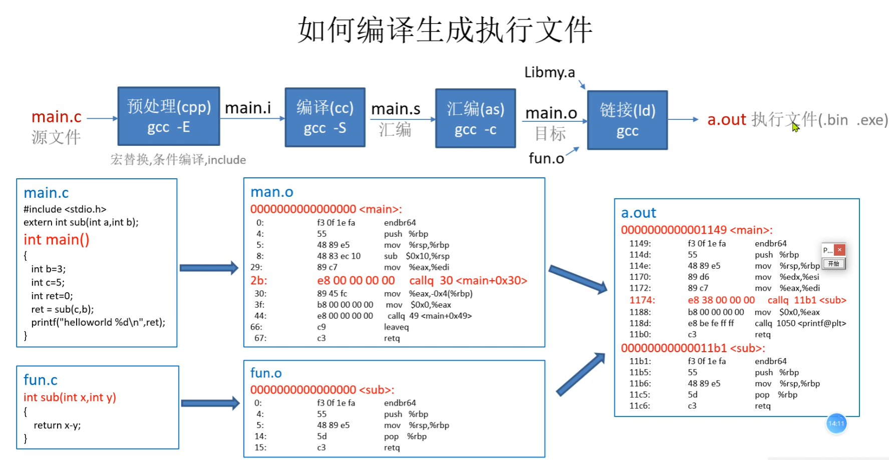

将C语言源代码文件（.c文件）转换成可执行文件（.exe文件）的过程包括以下几个主要步骤：

1. **预处理（Preprocessing）**：
    - 预处理器读取源代码文件并处理所有的预处理指令，如`#include`、`#define`等。预处理器会将宏展开、头文件包含到代码中，并处理条件编译指令。
    - 生成一个扩展名为.i的中间文件，包含所有预处理后的代码。

2. **编译（Compilation）**：
    - 编译器将预处理后的代码转换为汇编语言代码。编译器分析源代码的语法和语义，将高级语言指令转换成等价的汇编语言指令。
    - 生成一个扩展名为.s的汇编语言文件。

3. **汇编（Assembly）**：
    - 汇编器将汇编语言文件转换为机器语言的目标文件（object file）。每个汇编指令都被转换为相应的机器指令（操作码和操作数）。
    - 生成一个扩展名为.o或.obj的目标文件。

4. **链接（Linking）**：
    - 链接器将一个或多个目标文件和库文件组合在一起，生成最终的可执行文件。链接器解决目标文件之间的符号引用，将所有代码和数据段合并，并生成最终的机器代码。
    - 生成一个扩展名为.exe的可执行文件。

具体步骤如下所示：

1. **预处理**：
    ```bash
    gcc -E source.c -o source.i
    ```

2. **编译**：
    ```bash
    gcc -S source.i -o source.s
    ```

3. **汇编**：
    ```bash
    gcc -c source.s -o source.o
    ```

4. **链接**：
    ```bash
    gcc source.o -o executable.exe
    ```

以上是通过GNU编译器（GCC）的示例，实际过程可能根据编译器的不同而有所变化。现代编译器通常将这些步骤集成在一起，用户只需执行一个简单的命令即可完成整个转换过程。例如，使用GCC编译一个C文件到可执行文件，可以直接使用以下命令：

```bash
gcc source.c -o executable.exe
```

这样，GCC会自动完成预处理、编译、汇编和链接步骤，生成最终的可执行文件。

