### 1、宏观

#### 1.1、32位机内存分配图

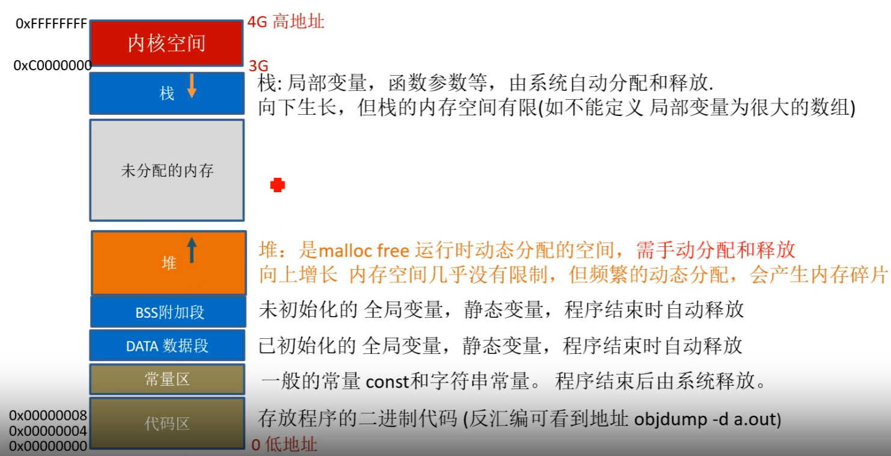


#### 1.2、内存四区

一般来说，内存主要分为如下左图==代码区和数据区==；数据区又分为==静态和动态区==。

右图为C语言中的内存四区的大致分布情况，自下而上地址递增。

<div style="display: flex; justify-content: space-between;">
    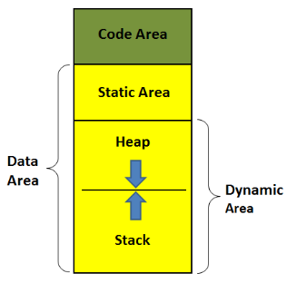
    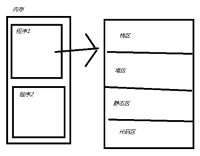
</div>

参考链接：[C语言知识整理（3）：内存管理（详细版） - mattran - 博客园 (cnblogs.com)](https://www.cnblogs.com/yif1991/p/5049638.html)

------

### 2、关于堆

#### 2.1 malloc与free

使用前提：需包含<stdlib.h>

malloc() :申请内存空间，位于堆上

free(): 释放内存空间，使得该空间可以再次被操作系统使用

```c
#include <stdio.h>
#include  <stdlib.h>
int main()
{
   char *pt;
   pt= (char *)malloc(10); //堆上申请空间(malloc的输入参数，是申请空间的字节数)
                           //成功 返回值是申请空间的地址，失败返回NULL;
   if(pt ==NULL){ 
      printf("申请空间失败");
      return -1;
   }
   *pt=0x11;
   *(pt+1)=0x22;
   printf("%x %x %x \n",pt[0],pt[1],pt[2]);
   free(pt); //释放空间，避免内存泄漏
   pt =NULL; //避免野指针 (迷途指针),操作已释放的空间
   return 0;
}

out: 11 22 0
```


如何用函数实现？

法1️⃣：使用不传参函数

```c
#include <stdio.h>
#include <stdlib.h>
#include <string.h>

char * getmemory(void)
{
   char* p = NULL;
   p=(char *) malloc(100); 
   strcpy(p,"hello world");
   return p;
}

int main( )
{
   char *str=NULL;
   str = getmemory(); 
   printf("%s\n",str);
   free(str);
   return 0;
}

out: hello world
```


法2️⃣：用指针的指针

```c
#include <stdio.h>
#include <stdlib.h>
#include <string.h>

void getmemory(char** p)
{
   *p=(char *) malloc(100); 
   strcpy(*p,"hello world");
}

int main( )
{
   char *str=NULL;
   getmemory(&str); 
   printf("%s\n",str);
   free(str);
   return 0;
}
out: hello world
```

最后，

思考以下代码：

```c
//问: 输出结果是什么? 为什么
#include <stdio.h>
#include <stdlib.h>
void GetMemory(char **p,int num){                          
   *p=(char *)malloc(num); 
}  
int main(){
   char *str=NULL;
   GetMemory(&str,100);  
   strcpy(str,"hello");
   free(str);
   if(str!=NULL)
   {
      strcpy(str,"world");
   }   
   printf("\n str is %s",str);
}
```

 答案：输出str is world。

- 进程中的内存管理 是由库函数完成，不是由操作系统。

- malloc时 库函数 会向操作系统申请空间，并做记录 但free时，==库函数 不会把空间马上还给操作系统==，还能继续访问。 

- 但后面可能这个空间分配给别人。 所以==为避免误操作 free(str) 后 需 str=NULL==;


#### 2.2 内存泄露

==case1==: 未配对

```c
 char *pt = (char *)malloc(10); //堆上申请空间，未配对free(pt)
```

==case2==: 丢失地址

```c
char *pt= (char *)malloc(10); 	
pt= (char *)malloc(20); 	//覆盖了指针，导致前面10个空间的地址丢失。
```

==case3==: 未能分级释放; 当涉及结构嵌套时，使用free进行空间释放时，主要必须从嵌套的最深层使用free()

```c
#include <stdio.h>
#include  <stdlib.h>
struct birth
{
   int year;
   int month;
   int day;
};
struct student
{
   char is_male;
   char *name;
   struct birth * bi;
};
int main()
{
   struct student *pt;
   pt= (struct student *)malloc(sizeof(struct student)); //堆上申请空间

   pt->is_male =1;
   pt->name ="wangwei";
   pt->bi = (struct birth *)malloc(sizeof(struct birth)); //堆上申请空间
   pt->bi->year =2000;
   pt->bi->month =3;  
   pt->bi->day =2;  

   printf("%s %d \n",pt->name,pt->bi->day);

  //逐级释放空间，避免内存泄漏
   //pt->name 是字符串常量 不用释放 
   if(pt->bi!=NULL){ 
      free(pt->bi); //先释放子空间
      pt->bi=NULL;
   }
   free(pt); //后释放父空间
   pt =NULL; //避免野指针 (操作已释放的空间)
   return 0;
}	
```

------

### 3 栈相关

#### 3.1 初步跟踪

下面以一简单代码为背景，使用gdb调试来分析函数是如何在栈中被调用，以期加深对c代码执行的理解；代码如下：

```c
#include <stdio.h>

void foo(int a, int b) {
    int c = a + b;
    printf("Result: %d\n", c);
}

int main() {
    int x = 3;
    int y = 4;
    foo(x, y);
    return 0;
}
```

首先，分别依次执行以下命令：

` gcc -g hello.c`

`gdb a.out`

`(gdb) b main`：main函数处打断点

`(gdb) b foo`：foo函数处打断点

`(gdb) r` :运行至main函数处

`(gdb) disas main`:反汇编main函数

下图分别为main函数和foo函数的汇编代码，最左侧为代码地址

<div style="display: flex; justify-content: space-between;">
    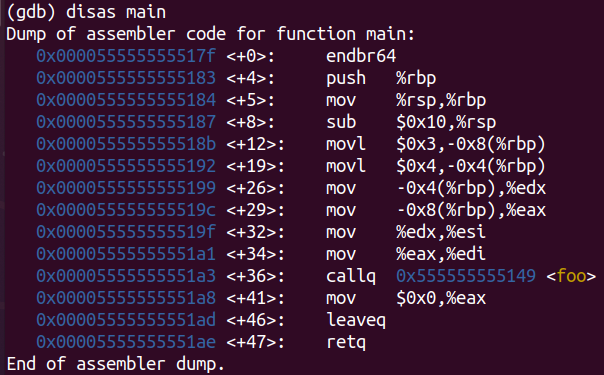
    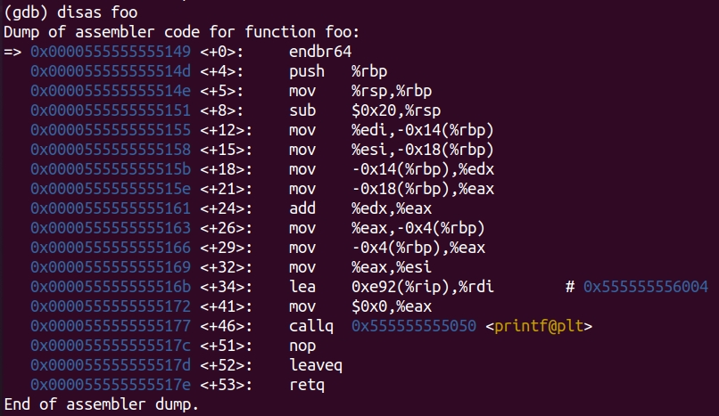
</div>

此刻程序依然在main函数中，下面查看当前栈帧信息，命令如下

`(gdb) i frame`

```html
Breakpoint 1, main () at hello.c:8
8	int main() {
(gdb) i frame
Stack level 0, frame at 0x7fffffffe000:
 rip = 0x55555555517f in main (hello.c:8); saved rip = 0x7ffff7dea083
 source language c.
 Arglist at 0x7fffffffdff0, args: 
 Locals at 0x7fffffffdff0, Previous frame's sp is 0x7fffffffe000
 Saved registers:
  rip at 0x7fffffffdff8
```

**栈帧信息说明**：

`0x7fffffffe000 `为当前栈帧在内存中的起始地址；

`rip = 0x55555555517f` 指令指针寄存器，保存了当前正在执行的指令地址，结合汇编代码可知，其值为main函数地址；

`saved rip = 0x7ffff7dea083` 这是调用此函数时保存的返回地址。即，当`main`函数执行完毕时，程序将跳转回这个地址继续执行；

`Locals at 0x7fffffffdff0` 这个地址是局部变量所在的栈地址；

`Saved registers: rip at 0x7fffffffdff8` 指令指针寄存器存储的值在栈中的地址。


继续步进调试代码，进入`foo`函数，查看栈帧信息：

`(gdb) i frame`

```html
(gdb) i frame
Stack level 0, frame at 0x7fffffffdfe0:
 rip = 0x555555555149 in foo (hello.c:3); saved rip = 0x5555555551a8
 called by frame at 0x7fffffffe000
 source language c.
 Arglist at 0x7fffffffdfd0, args: a=21845, b=1431654909
 Locals at 0x7fffffffdfd0, Previous frame's sp is 0x7fffffffdfe0
 Saved registers:
  rip at 0x7fffffffdfd8
```

**栈帧信息说明**：(解释与main函数不同点)

`called by frame at 0x7fffffffe000` ：这里的`0x7fffffffe000`就是`main`函数的栈帧起始地址，说明本栈帧由main函数栈帧调用；

`saved rip = 0x5555555551a8`：指令指针寄存器存储的值，为函数调用后，主函数中的该被调函数代码的下一句代码的地址，从而实现函数返回后，可以继续执行剩余代码。


使用命令查看地址映射：(可以查看整个程序在系统中内存分配情况)

`(gdb) info proc mappings`

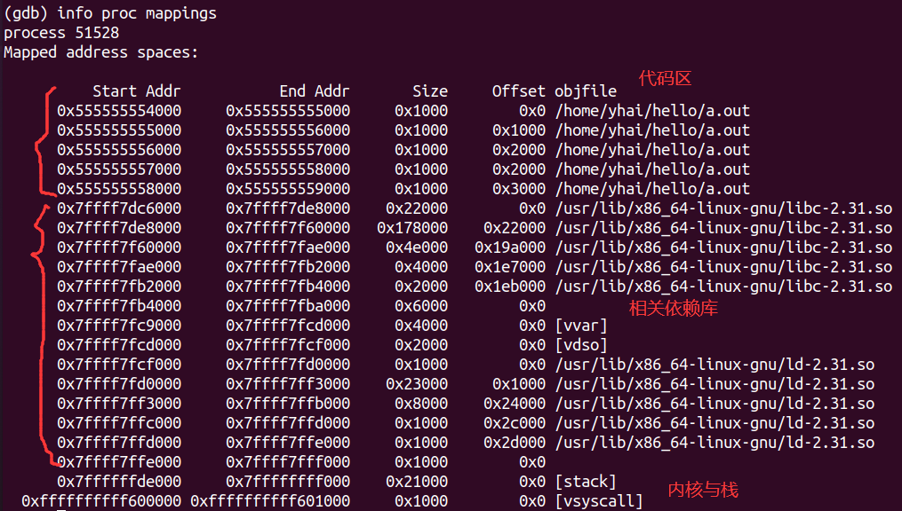


#### 3.2 高级跟踪

==入栈顺序：从下到上，从右至左==，**注意**：下图中的“返回地址”和“前栈栈底rbp”需要颠倒一下。

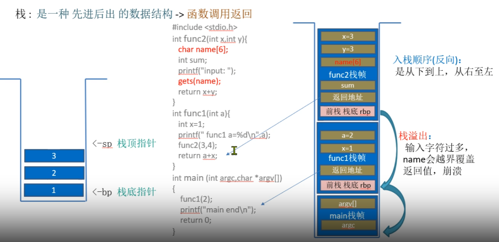

代码如下：

```c
#include <stdio.h>
int func(int x,int y){
   char name[6];
   int sum = 0; 
   printf("Type you name: "); 
   gets(name); //输入字符过多，name会越界，栈溢出崩溃
   return x+y;
}

int main (int argc,char *argv[]) {
    func(3,4);
    return 0;
}
```

注意编译时关闭栈保护：`gcc -g -fno-stack-protector -z execstack  main.c`

反汇编结果如下：

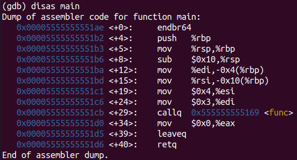

**设置main函数的断点，起初栈中只有main函数信息如下**：（命令：`bt full`）

```bash
(gdb) bt full
#0  main (argc=1, argv=0x7fffffffe0e8) at hello.c:12
No locals.
```

查看此时栈底（`x $rbp`）

```bash
(gdb) x $rbp
0x7fffffffdff0:	0x00000000
```

查看栈顶：

```bash
(gdb) x/8 $rsp
0x7fffffffdfe0:	0xffffe0e8	0x00007fff	0x00000000	0x00000001
0x7fffffffdff0:	0x00000000	0x00000000	0xf7dea083	0x00007fff
```

查看地址映射：（栈起始地址为：`0x7ffffffde000`）

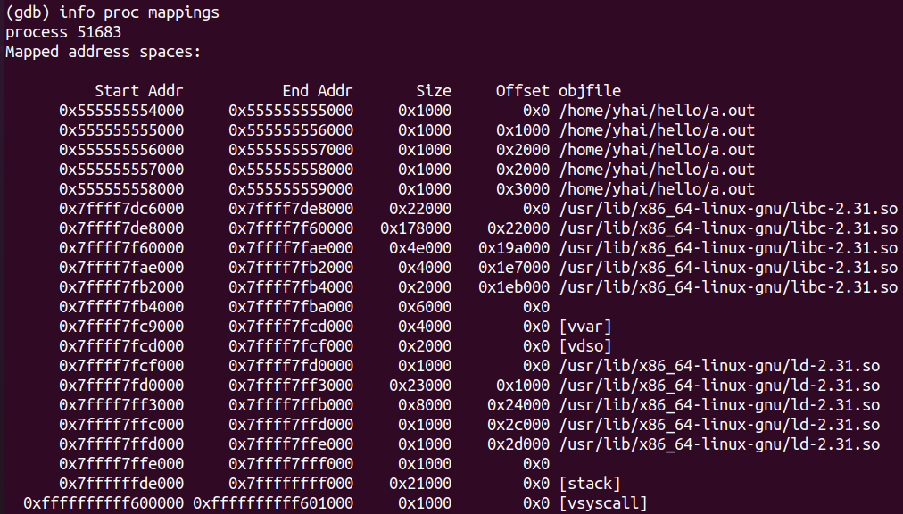

**运行进入func函数， 查看栈帧信息**：

```bash
(gdb) bt full
#0  func (x=21845, y=1431654957) at hello.c:2
        name = "\000\000\340QUU"
        sum = 21845
#1  0x00005555555551d0 in main (argc=1, argv=0x7fffffffe0e8) at hello.c:12
No locals.
```

查看当前栈底：

```bash
(gdb) x/12xw $rbp
0x7fffffffdfd0:	0xffffdff0	0x00007fff	0x555551d0	0x00005555
0x7fffffffdfe0:	0xffffe0e8	0x00007fff	0x00000000	0x00000001
0x7fffffffdff0:	0x00000000	0x00000000	0xf7dea083	0x00007fff
```

查看当前栈的栈顶：

```
(gdb) x/20xw $rsp
0x7fffffffdfb0:	0xffffdfd6	0x00007fff	0x00000004	0x00000003
0x7fffffffdfc0:	0xf7fb72e8	0x00007fff	0x555551e0	0x00000000
0x7fffffffdfd0:	0xffffdff0	0x00007fff	0x555551d0	0x00005555
0x7fffffffdfe0:	0xffffe0e8	0x00007fff	0x00000000	0x00000001
0x7fffffffdff0:	0x00000000	0x00000000	0xf7dea083	0x00007fff
```

查看sum值

```bash
(gdb) x &sum
0x7fffffffdfcc:	0x00005555
```

查看name值

```
(gdb) x &name
0x7fffffffdfc6:	0x51e00000
```

结合以上内容，总结程序栈内容如下

```html
--------4G---------0xFFFFFFFF  高地址
|      -----      | 0xffffffffff601000  
|       内核      |   
|      -----      | 0xffffffffff600000  //内核系统调用 起始地址
|                 |   
========3G=========0xC0000000
|                 |
|-----------------| 0x7ffffffde000  //系统栈的起始地址: 栈是向下生长
|    栈(stack)    |    
|    --------     | 0x7fffffffdff0  //main函数的栈底
|   0x00000001    |   //argc=1   调用main函数时入栈 
|   0x00000000    |   //字节对齐  
|   0x00007fff    |   //argv=0x7fffffffe0e8  指针数组首地址(8字节，64位机，小端)
|   0xffffe0e8    |
|    -------      |   //当main函数栈进完后，会把下一地址存入rbp中，作为新栈的栈底
|   0x00005555    |  //返回地址(0x00005555555551d0)： 调用func后，返回到main的地址
|   0x555551d0    |
|   0x00007fff    | 0x7fffffffdfd0 //func函数的栈底：存储的上一栈的栈底(main函数的栈底 8字节)
|   0xffffdff0    |  
|   0x00005555    |  //sum 局部变量入栈   ->  顺序是从下到上，从右至左，反向进栈
|   0x51e00000    |  //name[6]
|   0x00007fff    |
|   0xf7fb72e8    |  //补全
|   0x00000003    |  //实参拷贝到形参 b=4 a=3; 
|   0x00000004	  |                
|-----------------| 0x7ffffffff000 
|                 |
|      .....      |          
|                 |
|-----------------|
|    堆(heap)     |   
-------------------
|    DATA数据段   | 
-------------------
|                 |
|      -----      | 0x555555558000 
|   代码区(只读)   | 
|      -----      | 0x555555554000  //a.out 程序的 起始地址
|                 | 
-------------------0x00000000 低地址		
```

------

### 4、大小端

这部分关注内容为：数据在内存中存储时，它的地址高低问题；比如对于一个`int`型数据，按照从右到左的顺序，内存地址是增加还是减少？

- 小端（较多采用）：将低序字节存储在起始地址，这称为小端(little-endian)字节序
- 大端：将高序字节存储在起始地址，这称为大端(big-endian)字节序

假如现有一32位`int`型数`0x12345678`，那么其MSB(Most Significant Byte，最高有效字节)为`0x12`，其LSB (Least Significant Byte，最低有效字节)为`0x78`，在CPU内存中有两种存放方式：（假设从地址`0x4000`开始存放），则大小端区别如下：

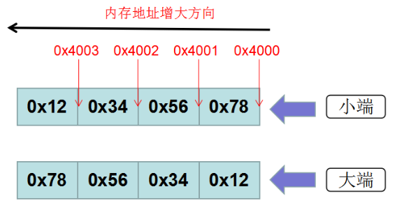

```c
#include <stdio.h>

int main () {
    int a = 0x12345678;
    char* b = (unsigned char *)&a;
    printf("%x\n", *(b+1));
    return 0;
}
out: 56
```

------

### 5、指针偏移

==指针偏移多少是由它指向的数据类型决定==

```c
#include <stdio.h>
int main () {
    int a[5] = {1,2,3,4,5};
    int *ptr = (int *)(&a+1);
    printf("%d, %d\n", *(a+1), *(ptr-1));
    return 0;
}

out:2, 5
```

注意：上面代码中的`&a+1`，这里加一其实地址增加了20个字节，也即偏移了整个数组的大小。

（**这里不要和数组名也是地址搞混淆，记住`&a`表示取整个数组的地址，而`a`只是数组第一个元素的地址**）

当去掉上述代码中的第4行的指针类型强转，也即

```c
#include <stdio.h>
int main () {
    int a[5] = {1,2,3,4,5};
    int *ptr = (&a+1);
    printf("%d, %d\n", *(a+1), *(ptr-1));
    return 0;
}
```

运行出现warning（指针类型不匹配）:

**warning: initialization of ‘int \*’ from incompatible pointer type ‘int (*)[5]’ [-Wincompatible-pointer-types]**

```html
//例:指针偏移 + 类型转换
//问：下题输出信息是？
int a[5]={1,2,3,4,5}; 
int *ptr=(int *)(&a+1); 
	//&a:取数组的地址。    
	//&a+1:下一个对象的地址(对象是 数组类型，长度单位 是 4*5,偏移1个数组的大小),
	//指针的偏移: 是以它指向的对象的数据类型的长度为偏移的单位
	//          指针的类型就像人的身份，你是以个人，还是老板的身份
	//          不同的身份，你的贷款额度不一样
	//(int *): 把指向数组类型的地址，强转为指向int型的地址	                        
	//int 型是4 ，double型是8  数组型是数组长度。	                        
printf("%d,%d",*(a+1),*(ptr-1)); 
	//a: 数组名，是数组首个元素的地址，指向的数据类型是元素的类型 int
	//a+1:  下一元素的地址，即a[1]  (对象是 int类型，长度单位是 4)    
	//*(a+1): a地址偏移1个单位(int 是4)，再取里面内容(int型), 是2
	//ptr: 是指向int型的指针
	//ptr-1: 地址减1个单位(int型是4)
	//*(ptr-1): 取里面内容(int型)   是5
```

### 6、字节对齐

空间换时间，对于一个自定义类型（如struct），==内存大小为其中最大原始类型所占字节的整数倍==

```c
#include <stdio.h>
typedef struct stu
{
   char sex;
   int age;
}stu;
int main(){
  stu s={1,5};
  //问题：如不对齐，长度为5, 取age数据，需要读两次的数据来拼接。
  printf("%d\n",s.age);
  //字节对齐：补空成，类型最大的元素 的整数倍 -> 空间换时间(避免读两次来拼接数据)
  //          sex 补齐3个char 与int想等对齐后，只需读一次 
  printf("%d\n",sizeof(stu));  //8 
  return 0;
}
```

#### 6.1 逐段对齐

下面的第一个结构体中，char类型（1byte）和short（2byte）类型在一起再补上一个字节就正好凑到4字节，完成了与int类型的对齐；

第二个结构体中，更换了数据声明的顺序，导致char和short无法在一起凑到4字节，只能各自部字节数到4；这就导致第二种声明中的结构体占更多的字节数。

```c
typedef struct stu
{
    char sex;
    short num;
    int age;
}stu;	// 1 2补1 + 4 =8

typedef struct stu
{
    char sex;
    int age;
    short num;
}stu;	//1补3 + 4 + 2补2 =12  
```

#### 6.2 带位数指定的逐段对齐

```c
struct s
{
    int i: 8; //占int型里的8位
    int j: 4; //占int型里的4位
    double b; //8
    int a:3;
}; //4补4 +  8 + 4补4  = 24 逐段对齐 
printf("sizeof(s1)= %d\n", sizeof(s2));
```

#### 6.3 带联合体的对齐

```c
typedef struct stu
{
   int num;       //4
   char name[30]; //30  
   char job;			 //1   
   double sex;		 //8
   union    //只分配最大元素的空间（8）
   {
     int grade;	//4
     double d;		//8   类型最大值
   }gorp;
}stu;  //类型最大值8 ，总长51，补成8的倍数 为56
```


### 7、常考的关键字

#### 7.1 `const`

[C语言丨const关键字的用法详解 - 沐歌爱编程 - 博客园 (cnblogs.com)](https://www.cnblogs.com/mu-ge/p/14271878.html)

下面我们从几个方面来说一下`const`的用法：

##### （1）修饰局部变量

> const int n=5;
>
> int const n=5;

这两种写法是一样的，都是表示变量n的值不能被改变了，需要注意的是，用`const`修饰变量时，一定要给变量初始化，否则之后就不能再进行赋值了。

接下来看看`const`用于修饰常量静态字符串，例如：

> const char* str="fdsafdsa";

如果没有`const`的修饰，我们可能会在后面有意无意的写`str[4]='x'`这样的语句，这样会导致对只读内存区域的赋值，然后程序会立刻异常终止。有了`const`，这个错误就能在程序被编译的时候就立即检查出来，这就是`const`的好处。让逻辑错误在编译期被发现。

##### （2）常量指针与指针常量

**常量指针**：指针指向的内容是常量，可以有一下两种定义方式。

> const int* n; //n是一个指向常整型数的指针(指向的整型数不可改，但指针可以)
>
> int const* n;

==需要注意的是一下两点==：

1、常量指针说的是**不能通过这个指针改变变量的值**，但是还是可以通过其他的引用来改变变量的值的。

> int a=5;
>
> const int* n=&a;
>
> a=6;

2、常量指针指向的值不能改变，但是这**并不是意味着指针本身不能改变**，常量指针可以指向其他的地址。

> int a=5;
>
> int b=6;
>
> const int* n=&a;
>
> n=&b;

**指针常量**：指针本身是个常量，不能在指向其他的地址，写法如下：

> int*const n; //n是一个指向整型数的常指针(也就是说，指向的整型数可改，但指针不可改)

需要注意的是，指针常量指向的地址不能改变，但是地址中保存的数值是可以改变的，可以通过其他指向改地址的指针来修改。

> int a=5;
>
> int*p=&a;
>
> int* const n=&a;
>
> *p=8;

区分常量指针和指针常量的关键就在于星号的位置，我们以星号为分界线，如果`const`在星号的左边，则为常量指针，如果`const`在星号的右边则为指针常量。如果我们将星号读作‘指针'，将`const`读作‘常量'的话，内容正好符合。`int const * n；`是常量指针，`int *const n；`是指针常量。

##### （3）指向常量的常指针

是以上两种的结合，指针指向的位置不能改变并且也不能通过这个指针改变变量的值，但是依然可以通过其他的普通指针改变变量的值。

>  const int* const p;

==如何记忆？==

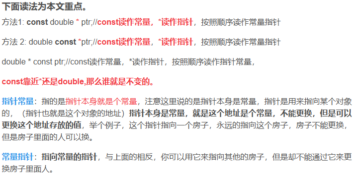

[常量指针和指针常量巧妙记忆方法_指针常量和常量指针的口诀-CSDN博客](https://blog.csdn.net/qq_39736982/article/details/82705026)

##### （4）修饰函数的参数

根据常量指针与指针常量，const修饰函数的参数也是分为三种情况

###### (a) 防止修改指针指向的内容

> void StringCopy(char \*strDestination, const char\* strSource);

其中 `strSource `是输入参数，`strDestination` 是输出参数。给 `strSource` 加上 `const` 修饰后，如果函数体内的语句试图改动 `strSource` 的内容，编译器将指出错误。

###### (b) 防止修改指针指向的地址

> void swap ( int* const p1 , int* const p2 )

指针p1和指针p2指向的地址都不能修改。

###### (c) 以上两种的结合。

##### （5）修饰函数的返回值

如果给以“指针传递”方式的函数返回值加 const 修饰，那么函数返回值（即指针）的内容不能被修改，该返回值只能被赋给加const 修饰的同类型指针。 

例如函数

> const char* GetString(void);

如下语句将出现编译错误：

> char*str = GetString();

正确的用法是

> const char*str = GetString();

------

#### 7.2 `static`

##### （1）静态局部变量

定义静态局部变量，避免了局部变量在退出函数时被销毁；

强调“生存周期”

```c
void count()
{
    static int num = 0; //定义静态局部变量 -> 数据持久(改变生存周期)
                        //底层: 从栈区移到全局数据区,实现持久(程序退出时才释放)
                        //思想: 想数据持久存在，又避免全局变量的强耦合问题
    num++;
    printf("%d\n",num);
}

int main(void)
{
    int i=0;
    for (i = 0;i <= 5;i++)
    {
        count();  //能持久保持上一次的值
    }
    return 0;
}
```

##### （2）静态全局变量

定义静态全局变量，使得该变量只能在声明该变量的文件中被使用（只在该文件中是全局的），而在其他文件中访问不到；

强调“作用域”

```c
//---main.c
#include <stdio.h>
void fn();
int num;   //定义 全局变量
//static int num; //定义静态全局变量(限定仅本文件内 可见)
                  //底层: 存储在全局数据区(程序退出时才释放，不像栈和堆)
                  //思想: 避免名字冲突(仅文件内可见),和强耦合(避免全局变量的多文件强耦合)
void main(){
    printf("init num=%d\n",num);  //自动初始化为0
    num =10; 
    printf("main num=%d\n",num);
    fn();
}
//---fn.c
#include <stdio.h>
extern int num; //声明 num 是外部变量
void fn()
{
    num++;
    printf("fn n=%d\n",num);
}
//---使用
$ gcc main.c fn.c //当用static时，链接错误(外部文件 不可访问 static 静态全局变量)
$ ./a.out 
```


##### （3）静态函数

声明静态函数，使得该函数的作用域仅限于声明该函数的文件，起到隐藏隔离（限定作用域）的作用

强调“作用域”

```c
//---main.c
#include <stdio.h>
extern void fn(); //声明 fn 是外部函数
void main(){
    fn();
}
//---fn.c
#include <stdio.h>
//声明为静态函数 -> 隐藏 隔离 保护(外部文件不能访问 改变作用域)                  
//注:在C++中就比较重要，赋予对象，唯一共享的概念
static void fn()  
{
    printf("fn go\n");
}
//---使用
$ gcc main.c fn.c //当用static时，链接错误(外部文件 不可访问 static 静态函数)
$ ./a.out 
```

#### 7.3`volatile`

==声明volatile后，编译器就不会优化，会从内存重新装载内容，而不是直接从寄存器拷贝内容(副本)==

​	               //否则会优化，会读寄存器里的副本，而重新读内存（因寄存器比内存快）

volatile 关键字是一种类型修饰符，用它声明的类型变量表示可以被某些编译器未知的因素更改，比如：操作系统、硬件或者其它线程等。**遇到这个关键字声明的变量，编译器对访问该变量的代码就不再进行优化，从而可以提供对特殊地址的稳定访问。**声明时语法：**int volatile vInt;** 当**要求使用 volatile 声明的变量的值的时候，系统总是重新从它所在的内存读取数据，即使它前面的指令刚刚从该处读取过数据**。而且读取的数据立刻被保存

一般说来，volatile用在如下的几个地方：

- 1）存储器映射的硬件寄存器通常也要加 volatile 说明，因为每次对它的读写都可能由不同意义；
- 2）多任务环境下各任务间共享的标志应该加 volatile；
- 3）中断服务程序中修改的供其它程序检测的变量需要加 volatile；

##### （1）读硬件寄存器时（如某传感器的端口）

```c
//假设某烟雾传感器的 硬件寄存器如下(当又烟雾时报警变为1)
#define GPA1DAT *((volatile unsigned int*)0xE0200084) 
void main(){
 while (1){//反复读取GPA1DAT值，当为1时火灾报警
    if (GPA1DAT) {  //如不加volatile，编译器优化后，变成只读一次，
                   //后面用的是副本数据。一直为0
	fire()      
	break;
     }
 }
}
```

##### （2）多线程中对共享的变量的修改

有些变量是用 volatile 关键字声明的。**当两个线程都要用到某一个变量且该变量的值会被改变时，应该用 volatile 声明，该关键字的作用是防止优化编译器把变量从内存装入 CPU 寄存器中。如果变量被装入寄存器，那么两个线程有可能一个使用内存中的变量，一个使用寄存器中的变量，这会造成程序的错误执行。volatile 的意思是让编译器每次操作该变量时一定要从内存中真正取出，而不是使用已经存在寄存器中的值**

```c
volatile  char  bStop  =  0;  //注意：需声明为volatile，线程2才能通过它停止线程1
                          //如不声明，编译器优化后，变成一直读副本数据。
void thread1(){  
  while(!bStop)  {
    //...一直循环做一些事情
  }  
}
void thread2(){  
   //...处理一些事情后。
   bStop =1; //终止线程2  
} 
```

##### （3）中断中对共享变量的修改

```c
static int i=0; //应加static修饰
int main(void)
{
     ...
     while (1){
	 if (i) { //虽中断中更改了i的值，但因未声明i 是易变的，
		//编译器优化后，导致它读的是副本数据，导致一直循环不退出
	   break;
	 }
    }
}
void interrupt(void)
{
      i=1;  //中断中改变 i的值，但main函数里面读i 的内容时，可能直接从CPU寄存器读，而非内存处
    		//所以有加volatile关键字的必要
}
```

思考🤔：下面函数声明存在什么问题？

```C
int square(volatile int *ptr) 
{ 
   return *ptr * *ptr;  
} 
```

答：因为`*ptr`为易变数据，语句`return *ptr * *ptr;`中的前后两个`*ptr`可能不一样，这就可能导致违背了该函数的初衷，因此要做以下修改：

```c
int square(volatile int *ptr) 
{ 
    int a = *ptr;
    return a * a;  
} 
```

#### 7.4`define`

宏定义

```c
#define money 1000;
```

与`const`相比：

```c
#include <stdio.h>

#define people 380  //宏只是简单替换，没有类型安全检查(可能会产生意料不到的错误)
const int money=380; //const 常量有数据类型,会做类型安全检查(如 const int money="a" 报错),可调试

int main(void)
{
    printf("有 %d 人 获得奖金 %d\n",people,money);
    return 0;
}
```

