#### 1、指针 定义赋值

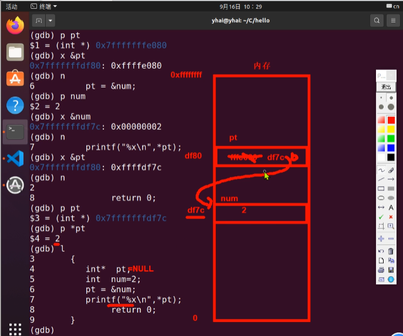

```c
int *p; //定义指针p，为一个指向int型数据的指针，用于存放int型数据的地址
int num = 2; 
p = &num; //将num的地址赋值给p，称p为指向num的指针
```

------

##### 1.1 指针的读

==`*p++`==这里加1要注意，地址和对象严格捆绑，“加1”等价于跳到下一个对象（`int`型则地址加4个字节，`char`型则地址加1个字节，即与数据所占空间大小相关）

```c
#include <stdio.h>
int main()
{
    int* p = NULL;
    int num = 2;
    p  = &num;
    printf("%x\n", p); //读 指针 (指针是个变量，它的存放的是地址)
    printf("%d\n",sizeof(p)); //指针的大小，32位机是4，64位机是8
    printf("%x\n", *p);  //读 指针指向的空间:把指针p 指向的空间的内容取出来
    printf("%x\n",sizeof(*p));//指针指向的类型的大小,这里指向int型，故大小为4
    //取出p指向的空间的内容，再p指针加1，加1（即指向下一个对象，如果是int 则是地址加4个字节）
    //优先级是从右到左，与*(pt++)等价
    printf("%x\n",*p++);    
    printf("%x\n",p);
    return 0;
}
out:
ffffdb3c
8
2
4
2
ffffdb40
```


------

##### 1.2 指针的写

```c
#include <stdio.h>
int main()
{
    int *p = 3;
    int *qt;  //同类型指针
    int x = 9;
    qt = &x;
    p = qt;
    printf("%x %x", *qt, *p);
    return 0;
}
out:
9 9
```

<div style="display: flex; justify-content: space-between;">
    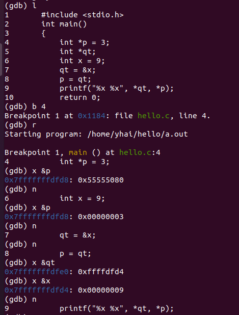
    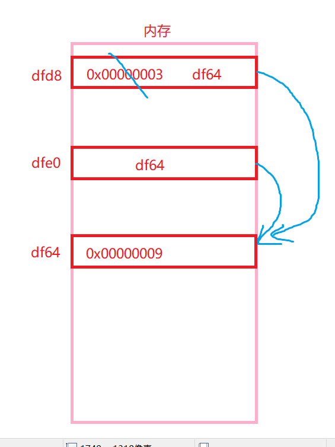
</div>

以上结果为gdb调试，以及对应的手绘内存示意图。


```c
#include <stdio.h>
int main()
{
    int *p;
    int num = 3;
    p = &num;
    char *qt;
    char x = 9; //针对不同类型指针，观察
    qt = &x;
    p = qt;
    printf("%x %x\n", *qt, *p);
    return 0;
}
out:
9 309
```


<div style="display: flex; justify-content: space-between;">
    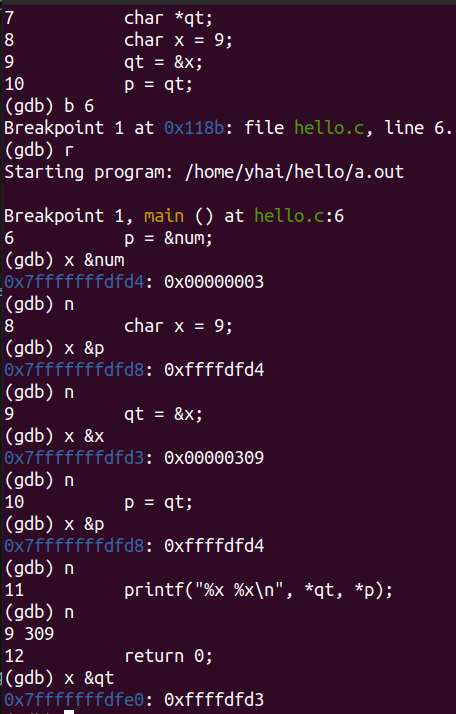
    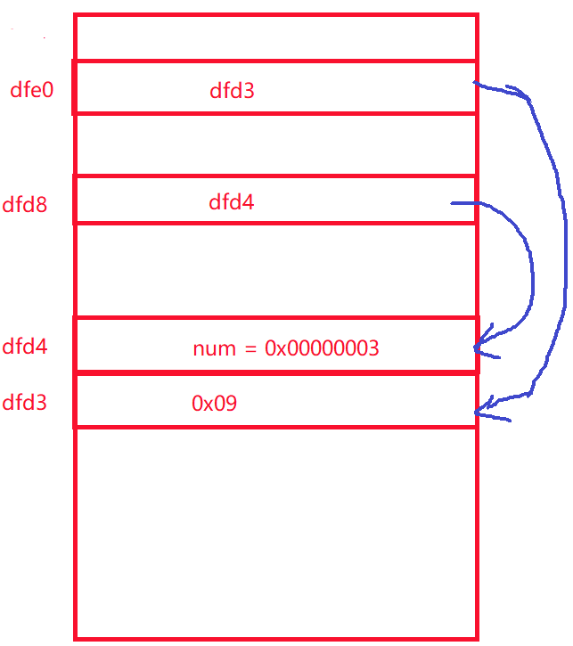
</div>

结合以上调试和内存图，当我们使用int型指针取某地址的内容时，总是会取4个字节的内容；


```c
#include <stdio.h>
int main()
{
    int *p;
    int num = 3;
    p = &num;
    char *qt = 'a';//指向字符常量，使用‘*’取指针指向的内容时会发生段错误
    
    p = qt;
    printf("%x %x\n", *qt, *p);
    return 0;
}
out:
Segmentation Error
```


<div style="display: flex; justify-content: space-between;">
    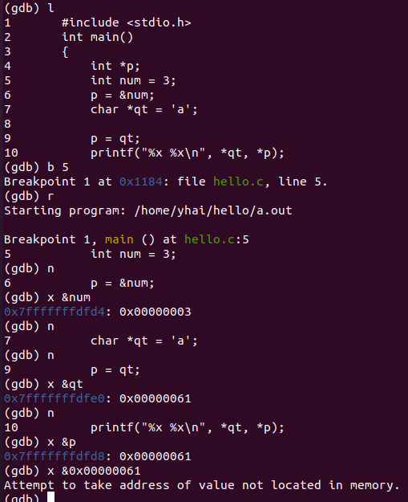
    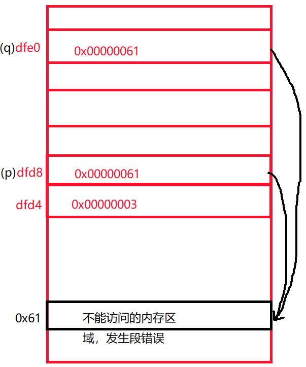
</div>

由于 `qt` 被赋值为 `0x61`（记住代码 `char *qt = 'a'`是直接把`0x61`赋值给`qt`，而不是将其地址给qt），当尝试访问 `qt` 所指向的内容时，会导致内存访问错误，因此会出现 `Attempt to take address of value not located in memory` 的错误信息;若改成

```c
    char *qt;
    char s = 'a';
    qt = &s;
```

则不会出现段错误。


```c
#include <stdio.h>
int main()
{
    int *p;
    int num = 3;
    p = &num;
    char *qt = "abcdef";   
    p = qt;
    printf("%x %x\n", *qt, *p);
    return 0;
}
```

<div style="display: flex; justify-content: space-between;">
    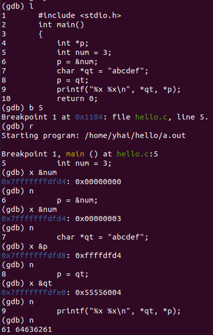
    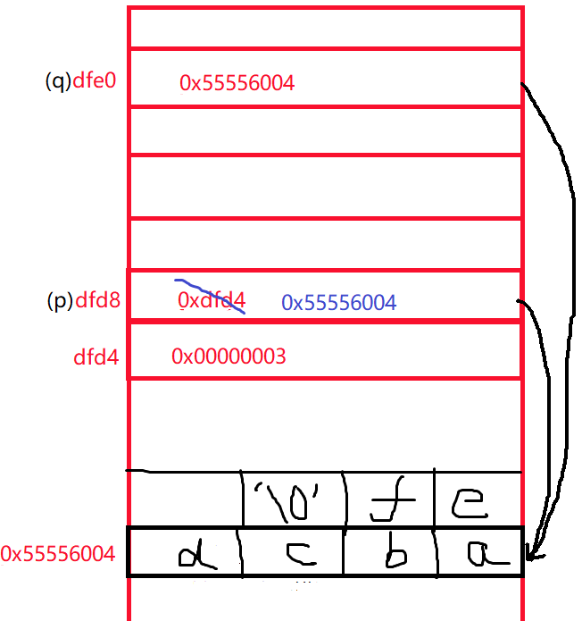
</div>

==为什么使用`char *qt = "a";`就是正确的？==

**字符串字面量**： 在 C 语言中，字符串字面量（如 `"a"`）是在内存中以只读方式存储的字符数组，并且自动在末尾添加一个空字符 `\0`。因此，`"a"` 实际上是一个包含两个字符的数组：`{'a', '\0'}`。

**指针的赋值**： 当你写 `char *qt = "a";` 时，字符串字面量 `"a"` 的地址被赋给了指针 `qt`。`qt` 现在指向字符串 `"a"` 的第一个字符 `'a'`。

------

##### 1.3 类型转换

```c
#include <stdio.h>
int main()
{
    int num=0x12345678;
    int* p=&num;
    char* c=(char *)p;  //把p的 int* 类型 强转为 char* 类型
                    //最好把类型转换加上，否则有些编译器会报错
    printf("%x %x",*p,*c);
    return 0;
}
out:
12345678 78
```

注：*类型转换有较高的风险*

------

#### ChatGPT回答

==**Chatgpt  关于内存计算**==

GB（GigaBytes，千兆字节）和字节（bytes）之间的转换是基于二进制和十进制的关系。通常有两种标准：**二进制**和**十进制**。

**二进制标准（也称为IEC标准）**

在计算机科学中，内存和存储通常使用二进制标准，即每个单位是2的幂。

- **1 KB (KiloByte)** = 2^10 字节 = 1,024 字节
- **1 MB (MegaByte)** = 2^20 字节 = 1,024 KB = 1,048,576 字节
- **1 GB (GigaByte)** = 2^30 字节 = 1,024 MB = 1,073,741,824 字节

**常用转换**

根据二进制标准进行GB到字节的转换：

- **1 GB = 2^30 字节 = 1,073,741,824 字节**

**计算示例**

**二进制标准**：
$
1 \text{ GB} = 2^{30} \text{ 字节} = 1,073,741,824 \text{ 字节}
$
$
4 \text{ GB} = 4 \times 2^{30} \text{ 字节} = 4,294,967,296 \text{ 字节}
$

==Chatgpt 关于指针大小(不同位数系统中)==

**32位系统**：在32位系统中，指针（无论它指向的类型是什么）都占用4个字节。因为32位系统的地址空间是4GB，所以需要32位（4字节）的指针来表示任意内存地址。

**64位系统**：在64位系统中，指针占用8个字节。这是因为64位系统的地址空间大大扩展了，可以访问更大的内存地址，所以需要64位（8字节）的指针来表示。

==Chatgpt 解释GDB调试过程中的地址为什么只显示48位==


在64位系统中，虽然理论上可以使用64位地址，但实际中常见的地址是48位。这是由于以下原因：

1. **物理地址空间限制**：
   - 现代64位处理器通常使用48位的虚拟地址空间。这是因为64位地址空间（`2^64`字节）太大，当前的硬件不需要这么多。
   - 使用48位地址空间（`2^48`字节）已经可以支持256 TB的内存，这足以满足当前和近期的需要。
2. **虚拟地址和物理地址**：
   - 虚拟地址空间和物理地址空间的大小受限于CPU和操作系统的设计。48位虚拟地址空间减少了页表的大小和复杂性。
   - 大多数操作系统和硬件平台不会使用全部64位地址空间来避免管理和性能上的开销。
3. **地址格式**：
   - 64位地址中通常只有48位被有效使用，高16位通常为符号扩展位。
   - 在GDB中看到的地址`0x7fffffffdfdc`就是48位虚拟地址，符合当前处理器和操作系统的设计。

总结：

- 在64位系统中，地址通常是48位，这足以支持大规模内存而不会增加额外的管理负担。
- GDB显示的地址`0x7fffffffdfdc`是48位虚拟地址，反映了实际使用的地址空间大小。

------


#### 2、数组 定义赋值

```c
#include <stdio.h>
int main()
{
    int a[4]={9,5,2,7}; //定义数组a(长度为4,即有4个元素)，并赋初值(a[0]=9 a[1]=5 a[2]=2 a[3]=7) 
                        //越界赋值：如 int a[4]={9,5,2,7,8};  (多了一个，编译会报错，或8赋值失效) 
                        //自适应长度:  int a[]={9,5,2,7,8};                  	                    
    printf("%d ",a[0]); //读 数组的元素 (通过元素的序号  从零开始)	 
                        //越界读: a[4]  指向未知值  
    a[0]=3;     //改 元素值
                //越界改: a[6]=8;  对未知区域赋值，风险很大，可能段错误，                                 
    printf("%x %x ",a, &a[0]); //读 数组名a(数组的首地址) ,&a[0](第一个元素的地址)  
    printf("%d ",sizeof(a));    //整个数组长度(求a 指向的数据类型 所占的内存区域长度)
    printf("%d ",sizeof(&a[0])); //地址的长度
    printf("%d \n",sizeof(a[0]));  //第一个元素的长度
    //遍历数组: 读 数组的所有元素
    int i;
    for(i=0;i<sizeof(a)/sizeof(a[0]);i++){//sizeof(a): 整个数组长度(占的字节数)   sizeof(a[0]):第一个元素的长度
                                    //sizeof(a)/sizeof(a[0]): 元素个数   	 
        printf("a[%d]=%d\n",i,a[i]);
    }
    return 0;
}
out:
9 ffffdb30 ffffdb30 16 8 4 
a[0]=3
a[1]=5
a[2]=2
a[3]=7

```

注：数组名就是数组的首地址

------


#### 3、指针数组互换

##### 3.0 数组和指针关系的注意点（字符串）

1、使用指针

```c
#include <stdio.h>
int main()
{
    char *a = "abcdef";
    printf("%c\n", a[0]);
    char *pc = a;
    //*(a+1) = 'w'; //错误，因为指针指向常量区，只能读不能写；如果
                    //将第一行改成 char a[] = "abcdef",则可以修改；
    printf("%c\n", a[1]);
    return 0;
}
```

<div style="display: flex; justify-content: space-between;">
    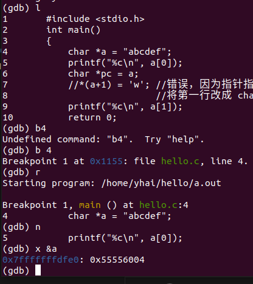
    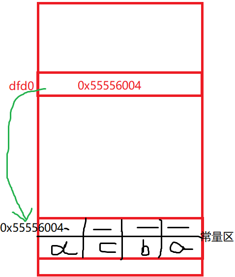
</div>

- 由于a指向常量区，常量区不可写；
- 根据gdb调试可知，指针a存储的内容为：`0x55556004`,为常量区的地址；
- `a` 是一个指向字符串常量 `"abcdef"` 的指针；

2、使用数组

```c
#include <stdio.h>
int main()
{
    char a[] = "abcdef";
    *(a+1) = 'w';
    printf("%c\n", *(a+1));
    return 0;
}
```

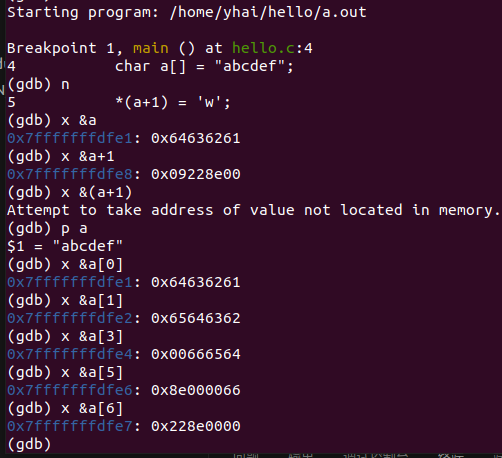

- 使用数组形式时，`a` 是一个字符数组，数组的内容是字符串 `"abcdef"` 的副本；
- 字符数组的内容存储在栈上或全局/静态内存中（取决于数组的声明位置），可以安全地修改；

==为什么调试过程中使用的‘x &a+1’会使得地址直接加了7==

在调试过程中使用的命令 `x &a+1` 会使得地址直接加7，这是因为 `&a` 的类型是 `char (*)[7]`，即指向一个包含7个字符的数组的指针。

这里举另一个例子说明：

```c
#include <stdio.h>
int main()
{
    int a[] = {1,2};
    printf("%d\n", sizeof(a));
    printf("%x\n",a);
    printf("%x\n",&a);
    printf("%d\n", sizeof(&a));
    printf("%x\n", &a+1);
    return 0;
}
out:
8
ffffdb40
ffffdb40
8
ffffdb48
```

GPT对以上代码现象的回答：

**`printf("%d\n", sizeof(a));`**

- `sizeof(a)` 返回数组 `a` 所占用的总字节数。
- 这里 `a` 是一个 `int` 类型的数组，有两个元素，每个 `int` 通常占用4个字节。
- 因此，`sizeof(a)` 是 `2 * 4` 字节，也就是 `8`。

**`printf("%x\n", a);`**

- `a` 是数组的名称，表示数组的起始地址。

**`printf("%x\n", &a);`**

- `&a` 是数组的地址，与 `a` 是同一个地址。
- 但在C语言中，`a` 和 `&a` 有不同的类型：
  - `a` 的类型是 `int*`，==指向数组的第一个元素==。
  - `&a` 的类型是 `int (*)[2]`，==指向整个数组==。
- ==虽然它们的值相同，但语义上是不同的==。

**`printf("%x\n", &a+1);`**

- `&a` 的类型是 `int (*)[2]`，它是一个指向包含2个整数的数组的指针。
- `&a + 1` 指向数组 `a` 之后的内存地址。
- 由于 `a` 包含2个 `int`，每个 `int` 是4个字节，所以 `&a + 1` 的地址是 `&a` 的地址加上 `2 * sizeof(int)`，即 `8` 个字节。

------

##### 3.1 花式定义

1、指针的指针

```c
a) int num;    //定义变量，变量类型是   int
b) int * pt;   //定义指针, 其指向的类型是 int 
c) int **ppt;  //定义指针的指针，它指向的是指针(其指向的类型是 int) 
               //int *(*ppt);  优先级 从右到左 
               // int *pt;  pt == *ppt; 替换法(用pt 替代*ppt ，则ppt是指向pt 的指针)  
```

最好写成：

`int* pt;`

`int** pt; `

2、指针数组嵌套

```c
d) int a[3];  //定义数组: 数组元素类型是int
e) int (*pa)[3]; //定义数组指针:  其指向的类型是数组(有3个整型数元素)
                 //替换法(用a 替代*pa ，则pa是指向a数组的指针) 
f) int* ap[3]; //定义指针数组: 数组元素的类型是指针(其指向的类型是 int) 
               //(int *) ap[3];  优先级 从右到左,    

g) int* (*apa)[4]; //定义指针数组的指针: 其指向的类型是数组，而数组元素的类型是指针
                   //(其指向的类型是 int)  
```

```c
#include <stdio.h>

int main() {
    int a[3] = {1, 2, 3};
    int (*pa)[3] = &a;
    int* ap[3] = {&a[0], &a[1], &a[2]};//每一元素的类型均为int型指针
    int* (*apa)[3] = &ap;//apa是一个指向数组指针的指针

    // 通过打印来确认指针内容
    printf("a[0]: %d\n", a[0]);
    printf("*pa[1]: %d\n", (*pa)[1]);//这里只有加上小括号以后，才可以将*pa看成数组名
    printf("*ap[2]: %d\n", *ap[2]);
    printf("*ap[2]: %d\n", *(*apa)[1]);//先取数组内容，再用*解指针
    return 0;
}
out:
a[0]: 1
*pa[1]: 2
*ap[2]: 3
*ap[2]: 2
```

- int (*pa)[3];  //数组指针,可以使用a替代(\*pa)，则pa是指向数组a的指针；

- int* ap[3];  //指针数组，将`int *`看做整体，所以该语句为：包含三个int型指针的数组；

3、函数指针

```c
j) int (*pfun)(int);//定义函数指针: 其指向的类型 是函数(该函数有一个整型参数并返回一个整型) 
                  //pfun指针，存放的是函数名(函数代码的起始地址) 
                  //例：
                  //  int add10(int num){
                  //     return num+10;
                  //  }
                  //  int (*pfun)(int); 
                  //  pfun = add10;
                  //  printf("%d",pfun(5));
o) int (*a[10])(int); //定义函数指针数组： 数组的元素类型是函数指针
                      //                 (该函数有一个整型参数并返回一个整型数)
                      //替换法：用pfun 替换 a[10]
                      //    类似 pfun a[10]  数组里存放10个函数指针
```


------


##### 3.2 长度大小

```c
char str1[] = "abc";
char str2[] = "abc";	
printf("%d",str1 == str2); //不等: 因 字符串数组 会分配独立的空间

char *str3 = "abc";
char *str4 = "abc";	
printf("%d",str1 == str2); //相等: 因 指向 相同的字符串常量区域

printf("%d\n", sizeof(str1));  //sizeof 要包含结尾字符\0
printf("%d\n", strlen(str1));  //strlen 遇\0 结束， \0不计入长度

printf("%d\n", sizeof(str3));  //指针的大小
printf("%d\n", strlen(str4));  //动态计算指向的字符串 的大小  \0不计入长度
```

**`sizeof` 和 `strlen` 的区别**

- `sizeof` 计算的是变量的大小，对于指针类型，返回的是指针本身的大小，而不是指向内容的大小。
- `strlen` 计算的是字符串的长度（字符的个数），不包括终止的空字符 `'\0'`。

**字符串常量的存储**

- 在大多数C编译器中，相同的字符串常量可能会被优化为指向同一个地址。也就是说，`str3` 和 `str4` 可能会指向同一个内存地址。

```c
// 将 str 中的小写字母转换成大写字母
void UpperCase( char str[] )   //char str[] 等同与char *str
{
   int i;
   printf("%d\n",sizeof(str)); //指针的大小是4  （64位机是8）

   for(i=0; i<sizeof(str)/sizeof(str[0]); ++i ){
      if( 'a'<=str[i] && str[i]<='z' )
         str[i] -= ('a'-'A' );
   }
}

int main()
{
   char str[] = "aBcDeEfGhijkomN";
   printf("str字符长度为: %ld \n",sizeof(str)/sizeof(str[0]));
   UpperCase(str);
   printf("str=%s \n",str);
   return 0;
}


//解答：
//函数内的sizeof有问题。
//根据语法，sizeof如用于数组，只能测出静态数组的大小，无法检测动态分配的或外部数组大小。
//函数外的str是一个静态定义的数组，因此其大小为6，
//函数内的str实际只是一个指向字符串的指针，没有任何额外的与数组相关的信息，
//因此sizeof作用于上只将其当指针看，一个指针为4个字节，因此返回4。
```


------

##### 3.3 指针数组

对于 `char *strArr[] = {"hello", "world"};` 这种声明方式，我们定义了一个指针数组 `strArr`，其中的每个元素都是一个指向字符串常量的指针。要访问数组中的元素，我们可以使用以下几种方法：

**1. 使用数组下标访问**

`strArr` 是一个指针数组，每个元素是一个 `char*` 类型的指针，指向一个以 null 结尾的字符串。可以使用数组下标来访问每个指针：

```c
#include <stdio.h>

int main() {
    char *strArr[] = {"hello", "world"};

    // 访问第一个字符串
    printf("First element: %s\n", strArr[0]);  // 输出 "hello"

    // 访问第二个字符串
    printf("Second element: %s\n", strArr[1]); // 输出 "world"

    return 0;
}
```

在上面的代码中，`strArr[0]` 和 `strArr[1]` 分别返回指向字符串 `"hello"` 和 `"world"` 的指针。

**2. 使用指针遍历数组**

你可以使用指针来遍历 `strArr` 数组，通过指针算术操作访问数组中的元素：

```c
#include <stdio.h>

int main() {
    char *strArr[] = {"hello", "world"};
    char **ptr = strArr; // 指向指针数组的指针

    // 遍历数组中的元素
    for (int i = 0; i < 2; i++) {
        printf("Element %d: %s\n", i, *(ptr + i)); // 输出 "hello" 和 "world"
    }

    return 0;
}
```

这里，`ptr` 是一个指向 `char*` 的指针，`*(ptr + i)` 访问了数组中的第 `i` 个指针（即第 `i` 个字符串）。

**3. 通过指针间访问**

可以使用指针对数组元素进行间接访问：

```c
#include <stdio.h>

int main() {
    char *strArr[] = {"hello", "world"};
    char **ptr = strArr; // 指向指针数组的指针

    // 通过指针间接访问元素
    printf("First element: %s\n", *ptr);        // 输出 "hello"
    printf("Second element: %s\n", *(ptr + 1)); // 输出 "world"

    return 0;
}
```

在这里，`*ptr` 是 `strArr[0]`，而 `*(ptr + 1)` 是 `strArr[1]`。

**4. 使用指针和下标运算结合**

你还可以结合指针和数组下标运算：

```c
#include <stdio.h>

int main() {
    char *strArr[] = {"hello", "world"};
    char **ptr = strArr; // 指向指针数组的指针

    // 使用指针和下标运算
    printf("First element: %s\n", ptr[0]); // 输出 "hello"
    printf("Second element: %s\n", ptr[1]); // 输出 "world"

    return 0;
}
```

在这里，`ptr[0]` 和 `ptr[1]` 分别等于 `*(ptr + 0)` 和 `*(ptr + 1)`，即 `strArr[0]` 和 `strArr[1]`。

==【问：int型和char型指针数组在取数组内容时，有什么不同之处，为什么？】==

==chatgpt回答：==

`char*` 类型指针数组

```c
#include <stdio.h>

int main() {
    char *strArr[] = {"hello", "world"};

    // 访问字符串的地址
    printf("Address of strArr[0]: %p\n", (void*)strArr[0]);
    printf("Address of strArr[1]: %p\n", (void*)strArr[1]);

    // 访问字符串内容
    printf("Content of strArr[0]: %s\n", strArr[0]);
    printf("Content of strArr[1]: %s\n", strArr[1]);

    return 0;
}
```

- **地址**：`strArr[0]` 和 `strArr[1]` 是 `char*` 类型的指针，指向字符串的起始地址。在打印这些指针的地址时，输出的是字符串常量在内存中的地址。
- **内容**：打印 `strArr[0]` 和 `strArr[1]` 时，`printf` 将这些指针解释为 C 字符串，并输出字符串的内容。

`int*` 类型指针数组

```c
#include <stdio.h>

int main() {
    int x = 10;
    int y = 20;
    int *intArr[] = {&x, &y};

    // 访问整数的地址
    printf("Address of intArr[0]: %p\n", (void*)intArr[0]);
    printf("Address of intArr[1]: %p\n", (void*)intArr[1]);

    // 访问整数内容
    printf("Value at intArr[0]: %d\n", *intArr[0]);
    printf("Value at intArr[1]: %d\n", *intArr[1]);

    return 0;
}
```

- **地址**：`intArr[0]` 和 `intArr[1]` 是 `int*` 类型的指针，指向整数变量 `x` 和 `y` 的地址。打印这些指针的地址时，输出的是整数变量在内存中的地址。
- **内容**：打印 `*intArr[0]` 和 `*intArr[1]` 时，`printf` 将这些指针解引用，输出整数值。

==【问：为什么一个要对指针解引用，而另一个不用？】==

==答：==

1. **字符串与字符指针（`char*`）**

在C语言中，字符串实际上是一个以 `\0`（null）字符结尾的字符数组。一个 `char*` 类型的指针指向一个字符数组的起始位置，也就是字符串的首地址。

当我们打印 `char*` 类型的指针时，例如使用 `printf("%s", strArr[0]);`，`printf` 函数会将这个指针解释为一个指向字符串的指针，然后自动从这个地址开始，逐字节读取字符并输出，直到遇到 `\0` 终止符。这种情况下，不需要显式地对指针进行解引用，==因为 `printf` 的 `%s` 格式符已经预期指针指向的是一个字符串并自动处理。==

```c
char *strArr[] = {"hello", "world"};
printf("%s", strArr[0]);  // 直接输出 "hello"
```

这里的 `strArr[0]` 是一个 `char*` 类型的指针，==`printf` 会自动处理并输出指向的字符串内容，因此不需要显式的解引用。==

2. **整数指针（`int*`）**

当我们想要输出指针指向的整数值时，需要对指针进行解引用。解引用操作通过 `*` 运算符来完成，它从指针指向的内存地址中取出实际存储的整数值。

```c
int x = 10;
int *intArr[] = {&x};
printf("%d", *intArr[0]);  // 输出 10
```

3. **原因总结**

- **字符指针 (`char*`)：** 当我们打印 `char*` 指针时，==由于 `printf` 的 `%s` 格式符能够自动识别并处理指针所指向的字符串（即读取字符直到 `\0` 终止符），因此不需要手动解引用==。
  
- **整数指针 (`int*`)：** 整数指针只是指向整数的内存地址。为了访问和输出这个整数的值，我们必须显式地对指针进行解引用。==`printf` 的 `%d` 格式符期望的参数是一个整数，而不是指针，因此需要通过 `*` 操作符来解引用指针，获取它指向的整数值。==


------


##### 3.4 多维数组

二维数组是C语言中常用的数据结构，它可以理解为一个数组的数组，用来存储具有行和列两维特征的元素。我们可以通过 `char` 类型和 `int` 类型的二维数组来理解它们的特点和使用方式。

1. **`char` 类型的二维数组**

- **定义**：`char` 类型的二维数组用于存储字符数据，比如一个文本块或者字符串数组。每个元素占用一个字节。
  
  ```c
  char grid[3][4];
  ```

  这里，`grid` 是一个 3 行 4 列的字符矩阵，可以存储 12 个字符。

- **用途**：常见用途包括存储多个字符串（如文本行）或字符矩阵。例如：

  ```c
  char names[2][5] = {"Tom", "Amy"};
  ```

  这是一个可以存储2个最多为4个字符的字符串（包括终止符）的二维数组。

- **访问**：通过行列索引来访问具体的字符。

  ```c
  char firstChar = names[0][0];  // 访问 "Tom" 中的 'T'
  ```

2. **`int` 类型的二维数组**

- **定义**：`int` 类型的二维数组用于存储整数数据，每个元素通常占用4个字节（具体取决于平台）。
  
  ```c
  int matrix[3][4];
  ```

  这里，`matrix` 是一个 3 行 4 列的整数矩阵，可以存储 12 个整数。

- **用途**：常见用途包括数值矩阵存储、表格数据、棋盘状态等。例如：

  ```c
  int scores[3][4] = {
      {85, 90, 78, 92},
      {88, 76, 91, 85},
      {89, 93, 95, 80}
  };
  ```

  这是一个学生成绩表，每行表示一个学生的4门成绩。

- **访问**：通过行列索引来访问具体的整数。

  ```c
  int score = scores[1][2];  // 访问第二个学生的第三门成绩，即 91
  ```


