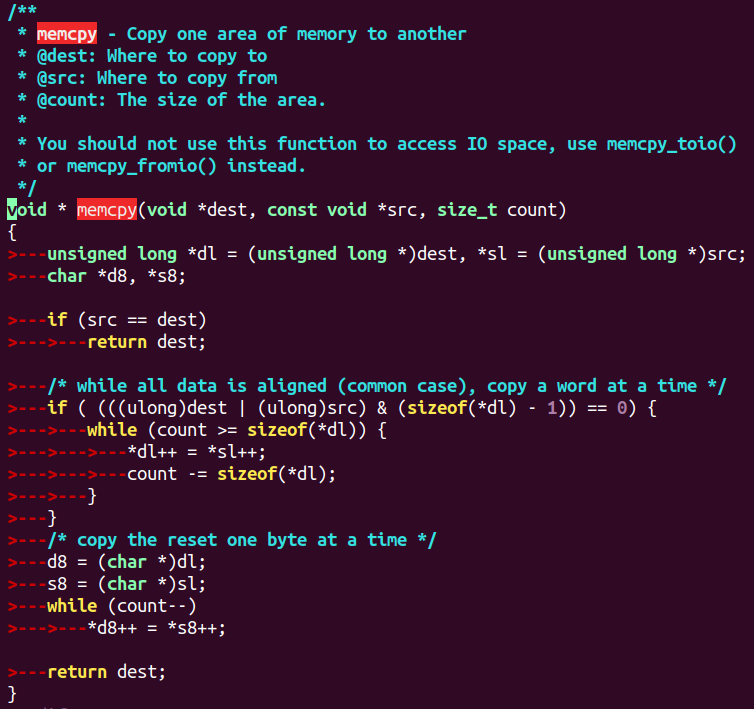

#### 1、string.c文件中涉及到的内存拷贝函数



```c
unsigned long *dl = (unsigned long *)dest, *sl = (unsigned long *)src;
char *d8, *s8;
```
- The function casts the `dest` and `src` pointers to `unsigned long` pointers. This allows for efficient copying in larger chunks (typically 8 bytes at a time, assuming `long` is 8 bytes on the system).
- The `char` pointers `d8` and `s8` are declared for copying byte-by-byte when necessary.

```c
if (src == dest)
    return dest;
```
- This checks if the source and destination pointers are the same. If they are, the function simply returns the destination pointer without copying, as no action is needed.

1. **Aligned Copy (Optimized Case):**
   ```c
   if ((((ulong)dest | (ulong)src) & (sizeof(*dl) - 1)) == 0) {
       while (count >= sizeof(*dl)) {
           *dl++ = *sl++;
           count -= sizeof(*dl);
       }
   }
   ```
   - If the memory addresses of both the source and destination are aligned (i.e., both pointers are divisible by the size of `long`), the function copies data in larger chunks (`sizeof(*dl)`), which improves efficiency.
   - This loop copies data from the source to the destination until fewer bytes than the size of a `long` remain (`count` is reduced by `sizeof(*dl)` each iteration).

2. **Byte-by-Byte Copy (Unaligned Case):**
   ```c
   d8 = (char *)*dl;
   s8 = (char *)*sl;
   while (count--) {
       *d8++ = *s8++;
   }
   ```
   - If the memory is not aligned, the function falls back to copying one byte at a time.
   - Here, the data is copied byte by byte from the source to the destination.


**关于字节对齐的判断**       if ((((ulong)dest | (ulong)src) & (sizeof(*dl) - 1)) == 0)

这句代码的含义是用来判断 `dest` 和 `src` 是否在内存中是对齐的。内存对齐是指数据存储时，其地址是某种数据类型大小的倍数，例如 8 字节的 `long` 类型应当存储在一个地址是 8 的倍数的位置。

我们来逐步解释这一句代码：

```c
if ((((ulong)dest | (ulong)src) & (sizeof(*dl) - 1)) == 0)
```

1. **类型转换 `(ulong)dest` 和 `(ulong)src`:**
   ```c
   (ulong)dest
   (ulong)src
   ```
   - 这里将 `dest` 和 `src` 指针转换为 `unsigned long` 类型（在代码中用 `ulong` 表示）。这样做的目的是为了处理内存对齐的问题，因为 `long` 类型的大小通常是 8 字节，指针通常是 4 或 8 字节。因此，通过转换为 `unsigned long` 类型，我们可以更方便地对齐内存地址进行操作。

2. **按位或操作 `|`:**
   ```c
   (ulong)dest | (ulong)src
   ```
   - 使用按位 OR 运算符将 `dest` 和 `src` 转换后的地址进行按位“或”操作。这是用来检查两个地址的低位是否有冲突。例如，若 `dest` 和 `src` 都不是 8 字节对齐的，可能会导致按位运算后低位不为零，从而不能满足对齐条件。

3. **按位与操作 `& (sizeof(*dl) - 1)`:**
   ```c
   & (sizeof(*dl) - 1)
   ```
   - `sizeof(*dl)` 是计算 `dl` 所指类型的大小。由于 `dl` 是 `unsigned long *` 类型，因此 `sizeof(*dl)` 返回 `long` 类型的大小（通常是 8 字节）。
   - `sizeof(*dl) - 1` 结果是 7（假设 `long` 是 8 字节）。这样做的目的是为了得到一个掩码，可以用来判断地址是否是 8 字节对齐。
   - 按位与操作 `& (sizeof(*dl) - 1)` 用来检查 `dest` 和 `src` 地址的最低几位是否为 0。如果是 0，说明地址是对齐的；如果不为 0，则表示地址没有对齐。

4. **判断是否为 0:**
   ```c
   == 0
   ```
   - 最终判断如果按位与的结果为 0，说明 `dest` 和 `src` 的地址在内存中是对齐的。否则，地址没有对齐。

总结：

这一句代码的作用是检查 `dest` 和 `src` 的内存地址是否对齐（即它们的地址是否都是 `long` 类型的倍数，通常是 8 字节对齐）。如果对齐，它会执行高效的按字节长（`long`）单位复制，否则会转而使用按字节复制的方式。

------

不对齐的情况下，`(ulong)dest | (ulong)src` 的结果的最低位不一定总是 0x07，但它的最低 3 位（即 `& 0x07` 部分）会根据地址的实际情况而变化。为了更好地理解这一点，我们可以从内存对齐的原理来分析。

🚩为什么 `& 0x07` 可以用于检查对齐？

假设我们在 64 位系统上，`long` 类型的大小是 8 字节。内存地址需要是 8 字节的倍数才能对齐。所以，内存地址的最低 3 位会控制该地址是否对齐。具体来说：
- 如果一个地址是 8 字节对齐的，它的最低 3 位是 000。
- 如果一个地址不是 8 字节对齐的，最低 3 位就会是非零值。

🚩对齐和不对齐的详细分析

**对齐的情况：**

对于 `dest = 0x1008` 和 `src = 0x1000`（都已经是 8 字节对齐），它们的最低 3 位是：
- `0x1008` 的二进制表示是 `0001 0000 0000 1000`，最低 3 位是 `000`。
- `0x1000` 的二进制表示是 `0001 0000 0000 0000`，最低 3 位也是 `000`。

按位 OR 操作后的结果是：
```c
0x1008 | 0x1000 = 0x1008
```
最低 3 位仍然是 `000`，表示这两个地址是 8 字节对齐的。

**不对齐的情况：**

假设 `dest = 0x1003` 和 `src = 0x1005`（这两个地址不对齐）。它们的最低 3 位是：
- `0x1003` 的二进制表示是 `0001 0000 0000 0011`，最低 3 位是 `011`。
- `0x1005` 的二进制表示是 `0001 0000 0000 0101`，最低 3 位是 `101`。

按位 OR 操作后的结果是：
```c
0x1003 | 0x1005 = 0x1007
```
最低 3 位是 `111`，表示这两个地址是 **不对齐** 的。

结论：

- **对齐的情况**：地址的最低 3 位会是 `000`，所以 `(ulong)dest | (ulong)src` 的最低 3 位结果是 `000`。
- **不对齐的情况**：地址的最低 3 位会非零（例如 `011`、`101` 等），所以 `(ulong)dest | (ulong)src` 的最低 3 位结果会是非零值，通常是 `011`、`101` 或 `111` 等。

**关键原因**：内存对齐要求特定的数据类型（如 `long` 类型）存放在地址是该数据类型大小的倍数的内存位置，因此对齐的地址最低几位是 `0`，而不对齐的地址的最低几位就会非零。