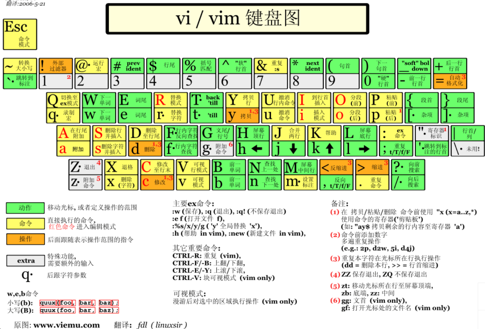
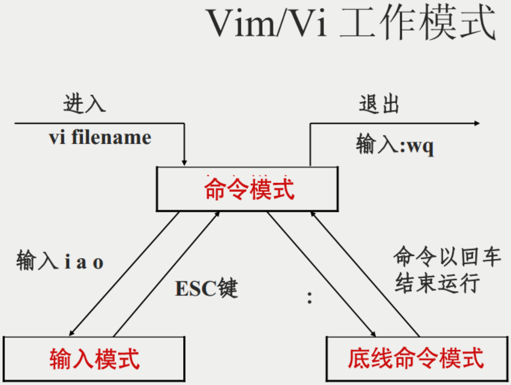

[l史上最全Vim快捷键键位图（入门到进阶） | 菜鸟教程 (runoob.com)](https://www.runoob.com/w3cnote/all-vim-cheatsheat.html)

[Linux vi/vim | 菜鸟教程 (runoob.com)](https://www.runoob.com/linux/linux-vim.html)




==命令模式下，从 windows 复制信息然后粘贴到vim ,使用快捷键组合：ctrl + shift + V ;==

#### 用户刚刚启动vim时，便进入了命令模式

以下是普通模式常用的几个命令：

- **i** -- 切换到输入模式，在光标J当前位置开始输入文本。
- **x** -- 删除当前光标所在处的字符。
- **:** -- 切换到底线命令模式，以在最底一行输入命令。
- **a** -- 进入插入模式，在光标下一个位置开始输入文本。
- **o**：在当前行的下方插入一个新行，并进入插入模式。
- **O** -- 在当前行的上方插入一个新行，并进入插入模式。
- **dd** -- 剪切当前行。
- **yy** -- 复制当前行。
- **p**（小写） -- 粘贴剪贴板内容到光标下方。
- **P**（大写）-- 粘贴剪贴板内容到光标上方。
- **u** -- 撤销上一次操作。
- **Ctrl + r** -- 重做上一次撤销的操作。
- **:w** -- 保存文件。
- **:q** -- 退出 Vim 编辑器。
- **:q!** -- 强制退出Vim 编辑器，不保存修改。

#### 命令模式下，按下i或a或o，则进入输入模式

可通过**ESC**返回到命令模式

在输入模式中，可以使用以下按键：

- **字符按键以及Shift组合**，输入字符
- **ENTER**，回车键，换行
- **BACK SPACE**，退格键，删除光标前一个字符
- **DEL**，删除键，删除光标后一个字符
- **方向键**，在文本中移动光标
- **HOME**/**END**，移动光标到行首/行尾
- **Page Up**/**Page Down**，上/下翻页
- **Insert**，切换光标为输入/替换模式，光标将变成竖线/下划线
- **ESC**，退出输入模式，切换到命令模式

#### 底线命令模式

在命令模式下按下 **:**（英文冒号）就进入了底线命令模式。

底线命令模式可以输入单个或多个字符的命令，可用的命令非常多。

在底线命令模式中，基本的命令有（已经省略了冒号）：

- `:w`：保存文件。
- `:q`：退出 Vim 编辑器。
- `:wq`：保存文件并退出 Vim 编辑器。
- `:q!`：强制退出Vim编辑器，不保存修改。

按 **ESC** 键可随时退出底线命令模式。



#### [**Vim 删除命令的常用方法包括**](https://blog.csdn.net/jiesa/article/details/53319755)[1](https://blog.csdn.net/jiesa/article/details/53319755)[2](https://zhuanlan.zhihu.com/p/358292858)[3](https://blog.csdn.net/guotianqing/article/details/106722407)[4](https://zhuanlan.zhihu.com/p/159458128)[5](https://www.cnblogs.com/zknublx/p/8795789.html):

1. 删除光标所在行：dd
2. 删除从光标所在行开始的n行：dnd，例如：d2d 删除光标所在行及其后1行，共删除2行
3. 删除从光标所在行到文件尾：dG
4. 删除从光标行到文件头：dgg
5. 删除从光标位置到行尾：d$
6. 进入普通可视模式，$选择到行尾，操作符d执行删除
7. 进入行可视模式，j/k/up/down进行上下选择，操作符d执行删除
8. 进入列可视模式，h/l进行列选择，j/k/up/down/linenumG进行行选择，操作符d执行删除


在vim中有3中方法可以==跳转到指定行==（首先进入命令行模式）：

1、ngg/nG （跳转到文件第n行，无需回车）

==2、:n （跳转到文件第n行，需要回车）==

3、vim +n filename （在打开文件后，跳转到文件的第n行


==区域选择 <action>a<object> 或 <action>i<object>==
在visual 模式下，这些命令很强大，其命令格式为

```
<action>a<object> 和 <action>i<object>

action可以是任何的命令，如 d (删除), y (拷贝), v (可以视模式选择)。
object 可能是： w 一个单词， W 一个以空格为分隔的单词， s 一个句字， p 一个段落。也可以是一个特别的字符："、 '、 )、 }、 ]。
假设你有一个字符串 (map (+) ("foo")).而光标键在第一个 o 的位置。

vi" → 会选择 foo.
va" → 会选择 "foo".
vi) → 会选择 "foo".
va) → 会选择("foo").
v2i) → 会选择 map (+) ("foo")
v2a) → 会选择 (map (+) ("foo"))
```


##### 块操作: `<C-v>`

块操作，典型的操作： `0 <C-v> <C-d> I-- [ESC]`

- `^` → 到行头
- `<C-v>` → 开始块操作
- `<C-d>` → 向下移动 (你也可以使用hjkl来移动光标，或是使用%，或是别的)
- `I-- [ESC]` → I是插入，插入“`--`”，按ESC键来为每一行生效。


 

==结合ctag用法==

``` 
vim . //进入目录
Ctrl + ]  //调到定义处
Ctrl + o  //返回上一次位置
          //Ctrl + i  再返回
g f	  //跳到光标停留的include的头文件里(若找不到，则需在.vimrc文件中添加路径，以include为例：set path +=.,~/kernel-4.9/include/**  )	
d w  //删除个字符串
u   //可无限撤销
:cs f f driver.c   //搜索 driver.c 文件
g d   //选中当前光标处的字符串
      //再 n  查找下一个	
ctrl shift  -  s  //查找光标处的字符串
                  // j:下一条  k:上一条  f:下一页  b：上一页  shift+g: 到末尾
:cs f s attach //全局 搜索字符串 attach        
Ctrl+w v   //  垂直分割窗口
           //  Ctrl+w w 可在窗口间切换
           //  Ctrl+w o  只保留当前gd窗口
ctrl +  变大字体
:e  .    //编辑当前目录
:Ve    //在当前窗口左侧新建一个窗口，内容为当前文件所在目录
:Rex  //从文件窗口，返回到该文件所在目录
-       //返回上一级
shift + g //跳转到文件末尾
:noh    // 取消选中
 
zo  //展开本层
zc  //折叠本层
zR  //全部展开
zM  //全部折叠

```

直接搜索某个单词比如`ARCH`：`$ /ARCH`   即可.


生成索引库：

```bash
$ sudo apt-get install vim  ctags cscope
$ cd ~/linux-4.9.140  //进入源码目录   
$ ctags   -R    //生成符号关联  ，无反馈信息，耐心等待
$ cscope -Rbkq  //生成索引库，要点时间，等待一会
```

"$ vim ~/.vimrc   添加vim 的配置文件（若要添加代码快折叠功能，

只需在下面配置的末尾加上：`set foldmethod=indent`）

```
"-------------------------------------------------------------------------------  
"           基本设置  
"-------------------------------------------------------------------------------  
" When started as "evim", evim.vim will already have done these settings.  
if v:progname =~? "evim"  
  finish  
endif   
  
"启用Vim的特性，而不是Vi的（必须放到配置的最前边）  
set nocompatible  
  
" 设置编码    
set encoding=utf-8    
set fenc=utf-8    
set fileencodings=ucs-bom,utf-8,cp936,gb2312,gb18030,big5   
   
"显示行号  
set number  
  
"设置默认打开窗口大小  
"set lines=70 columns=100  
  
"设置窗口透明度  
"set transparency=10  
  
"设置背景色  
"set bg=dark  
  
"用 koehler 调色板  
colorscheme koehler  
  
"隐藏工具栏和滑动条  
set guioptions=aAce      
            
"设置标签栏  
"最多30个标签  
set tabpagemax=30   
"显示标签栏    
set showtabline=2     
       
  
"设定文件浏览器目录为当前目录  
"set bsdir=buffer  
"set autochdir  
  
"保存100条命令历史记录  
set history=100   
      
"总是在窗口右下角显示光标的位置  
set ruler     
      
"在Vim窗口右下角显示未完成的命令   
set showcmd           
  
" 启用鼠标  
if has('mouse')  
  set mouse=a  
endif  
  
"设置语法高亮  
if &t_Co > 2 || has("gui_running")  
syntax on  
endif  
  
  
"-------------------------------------------------------------------------------  
"           文本操作设置  
"-------------------------------------------------------------------------------  
"设置字体  
set gfn=Courier:h15  
  
"设置自动缩进  
"设置智能缩进  
set tabstop=4  
set shiftwidth=4  
set softtabstop=4  
set expandtab  
set smarttab  
  
  
"设置Tab键跟行尾符显示出来  
set list lcs=tab:>-,trail:-  
  
"设置自动换行  
set wrap  
  
"设置Insert模式和Normal模式下Left和Right箭头键左右移动可以超出当前行  
set whichwrap=b,s,<,>,[,]  
  
"设置光标移动到屏幕之外时，自动向右滚动10个字符  
set sidescroll=10  
  
"设置使~命令成为操作符命令，从而使~命令可以跟光标移动命令组合使用  
set tildeop  
  
"在Insert模式下，设置Backspace键如何删除光标前边的字符。这里三个值分别表示空白字符，分行符和插入模式之前的字符。  
set backspace=indent,eol,start  
  
"定义键映射，不使用Q命令启动Ex模式，令Q命令完成gq命令的功能---即文本格式化。  
map Q gq  
  
" CTRL-U 在Insert模式下可以删除当前光标所在行所在列之前的所有字符.  Insert模式下，在Enter换行之后，可以立即使用CTRL-U命令删除换行符。  
inoremap <C-U> <C-G>u<C-U>  
  
"使 "p" 命令在Visual模式下用拷贝的字符覆盖被选中的字符。  
vnoremap p <Esc>:let current_reg = @"<CR>gvs<C-R>=current_reg<CR><Esc>  
  
  
"-------------------------------------------------------------------------------  
"           搜索设置  
"-------------------------------------------------------------------------------  
"打开搜索高亮  
set hlsearch  
  
"忽略大小写  
set ignorecase  
  
"在查找时输入字符过程中就高亮显示匹配点。然后回车跳到该匹配点。  
set incsearch     
  
"设置查找到文件尾部后折返开头或查找到开头后折返尾部。  
set wrapscan  
  
  
"put ctrl+shift+- s for find string
nmap <C-_>s :cs find s <C-R>=expand("<cword>")<CR><CR>
nmap <C-_>g :cs find g <C-R>=expand("<cword>")<CR><CR>
nmap <C-_>c :cs find c <C-R>=expand("<cword>")<CR><CR>
nmap <C-_>t :cs find t <C-R>=expand("<cword>")<CR><CR>
nmap <C-_>e :cs find e <C-R>=expand("<cword>")<CR><CR>
nmap <C-_>f :cs find f <C-R>=expand("<cfile>")<CR><CR>
nmap <C-_>i :cs find i ^<C-R>=expand("<cfile>")<CR>$<CR>
nmap <C-_>d :cs find d <C-R>=expand("<cword>")<CR><CR>  
"auto add cscope.out to vim   如:cs f s 命令不能用   
cs add cscope.out
set csto:0
set cscopetag
set nocsverb
set csverb
"添加内核目录，让你在任意文件下搜索时，都能跳到内核信息
"cs add /home/jetbot/kernel/cscope.out  /home/jetbot/kernel/
"set tags:./tags,tags,/home/jetbot/kernel/tags  
  
"-------------------------------------------------------------------------------  
"           文件设置  
"-------------------------------------------------------------------------------  
  
"设置当Vim覆盖一个文件的时候保持一个备份文件，但vms除外（vms会自动备份。备份文件的名称是在原来的文件名上加上 "~" 字符  
if has("vms")  
  set nobackup         
else  
  set backup          
endif  
  
 
"Enter换行时总是使用与前一行的缩进等自动缩进。  
set autoindent  
"设置智能缩进  
set smartindent         
 
  
  
"编辑一个文件时，你所编辑的内容没保存的情况下，可以把现在的文件内容与编辑之前的文件内容进行对比，不同的内容将高亮显示  
if !exists(":DiffOrig")  
  command DiffOrig vert new | set bt=nofile | r ++edit # | 0d_ | diffthis  
          \ | wincmd p | diffthis  
endif
```

