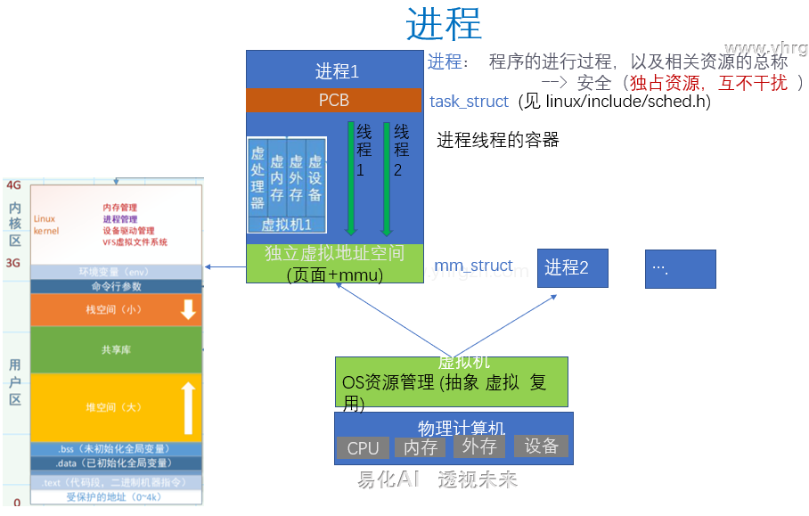
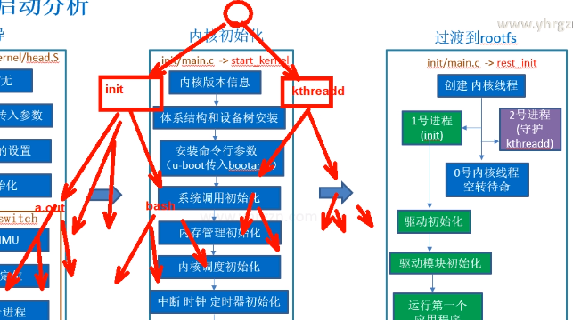

> 2024/12/15
>

过了第一遍内核移植的视频，发现前面的一些知识（如：内核源码分析、make的编译过程、Makefile文件的理解）全部在这里串了起来，解释如下：

首先，内核移植是一个较复杂的工程，这里“复杂”的程度取决于移植内核版本的跨度，跨度越大则难度就越大。刚开始学习移植时，为降低移植难度，在Linux官网上下载和原系统同一分支的内核版本，得到内核源码后，导入英伟达板子的官方配置（要确保相关文件目录中拷贝了-tegra-defconfig-文件，才能使用`make defconfig`，配置自动导入到`.config`文件），然后`time make Image -j5`进行编译。

接着用编译好的内核替换原系统的内核（省略一些操作），重启后发现内核启动日志有版本信息，但卡在了某个位置，无法进入文件系统。下面为排查问题过程（调试思路），

- 获得系统正常启动以及换内核后异常启动的内核日志信息（注意，可以取消内核日志信息输出的quiet模式），==使用软件对比两个日志信息的不同处==，这里要求==对内核启动信息有一定的掌握==；
- 通过修改内核源码中的日志信息打印函数，可以添加打印信息所处的文件位置和行号，方便进行修改；
- 对比后，尝试对出问题的部分代码注释后再编译调试（==最好使用非侵入式，也即不修改源码，而是使用`make menuconfig`取消相关配置==）；
- 结合问题内核信息的报错内容，考虑设备树的问题，尝试移植官方设备树到新的Linux内核源码中（因为Linux官网下载的内核设备树没有现在板子对应的设备树），这部分考验设备树编译的理解，如何移植是个问题，==有必要进一步搞清楚Makefile在大型项目中的工作原理==

下一步，1）回顾一下内核源码；

​			 2）理解Makefile，及其移植原理。

------

> 2024/12/16

众多的Kconfig 文件代码其实是构成了源码顶层目录中，用来配置.config 的图形菜单界面；注意到某些驱动配置所对应的Konfig文件位置是源码driver目录下，也即这部分和芯片的体系架构无关。此外，在菜单中进行配置修改时，Kconfig文件内容是不会改的，而是将修改内容输出/保存/加载到同级目录下的.config文件中。

大型项目的编译往往由最顶层Makefile和子目录下面的众多Makefile管理，底层的Makefile一般比较简单（通过配置菜单界面生成的.config文件中的变量，来决定哪些文件参加编译），通过修改底层目录的Makefile和Kconfig文件，可以添加第三方驱动。


> 2024/12/18

学习了设备树的基本概念；

了解了内核中与设备树相关的代码；

要明确一点，==已经编写好的设备树文件中是包含所有外设的硬件地址信息==；

在板子启动的u-boot阶段，会将设备树文件加载到内存中，然后这段内存的地址会由bootargs传给内核，内核中的代码首先会对这段dtb文件校验（校验不通过直接卡死），校验通过并读取这段代码内容以后，内核便知道了有哪些外设以及他们的地址信息、中断信息等，由此进行下一步的对外设的驱动。


> 2024/12/24

1、多次遇到U盘中的文件系统崩溃，考虑换个u盘试试；

2、尝试使用了另一个u盘，任然遇到文件系统问题；后来尝试将u盘作为扩展盘挂载使用，起初可以正常挂载，但没过多久后，挂载时报“签名丢失问题”，导致u盘又无法使用；

3、现在基于以上操作过程及现象，考虑问题可能出现在机器的usb口；再结合机器之前使用板载SD卡启动时没有出现过问题，于是考虑使用该SD卡接口；

4、基于3，得到新的问题：该SD卡作为挂载使用还是作为启动盘呢？

​	为了启动速度，选择挂载使用（事实上，如果想进一步作为启动盘，还是只要修改文件系统加载路径即可，也即修改/boot/extlinux/路径下的extlinux.conf文件中的bootargs变量中的启动参数即可）；所以，下一步重点在于先烧一个可以识别mmc1的系统到板子上，这个系统最好支持ramdisk，方便后期测试设备树。（27号把这个做了）


> 2024/12/29

1、成功烧写一个可以识别mmc1的系统到板子上，但内核启动时会出现下面的问题（内核会reboot直至进入系统，会耗点时间，但也能启动并挂载SD卡，==目前不清楚原因==）：


2、现在sd卡里面有

​	linux-4.9版本的内核，经过解压后，在目录`/arch/arm64/boot/dtb` 下，编写了一个最简的设备树，但该设备树运行在ramdisk中时，会卡在中间不动；另外，还在linux目录下，通过`ctags -R`及`cscope -Rbkp`生成索引库，方便vim阅读；

3、新学了几个命令：
	

```bash 
:Ve    //在当前窗口左侧新建一个窗口，内容为当前文件所在目录
:Rex  //从文件窗口，返回到该文件所在目录
-       //返回上一级
g f	  //跳到光标停留的include的头文件里(若找不到，则需在.vimrc文件中添加路径，以include为例：set path 		 //     +=.,~/kernel-4.9/include/**  )
```


> 2024/12/31

1、命令相关

```bash

//-i 选项忽略大小写
grep -i "pattern" filename
//-n 选项显示行号
grep -n "pattern" filename
//-w 选项匹配整个单词
grep -w "pattern" filename
// -r 递归查找路径中的字符
grep -r "pattern" /path/to/directory
//可以直接在内核源码目录使用，如下
grep -r "pattern"

```


> 2025/1/1 (幽人空翠间，何处寻行迹)

​	安徽美术馆，参观了主题为“何处寻行迹”的巡展（突出人与自然），并学习了一下山水画的知识。

[跨年大展：“何处寻行迹”巡展在安徽省美术馆启幕！中央美术学院美术馆 CAFA Art Museum](https://www.cafamuseum.org/exhibit/newsdetail/3670)


> 2025/1/4

换上了新买的SD卡，暂时没出现SD卡的问题；

​	上午先做了==内核从零开始配置网卡驱动==（主要是图形界面做些配置），此次配置为最简的（其他模块没有配置）；使用命令`time make Image -j5`编译，发现时间极短（4min），从时间角度来说，内核裁剪有益于减少开发过程中花费在内核编译等待中的时间；

​	下午尝试了一段时间，发现上面编译的内核运行会崩溃；内核4.9.253编译的内核在ramdisk启动时也崩溃，日志路径：G/notes/putty1.log ；

下面准备 下载尝试版本号为 4.9.307 的内核；

由于编译新内核报错，姑使用make menuconfig 取消了对watchdog timer support 中的Maxim Max77620 Watchdog Timer 的选中，记录一下；

换了新内核之后，首先导入了Nvida的官方配置，运行ramdisk后，发现内核崩溃日志和之前4.9.253基本一致；==考虑到视频中的ramdisk可以挂载，于是导入网盘中的`.config`，发现确实可以挂载ramdisk==，==分析可能英伟达官方的配置中存在与新版本内核冲突的地方，后期在仔细分析。==

> 2025/1/6

​	上午：在配置 4.9.307 的内核菜单，想要使其能够成功加载NFS（最终失败，大概率是新版内核代码问题，暂时解决不了）；主要收获：学习了一种快速找到内核配置菜单中选项开关的打开方法（写了一篇博客）；

​	下午：花了点时间仔细对比了一下不同内核在使用NFS挂载时的内核启动日志，发现暂时无法解决这个问题（内核太复杂）；然后学习了一下内核版本管理，但还没有操作（暂时只用了`git clone `命令去下载源码，以后遇到解决不了的问题时，可以结合内核`commit`去排查）。

​	总结：通过失败的过程，了解了内核移植的一般过程，懂得了简单的内核移植是不可能的；下一步降低内核版本要求，回退到4.9.253的官方内核版本（需要打补丁），接着进行其他外设的移植。暂时先不要求深入内核，内核部分先学会进行菜单配置就行，要求先把外设的移植先搞懂。

> 2025/1/13

设备驱动分类：

- 字符设备：摄像头、鼠标、键盘等

- 块设备：flash 、sd 卡等

- 网络设备：wifi 、以太网卡

字符设备驱动的关键：

- 1）、注册设备号
  - **动机**：*设备号是操作系统用来标识不同设备的一种机制。每个设备都需要一个唯一的标识符（即设备号），以便系统在与设备交互时能够准确定位到特定的硬件。*
  - **设备号组成部分**：
    - *主设备号*：标识设备类型或类别，如字符设备、块设备等
    - *次设备号*：标识同类设备中的特定设备实例，如同类硬件设备（比如多个串口设备）需要不同的次设备号
  - **原因**：注册设备号的目的是让操作系统能够管理和区分不同的设备。当用户应用程序访问设备文件时（如`/dev/ttyS0`），内核根据设备号查找相应的设备驱动进行处理。
  
  例子：假设你有一个串口驱动：
  
  | 设备文件   | 主设备号 | 次设备号 |
  | ---------- | -------- | -------- |
  | /dev/ttyS0 | 4        | 64       |
  | /dev/ttyS1 | 4        | 65       |
  
  这两个设备文件 `/dev/ttyS0` 和 `/dev/ttyS1` 对应同一个驱动（主设备号为 4），但它们是两个不同的物理串口（通过次设备号区分）。==主设备号确定驱动，次设备号区分设备（具体的硬件）。==
  
- 2）、初始化字符设备
  - **动机**：字符设备驱动程序需要在系统启动时正确初始化，使其能够响应设备的操作请求，如读、写等。
  - **原因**：初始化过程是必要的，因为只有在初始化后，字符设备才能被操作系统识别并能正确响应操作请求
  
- 3）、实现需要的文件操作
  
  - **动机**：字符设备在与用户空间程序进行交互时，是通过文件操作接口来完成的。内核需要提供对设备文件的常见操作支持，如打开、读取、写入、关闭等。
  - **原因**：操作系统通过这些标准的文件操作接口来与设备进行交互。用户程序可以像操作普通文件一样，通过标准的系统调用（如`open()`、`read()`、`write()`、`close()`）来访问设备

 

> 1/15


挂载成功后，过一会出现以上报错信息，按Enter键后，有几率能够恢复，且恢复后不再出现该报错信息；


> 1/21

字符设备硬件控制（应用层到内核层再到硬件层**点灯**）

​	首先，已经完成了从应用层到内核层的访问，完成了设备号注册、设备初始化、以及设备与文件系统的绑定；

下面要完成的是从内核层到硬件层的调用，主要步骤为：

1）根据芯片手册，找到控制目标管脚的寄存器地址（查手册）；

2）使用内核提供的 `ioremap` 函数，将硬件层地址映射到内核层，并进行相关配置（映射并配置）；

3）编译运行测试；

> 2/19

平台设备驱动最简的编写


> 2/20

改造字符设备为平台设备；以控制LED灯闪烁为例子

==重点：将硬件信息和驱动剥离开；==

步骤：

​	1、修改设备树，增加该LED灯节点（内容为GPIO口对应的寄存器地址）；（节点名：led-device-zhan）✅

​	2、修改驱动，在原有字符设备驱动的基础上进行修改，使其变成平台设备驱动；✅

​	3、测试，分别编译设备树文件、驱动文件和应用文件；最后设备树文件拷贝到tftp目录，驱动文件及可执行文件分别放到nfs目录下。✅


> 2/21 

**控制GPIO通用化**

使用内核专门提供的GPIO接口，以及板子厂商写好的针对GPIO的设备树，进行更纯粹的驱动开发（依然以点灯为例）

==重点：掌握内核有关接口函数的调用==

什么是“继承”？见同级目录下的"c语言中的继承.md"

1）设备树定义如下：

```c
yhai-led-gpiod {
     compatible = "yhai,led_gpiod";
     status = "okay";
		 //&gpio 表示引用gpio节点的设置，此时gpio为父节点，gpios为该父节点下的子节点；参数个数为2 由 gpio-cells = <2>;决定
		 //第一个参数 TEGRA_GPIO(J,7)  是GPIO号  通过进一步查阅设备树文档，知晓 TEGRA_GPIO(J, 7) = 9*8 + 7，估计再通过某种算法得			//到GPIO控制器物理地址
		 //第二个参数  GPIO_ACTIVE_HIGH 是电平极性    设备树中的宏定义设置了  GPIO_ACTIVE_HIGH = 0，也即初始化为低电平，对应激			// 活/点亮时为高电平
     gpios = <&gpio TEGRA_GPIO(J,7) GPIO_ACTIVE_HIGH>;
  };
```

2）驱动如下：

```c
#include <linux/init.h>
#include <linux/module.h>
#include <linux/platform_device.h>
#include <linux/property.h>
#include <linux/gpio/consumer.h>

int led_gpiod_probe(struct platform_device *pdev)
{
    struct gpio_desc  *gpiod = NULL;

    gpiod = gpiod_get(&pdev->dev, NULL, GPIOD_OUT_HIGH); //获取gpiod资源
    if (NULL == gpiod){
          printk("gpiod_get err\n");
          return -ENODEV;
    }
    gpiod_direction_output(gpiod, 1);  //设置为输出，并输出高电平
                                      //隐含调用了gpiod_set_value(gpiod, 1);
    platform_set_drvdata(pdev, gpiod);

    printk("led_gpiod_probe  ok\n");
    return 0;
}

int led_gpiod_remove(struct platform_device *pdev)
{
    struct gpio_desc *gpiod = platform_get_drvdata(pdev);
    gpiod_set_value(gpiod, 0);  //设置管脚低电平
    gpiod_put(gpiod);  //回收gpio口的gpio_desc资源
    printk("led_gpiod_remove  ok\n");    
    return 0;
}

struct of_device_id ids[] = {
    {.compatible = "yhai,led_gpiod"},
    {},
};

struct platform_driver led_gpiod_drv = {
    .driver = {
        .owner = THIS_MODULE,
        .name = "led_gpiod_drv" ,
        .of_match_table = ids,
    },
    .probe = led_gpiod_probe,
    .remove = led_gpiod_remove,    
};

module_platform_driver(led_gpiod_drv);
MODULE_LICENSE("GPL");
```


```c
/**
 * gpiod_get - obtain a GPIO for a given GPIO function
 * @dev:	GPIO consumer, can be NULL for system-global GPIOs
 * @con_id:	function within the GPIO consumer
 * @flags:	optional GPIO initialization flags
 *
 * Return the GPIO descriptor corresponding to the function con_id of device
 * dev, -ENOENT if no GPIO has been assigned to the requested function, or
 * another IS_ERR() code if an error occurred while trying to acquire the GPIO.
 */
struct gpio_desc *__must_check gpiod_get(struct device *dev, const char *con_id,
					 enum gpiod_flags flags)
{
	return gpiod_get_index(dev, con_id, 0, flags);
}
```

```c
/**
 * gpiod_get_index - obtain a GPIO from a multi-index GPIO function
 * @dev:	GPIO consumer, can be NULL for system-global GPIOs
 * @con_id:	function within the GPIO consumer
 * @idx:	index of the GPIO to obtain in the consumer
 * @flags:	optional GPIO initialization flags
 *
 * This variant of gpiod_get() allows to access GPIOs other than the first
 * defined one for functions that define several GPIOs.
 *
 * Return a valid GPIO descriptor, -ENOENT if no GPIO has been assigned to the
 * requested function and/or index, or another IS_ERR() code if an error
 * occurred while trying to acquire the GPIO.
 */
struct gpio_desc *__must_check gpiod_get_index(struct device *dev,
					       const char *con_id,
					       unsigned int idx,
					       enum gpiod_flags flags)
{
	struct gpio_desc *desc = NULL;
	int status;
	enum gpio_lookup_flags lookupflags = 0;
	/* Maybe we have a device name, maybe not */
	const char *devname = dev ? dev_name(dev) : "?";

	dev_dbg(dev, "GPIO lookup for consumer %s\n", con_id);

	if (dev) {
		/* Using device tree? */
		if (IS_ENABLED(CONFIG_OF) && dev->of_node) {
			dev_dbg(dev, "using device tree for GPIO lookup\n");
			desc = of_find_gpio(dev, con_id, idx, &lookupflags);
		} else if (ACPI_COMPANION(dev)) {
			dev_dbg(dev, "using ACPI for GPIO lookup\n");
			desc = acpi_find_gpio(dev, con_id, idx, flags, &lookupflags);
		}
	}

	/*
	 * Either we are not using DT or ACPI, or their lookup did not return
	 * a result. In that case, use platform lookup as a fallback.
	 */
	if (!desc || desc == ERR_PTR(-ENOENT)) {
		dev_dbg(dev, "using lookup tables for GPIO lookup\n");
		desc = gpiod_find(dev, con_id, idx, &lookupflags);
	}

	if (IS_ERR(desc)) {
		dev_dbg(dev, "lookup for GPIO %s failed\n", con_id);
		return desc;
	}

	/*
	 * If a connection label was passed use that, else attempt to use
	 * the device name as label
	 */
	status = gpiod_request(desc, con_id ? con_id : devname);
	if (status < 0)
		return ERR_PTR(status);

	status = gpiod_configure_flags(desc, con_id, lookupflags, flags);
	if (status < 0) {
		dev_dbg(dev, "setup of GPIO %s failed\n", con_id);
		gpiod_put(desc);
		return ERR_PTR(status);
	}

	return desc;
}
```


> 2/22

**设备树进阶，自定义属性**，这部分内容有助于加深对设备树及驱动之间关系的理解；

在Linux内核中，`of_match_table` 是用于设备树（Device Tree）与平台驱动匹配的一个数据结构。其主要作用是在设备驱动中进行设备和驱动的匹配，使得内核能够根据设备树中描述的硬件信息找到并加载对应的驱动程序。

### `of_match_table` 的作用：

- **匹配设备和驱动**：`of_match_table` 是一个数组，包含了设备树中设备的匹配信息（例如，设备的名称、型号或硬件ID等）。内核通过遍历设备树和驱动程序中定义的 `of_match_table`，找到匹配的设备并加载相应的驱动。
- **设备树和驱动关联**：当一个设备被初始化时，内核会根据设备树中的节点（`of_device_id`）与驱动程序中的 `of_match_table` 进行比较，确保设备和驱动是匹配的。

### “of”的含义：（设备树全称为“Open Firmware Device Tree”，简称为Devicetree（DT），是一种用于描述硬件的数据结构和语言）

- **"of"** 是 "Open Firmware" 的缩写，代表设备树的格式，它最初由OpenFirmware（主要用于PowerPC架构的机器）提出。现在，它广泛应用于各种架构的Linux设备中，如ARM、MIPS等。设备树（Device Tree）是硬件描述的标准化数据结构，描述了设备硬件信息，以便内核能够识别并驱动硬件。

在内核中，`of_property_read_string` 函数用于从设备树节点中读取字符串类型的属性。这种命名方式中使用 "property" 一词，原因主要与设备树（Device Tree）中的数据结构和语义相关。

### 为什么使用 "property"？

1. **设备树的概念**：
   - 在设备树中，每个节点（Node）通常代表一个硬件设备或资源，这些节点下可能会有多个属性（Properties），描述该硬件或资源的各种特性（如型号、内存地址、时钟频率等）。
   - 这些属性是设备树中的基本元素，可以是整数、字符串、二进制数据等类型的数据。属性在设备树的语境中通常表示硬件设备的特定配置或特性。
2. **内核中的命名惯例**：
   - 在Linux内核中，许多与设备树相关的函数名称中都会包含 "property" 这一词汇。这样命名可以让开发者直观地理解这个函数的作用是读取或操作设备树节点的属性。内核中有很多类似的函数，比如：
     - `of_property_read_u32`：读取设备树属性的32位无符号整数。
     - `of_property_read_bool`：读取设备树属性的布尔值。
     - `of_property_read_string`：读取设备树属性的字符串值。
   - 这种命名规则有助于提高代码的可读性和一致性，让人容易理解各个函数的作用。

总结：

1.1）内核驱动里的几个函数：

```c
of_property_read_string(np, "zhan_addr", &name)
of_property_read_u32(np, "zhan_age", &tmp)
of_property_read_u32_array(np, "zhan_infos", tmparray, 3)
```

1.2）设备树自定义属性

```c
zhan-led-gpiod{
        compatible = "zhan_led_gpiod";
        status="okay";
        gpios= <&gpio TEGRA_GPIO(J,7) GPIO_ACTIVE_HIGH>; 
        zhan_addr="hefei";
        zhan_age=<23>;
        zhan_infor=<12 34 0x66>;
    };
```


**面向对象和继承**

1）面向对象里的两个重要概念

- 属性（静态）：一般指所声明的这个类 具有的特性（一般用变量表示）；
- 行为（动态）：指这个类能做哪些事（用函数表示）

```c
struct  Dancer{  // 类声明定义(想法)    -> 封装
   //成员属性(静态)
   char name[128];
   int age;    
   char isMale;
  //成员行为(动态)
  void (*talk)(); 
  void (*walk)();   
  void (*dance)();  
  void (*playGame)();  
};

//创建新对象(类实例化) -> 变成现实(真正分配空间资源)
struct Dancer dc ={
   .name="lili",
   .age=18,
   .isMale=false,
   .dance = doDance,
}; 
```

2）继承

基于类(在C++中为class，在C中用结构体表示)的概念，这里引出父类和子类，进而引出这二者之间的联系--==继承==；

文字表示“继承”：在一个子类的声明中，包含对其父类的声明，说这个子类继承父类；

代码表示如下：

```c
struct  Animal{  //基类(父类)
   //成员属性(静态)
   int age;    
  //成员行为(动态)
   void (*eat)();  
   void (*breath)();  
   void (*walk)();  
};		
	
struct  Person{  //派生类(子类)
    struct Animal  ani;
    char name[128]; 
    void (*talk)();  
};	

struct  Dancer{  
   //用包含实现继承
    struct Person  per;    
    char isMale;
    void (*dance)();  
    void (*playGame)();  
};
```

实例化仍然使用结构体中的“.”：

```c
void doTalk(){
    printf(" can talk");
}
void doDance(){
     printf(" can dance");
}

//创建新对象(类实例化)
struct Dancer dc = {    
     .per = {      
        .ani = {.age = 18},   
        .name = "led_gpio",        
        .talk = doTalk,
     },   
     .isMale =false,
     .dance = doDance,
};

```

思考：这种继承的思想能够很好的描述类与类之间的关系，实现了更好的抽象化；使整个内核驱动呈现一种金字塔结构，这将有助于理解整个驱动架构（可以查看内核里面一些驱动，重点是结构体之间的继承关系）。

**设备模型的继承框图**


**文件目录**

```c
//设备间层次关系直观反映出来 sysfs 
//sysfs文件系统存在于内存中，是一个虚拟文件系统，其提供了kobject对象层次的视图
/sys
 |--block   //包含所有的块设备，进入到block目录下，会发现下面全是link文件，link到sys/device/目录下的一些设备
 |--device  //包含系统所有的设备，并根据设备挂接的总线类型组织成层次结构
 |--bus     //包含系统中所有的总线类型
 |--class   //系统中的设备类型
 |--module  
 |--dev
     |--block
     |--char  
```


> 2/24

==GPIO子系统==


1、暴露给应用层，用于测试驱动（常用命令及解释）

```bash

$ echo 79 > /sys/class/gpio/export   //导出79号gpio 引脚，使得可在应用层访问
$ echo out > /sys/class/gpio/gpio79/direction  //设置 为输出
$ echo 1 > /sys/class/gpio/gpio79/value //输出高电平 开灯
$ echo 0 > /sys/class/gpio/gpio79/value  //输出低电平， 关灯	
$ cat /sys/kernel/debug/gpio  //查询gpio状态(问题：发现找不到gpio文件)
$ echo 79 > unexport //取消导出（发现gpio79消失了)

//注 调试目录/sys/kernel/debug 不存在时，先运行下面命令
$ mount -t debugfs debugfs /sys/kernel/debug
$ cat /sys/kernel/debug/gpio  //查看gpio 当前配置情况（驱动暴露的调试信息）
$ cat  /sys/kernel/debug/tegra_gpio  //查看GPIO 寄存器内容(和芯片手册进行对应)
$ cat  /sys/kernel/debug/tegra_pinctrl_reg   //查看 pinctrl 寄存器内容
```

```bash
$ cat /sys/kernel/debug/gpio  //查看gpio 当前配置情况（驱动暴露的调试信息）
$ cat  /sys/kernel/debug/tegra_gpio  //查看GPIO 寄存器内容(和芯片手册进行对应)
$ cat  /sys/kernel/debug/tegra_pinctrl_reg   //查看 pinctrl 寄存器内容
```

2、实现在/sys目录下读写文件（写驱动)

关键代码：

```c
struct gpio_dev{
     struct platform_device *pdev;
     int led_gpio;        
     int led_gpio_direction;	 
     int smoke_sensor_gpio;
};

static struct gpio_dev *gpio_dev = NULL;

static ssize_t led_gpio_store(struct device *dev, struct device_attribute *attr,
              const char *buf, size_t count) {         
    //写文件,控制 gpio 输出 （ echo 1 >   led_gpio)        
    struct gpio_dev *pdata = gpio_dev;            
    if (buf[0] == '0') {
        pdata->led_gpio_direction = 0;
        gpio_direction_output(pdata->led_gpio, pdata->led_gpio_direction);
    }else if (buf[0] == '1') {
        pdata->led_gpio_direction = 1;
        gpio_direction_output(pdata->led_gpio, pdata->led_gpio_direction);
    }    
    printk(KERN_ERR "led_gpio_store %d \n",pdata->led_gpio_direction);   
    return count;
}

static ssize_t smoke_sensor_gpio_show(struct device *dev, struct device_attribute *attr, char *buf) {
    struct gpio_dev *pdata = gpio_dev; 
    int gpio_value = 0;

    gpio_value = gpio_get_value(pdata->smoke_sensor_gpio); //获取 gpio的输入值（cat  smoke_sensor_gpio 时会触发）
    
    return snprintf(buf, PAGE_SIZE, "%d\n",gpio_value);
}

//将属性与 写回调、读回调函数关联
static struct device_attribute gpio_attr[] = {  
    __ATTR(led_gpio, 0664, NULL, led_gpio_store), //写：关联属性文件的写回调函数(*store)  echo时触发
    __ATTR(smoke_sensor_gpio, 0664, smoke_sensor_gpio_show,NULL), //读：关联属性文件的读回调函数(*show)  cat 时触发
};
static int  gpio_init_sysfs(struct device *dev)
{
  int i, ret;
  for (i = 0; i < ARRAY_SIZE(gpio_attr); i++) {
    ret = sysfs_create_file(&dev->kobj,  //创建设备的属性文件
			&gpio_attr[i].attr);
     if (ret){
	dev_err(dev, "create charger node(%s) error\n",gpio_attr[i].attr.name);
        return -1;
    }
  }
  return 0;
}

static int gpio_dt(struct gpio_dev *pdata) {
    int gpio;
    int ret;
    enum of_gpio_flags flags;
    struct device *dev = &pdata->pdev->dev;
    struct device_node *node = dev->of_node;
    
    gpio = of_get_named_gpio_flags(node, "led_gpio", 0, &flags);
    if (gpio_is_valid(gpio))
    {
	    pdata->led_gpio           = gpio;
	    pdata->led_gpio_direction = (flags == GPIO_ACTIVE_HIGH)? 1:0;	    
	    printk(KERN_ERR"led_gpio: %d\n", pdata->led_gpio);
	    
	    ret = devm_gpio_request(dev,gpio, "led_gpio");
	    if (ret) {
		printk("Failed to get led_gpio gpio.\n");
		return -1;
	    }
    }

    gpio = of_get_named_gpio_flags(node, "smoke_sensor_gpio", 0, &flags);
    if (gpio_is_valid(gpio))
    {
	pdata->smoke_sensor_gpio        = gpio;
	printk(KERN_ERR"smoke_sensor_gpio: %d\n", pdata->smoke_sensor_gpio);

	ret = devm_gpio_request(dev,gpio, "smoke_sensor_gpio");
	if (ret) {
	   printk("Failed to get smoke_sensor_gpio gpio.\n");
	   return -1;
	}

	ret = gpio_direction_input(gpio);
	if (ret) {
	   printk("Failed to set flame_sensor_gpio gpio.\n");
	   return -1;
	}
    }

    return 0;
}

```

> 2/26

1、vim中复制粘贴

​	1）按'v'进入可视模式，

​	2）移动光标选中想要复制的区域

​	3）选中完毕后按'p'进行粘贴即可

2、做了平台设备驱动 与系统文件系统关联

关键函数有：

```c
	module_platform_driver(leds_drv);   //平台设备驱动入口

​	of_get_named_gpio_flags(node, "led_gpio", 0, &flags);  //获取匹配成功后设备树节点中的 property

​	sysfs_create_file(&dev->kobj, &gpio_attr[i].attr);   //在/sys/目录下创建文件供操作，第一个参数相当于设备地址，第二个是待创建的与设													// 备对应的文件名
​	gpio_direction_output(gpio_dev_pointer->led_gpio, gpio_dev_pointer->led_gpio_output); // 用于向文件写数据
 
​	gpio_get_value(gpio_dev_pointer->smoke_sensor_gpio); //用于读取文件数据
```

测试：

```bash
$ insmod gpio.ko
$ cd /sys/devices/sys_rw_gpio
$ echo 0 > led_gpio  //关灯
$ echo 1 > led_gpio  //亮灯	
$ cat smoke_sensor_gpio  //读管脚输入电平，默认读到0，用杜邦线，把它接到前面亮灯的管脚时，能成功读到1
```

结果：


> 2/28

管脚控制子系统

3.7.1 暴露到应用层

```c
$ cat  /sys/kernel/debug/gpio  //查看gpio 暴露的调试信息
$ cat  /sys/kernel/debug/tegra_pinctrl_reg //查看管脚复用寄存器的值
$ ls   /sys/kernel/debug/pinctrl/
$ cat  /sys/kernel/debug/pinctrl/pinctrl-handles //查看pinmux map对应的处理函数
```

3.7.2 点灯

```c
$ cat /sys/kernel/debug/gpio |grep GPIO07  /* 查看电路图上 GPIO07标号的管脚的在内核里的gpio 编号
   gpio-168 (GPIO07              )
  */  	
$ echo 168 > /sys/class/gpio/export  //导出gpio管脚，进行控制
         //成功可看到 /sys/class/gpio/gpio168 有生成
$ echo out > /sys/class/gpio/gpio168/direction  //设置 为输出
$ echo 1 > /sys/class/gpio/gpio168/value //输出高电平 开灯
$ cat /sys/kernel/debug/gpio |grep GPIO07 /*查看管脚状态
  内核里编号 电路图标号          |当前使用者(程序名)   输出 高电平
   gpio-168 (GPIO07              |sysfs               ) out hi
  */  
$ echo 168 > /sys/class/gpio/unexport  //取消导出(注：用完后，必须要释放，否则会导致别的程序访问不了)
```

3.7.3 设备树分析

（1）基本配置（包括管脚状态 和 复用寄存器地址设置）

```c
pinmux: pinmux@700008d4 {
    compatible = "nvidia,tegra210-pinmux";
    //定义pinmux 功能块的 寄存器资源(基地址 + 长度）
    reg = <0x0 0x700008d4 0x0 0x2a5   /* Pad control registers 管脚配置寄存器，如上拉 三态 驱动能力*/
           0x0 0x70003000 0x0 0x294>; /* Mux registers  复用设置寄存器*/
    #gpio-range-cells = <3>;  //声明 引用本节点，用 gpio-ranges 属性传参时 参数占3个单位
    status = "disabled";
};

//位置: public_sources\hardware\nvidia\soc\t210\kernel-dts\tegra210-soc\
gpio: gpio@6000d000 {//gpio子节点
    compatible = "nvidia,tegra210-gpio", "nvidia,tegra124-gpio", "nvidia,tegra30-gpio";
    reg = <0x0 0x6000d000 0x0 0x1000>; //前2个数表示起始地址(由父节点的#address-cells = <2> 决定)
                                       //后2个数表示长度范围(由父节点的#size-cells = <2> 决定)
    #gpio-cells = <2>;  //声明 引用本节点，用 gpios 属性传参时 参数占2个单位
    gpio-controller; //声明本节点 是 GPIO 控制器 
    //gpio-ranges: 设置gpio number 与 pinctrl number的 映射范围
    gpio-ranges = <&pinmux 0 0 246>; //设置管脚复用：通过引用pinmux节点，gpio-ranges属性传参的方式
   // 参数占的3个单位 0 0 246，由pinmux里的 #gpio-range-cells = <3>;指定
   //功用：设置 gpio 0~246 和 pinmux的 pin 0~246 的映射转换关系
   //第一个0： 表示gpio   的 base number
   //第二个0： 表示pinmux 的 base number
   //246: 表示长度范围
   //注：当gpio driver需要使用某一个gpio的时候，可以在gpiochip的request函数中，
   //调用pinctrl core提供的pinctrl_request_gpio接口（参数是gpio编号），
   //然后pinctrl core会查寻gpio ranges链表，将gpio编号转换成pin编号，
   //然后调用pinctrl的相应接口（参数是pin编号），申请该pin的使用。
};
```

（2）管脚复用状态配置

```c
//tegra210-porg-pinmux-p3448-0000-b00.dtsi"   
注 //当修改pinmux配置时，要修改当前的配置（状态1），
   //如果修改别的状态下的配置可能不生效(只有在特殊状态下才会切换,如CPU省电睡眠时 ）
   //或通过专用的接口去申请改写，如GPIO子系统的申请。	
#include <dt-bindings/pinctrl/pinctrl-tegra.h>
pinmux: pinmux@700008d4 {
  status = "okay";
  pinctrl-names = "default", "drive", "unused";  //定制设备自己的三种管脚状态
                             //如无指定，默认用第一个设备状态的配置单
  pinctrl-0 = <&pinmux_default>; //状态1(default) 对应的配置单(pinmux_default)
  pinctrl-1 = <&drive_default>;  //状态2(drive) 对应的配置单(drive_default)
  pinctrl-2 = <&pinmux_unused_lowpower>;

  pinmux_default: common { //默认的管脚复用，配置单
    /* SFIO Pin Configuration */
    dvfs_pwm_pbb1 {
        nvidia,pins = "dvfs_pwm_pbb1"; //
        nvidia,function = "cldvfs";  //配置当前管脚为cldvfs功能
        nvidia,pull = <TEGRA_PIN_PULL_NONE>;  
        nvidia,tristate = <TEGRA_PIN_ENABLE>; //开启三态(高阻),即断开了管脚与外界连接
        nvidia,enable-input = <TEGRA_PIN_DISABLE>; 
    };    
    dmic1_clk_pe0 {
        nvidia,pins = "dmic1_clk_pe0";
        nvidia,function = "i2s3";
        nvidia,pull = <TEGRA_PIN_PULL_NONE>;
        nvidia,tristate = <TEGRA_PIN_DISABLE>;
        nvidia,enable-input = <TEGRA_PIN_ENABLE>;
    };
    ...
    pe7 {
        nvidia,pins = "pe7";     //管脚名
        nvidia,function = "pwm3";  //配置管脚为 pwm3功能
        nvidia,pull = <TEGRA_PIN_PULL_NONE>; //管脚内部不上拉
        nvidia,tristate = <TEGRA_PIN_DISABLE>;  //禁用三态（高阻态），表示管脚与外界连通
        nvidia,enable-input = <TEGRA_PIN_DISABLE>;//禁用输入功能
    };         
    ...            
  };
  pinmux_unused_lowpower: unused_lowpower { //803 
    lcd_bl_pwm_pv0 {
        nvidia,pins = "lcd_bl_pwm_pv0";
        nvidia,function = "rsvd3";
        nvidia,pull = <TEGRA_PIN_PULL_DOWN>;
        nvidia,tristate = <TEGRA_PIN_ENABLE>;
        nvidia,enable-input = <TEGRA_PIN_DISABLE>;
    };    
    /* GPIO Pin Configuration */
    dap4_sclk_pj7 {  // pj7的管脚配置(79号 led灯)
        nvidia,pins = "dap4_sclk_pj7"; //指定管脚名
        nvidia,function = "rsvd1";  //配置该管脚为 rsvd1 功能
        nvidia,pull = <TEGRA_PIN_PULL_DOWN>; //管脚设为下拉
        nvidia,tristate = <TEGRA_PIN_ENABLE>;  //开启三态(高阻),即断开了管脚与外界连接
        nvidia,enable-input = <TEGRA_PIN_DISABLE>;//输入禁止
    };	          
  }
  drive_default: drive {
  };
    
};
```

(3)驱动分析

[Linux内核的pinctrl子系统驱动框架详解_linux pinctrl-CSDN博客](https://blog.csdn.net/u013171226/article/details/132431972)


> 3/1

做完了一遍PWM点灯，但不能写灯的亮度，怀疑驱动或设备树有问题？

> 3/3

（1）暴露到应用层

```c
echo 3 > /sys/class/pwm/pwmchip0/export //导出pwm3
echo 20000000 >/sys/class/pwm/pwmchip0/pwm3/period //设置pwm周期(单位ns)
cat /sys/class/pwm/pwmchip0/pwm3/period  //查看设置的周期值
echo 10000000 >/sys/class/pwm/pwmchip0/pwm3/duty_cycle //设置pwm 高电平的时间 -> 占空比  =duty_cycle/period=50%
echo 1 > /sys/class/pwm/pwmchip0/pwm3/enable  //使能pwm3 有接风扇，则会看到风扇转 (写0则停在转)
```

注意，在做上面步骤时，我使用的是32引脚，对应pwm0，但更改占空比调节不了LED亮度；此外，需要将此前在设备树中进行的引脚复用修改复原，否则在执行“echo 0 > /sys/class/pwm/pwmchip0/export ”时，会出现资源被占用的问题，也即无法导出。


（2）驱动分析


> 3/4

继续阅读pwm子系统源码，并写博客


> 3/22  Linux中断机制 中断上半部 和 定时器


==“进程”==：可以简单理解为，进程就是运行中的程序；

==“上下文切换”==：上下文切换是操作系统在不同任务或进程间切换时，保存当前任务的执行状态（如寄存器值、程序计数器等）并恢复下一个任务状态的过程，以实现多任务并发执行；

==“睡眠(sleep)”==： 进程的“睡眠”是指进程因主动请求（如调用sleep函数）或被动等待（如I/O操作未完成）而暂停执行，暂时释放CPU资源，直到特定事件发生后被唤醒恢复运行的状态。

==“并发”==：Linux 中的并发是指系统通过进程 / 线程调度、中断处理、异步 I/O 等机制，在宏观上实现多个任务同时推进的能力，其**核心是分时复用 CPU 资源并通过同步机制协调任务间的执行顺序**。

简要说明内核里的 `mdelay` 与 `msleep` 函数的功能与区别？在中断函数中的使用？

 - `mdelay` 是一个忙等待函数，它会让 CPU 进入忙循环，持续占用 CPU 资源，直到指定的毫秒数过去。

 - `msleep` 是一个睡眠函数，调用该函数时，当前进程会被挂起，让出 CPU 资源，调度器会选择其他进程运行，直到指定的毫秒数过去后，该进程才会被唤醒。 

   **区别**     

    `mdelay`：会持续占用 CPU 资源，在延迟期间，CPU 无法去执行其他任务，所以如果延迟时间较长，会导致系统响应变慢，影响系统性能。     `msleep`：不会占用 CPU 资源，在睡眠期间，CPU 可以去执行其他进程或线程的任务，提高了 CPU 的利用率。 

   **在中断函数中的使用**  

   在中断处理函数中可以使用 `mdelay`，不过由于它是忙等待，会占用 CPU 资源，在中断处理函数中长时间使用 `mdelay` 会导致系统无法及时响应其他中断，影响系统的实时性，所以一般只用于非常短时间的延迟。

   **`msleep`**：在中断处理函数中不能使用 `msleep`。因为中断处理函数是在中断上下文执行的，中断上下文不允许睡眠。中断上下文是一种特殊的执行环境，它没有自己的进程描述符，不能进行调度操作，而 `msleep` 会导致进程睡眠，需要进行调度，所以在中断处理函数中使用 `msleep` 会导致系统崩溃。 

   

`Jiffies` ，使用 `time_before` 、`time_after` 查询 `Jiffies` 的值，进而计算时间；

定时器，使用 `timer_list` 设置耗尽值进而计算时间；

使用内核调度中的`schedule_timeout`和`msleep`函数进行时间控制，能够有效节省 CPU 资源。这是因为当调用这些函数时，内核会通过调度算法将当前进程置于睡眠状态，让出 CPU 资源，使得其他进程能够在这段时间内使用 CPU 进行运算。在`msleep`延时结束后， 进程将结束睡眠状态。


**中断里面一般不能有长延时（如 `mdelay()` ）**，为什么？

​	1）软件延时会占用 cpu 资源，导致系统无法响应更高级中断；

​	2）导致其他中断延迟或者丢失；

​	3）正确做法：在中断服务程序中设置标志位，在主程序中使用延时程序；或使用硬件定时器，减少软件定时需求。


Linux 中的中断机制，分为上部中断和下部中断。对于任一外部中断源，在上部中断面前都是平级的；

所有时间来自于==时钟中断==，需要注意==长延时和短延时==在内核中的实现方法（要结合具体情况）。


> 3/24 中断下半部

1、`tasklet `和 `workqueue` 的区别？分别适合什么情况下使用？

（1）执行上下文

- **`tasklet`**：运行于中断上下文。这意味着它在执行期间不能睡眠，因为中断上下文没有进程上下文，不存在可以被调度的进程，睡眠操作会致使系统崩溃。

- **`workqueue`**：运行于进程上下文。这表明它能够睡眠，在需要进行可能会阻塞的操作（像访问磁盘、网络等）时，使用 `workqueue` 是可行的。

（2）执行顺序

- **`tasklet`**：相同类型的 `tasklet` 不会同时执行，同一类型的多个 `tasklet` 会按顺序依次执行。不过不同类型的 `tasklet` 能够并行执行。
- **`workqueue`**：工作队列中的工作项默认是串行执行的，不过也可以创建多个工作队列来实现并行执行。

（3）资源消耗

- **`tasklet`**：资源消耗相对较少。由于它运行在中断上下文，无需创建新的内核线程，所以占用的系统资源较少。
- **`workqueue`**：资源消耗相对较多。因为它需要创建内核线程来处理工作项，会占用一定的内存和 CPU 资源。

（4）使用场景

- `tasklet` 的适用场景
  - **对时间敏感的操作**：要是操作需要在中断处理完成后尽快执行，而且操作不会睡眠，那么 `tasklet` 就是合适的选择。例如，更新设备状态、清除中断标志等操作

- `workqueue` 的适用场景
  - **可能睡眠的操作**：如果操作需要进行阻塞式的 I/O 访问、获取信号量等可能会睡眠的操作，那么 `workqueue` 是必须的，因为只有在进程上下文才能进行睡眠操作。


2、中断禁用（用于并发控制）

local_irq_disable() //禁用本地中断的传递（理解为禁用 向同一CPU请求的所有中断）

local_irq_save(flags) //保存当前中断状态后，再禁用本地中断的传递；比 local_irq_disable 安全；

​								 // local_irq_restore(flags) 恢复本地中断的传递

disable_irq(irq_num) //通过传中断号的值，禁用指定的中断

​								  //使用 enable_irq(irq_num) 恢复中断号对应中断


> 3/25 开始 “并发”的学习

==“原子操作”==：指的是在执行过程中不可被中断的操作，也就是该操作一旦开始，就会一直执行到结束，在执行期间不会被其他线程或者进程的操作所干扰。（**原子操作如何避免数据竞争** 消除中间状态：原子操作的结果对其他线程要么全可见，要么全不可见。例如，线程 A 对原子变量 `x` 的写操作，线程 B 要么看到旧值，要么看到新值，不会看到中间状态。

）


并发: 核心是分时复用 CPU 资源并通过同步机制协调任务间的执行顺序;

```
进程、中断、和 多CPU 都存在并发控制
```

​	*多进程并发时，会出现资源争抢；另外，当多个进程大致同时进入临界区（是访问共享资源的一段代码）时，这种状态成为 “竞态”，在这种状态会产生不确定性的结果。*

为了避免以上问题，操作系统中提供了一些用于**并发控制的机制**：

```bash
（1）原子操作：将变量设置为原子变量，其他进程就看不到当前线程变量的中间状态，从而避免了多进程带来的竞态问题；
（2）中断屏蔽：在某一进程的 临界区前面关闭中断，从而避免 中断与进程之间的资源竞争；
（3）自旋锁：多CPU互斥，用于多CPU争抢设备时；
（4）互斥锁：二元信号量（可以看成 一个 flag变量，只不过内核里面封装了），会睡眠，用于 多进程之间互斥；

（5）信号量：资源计数，用于互斥和同步；

（6）读写锁：只有读不互斥，写互斥（考虑大部分设备都是“读多写少”），互斥锁的改进；
（7）顺序锁：读不会被写阻塞；
（8）读拷贝更新：写时拷贝；
```


> 3/26 并发的实现：Linux内核调度


```
睡眠态：无资源，不占用CPU；
就绪态：从睡眠态出发，获取到资源 时的状态；
运行态：从就绪态触发，占用CPU时的状态；
当时间片被耗尽时，从运行态转到 就绪态；
当资源（被占用）不满足，从运行态转到 睡眠态；
补充：
（1）睡眠态和就绪态 的任务以 循环队列的方式排队，运行态里面任一时刻只能有一个任务（CPU处理指令）；
（2）暂停态 类似于 是给到运行态的一个中断信号，使状态切换到暂停态（暂停态可以切到就绪态）；
（3）运行态还可以 通过命令 切到僵尸态（类似于杀死进程）

```



```
（1）什么是进程？什么是线程？进程与线程之间的关系？
	进程可以简单理解为“进行中的程序”，是操作系统资源分配的最小单位。每个进程拥有独立的内存空间（堆、栈、代码段等）、文件描述符、环境变量等资源。进程间通过进程间通信（IPC）如管道、消息队列、共享内存等方式交互；
	线程是进程内的执行单元，是操作系统调度的最小单位。同一进程内的所有线程共享进程的资源（如内存、文件句柄），但拥有各自的栈空间、寄存器状态和程序计数器。
（2）不同进程之间是什么关系？不同线程之间是什么关系？
	1）不同进程间：
		1.1）资源隔离性：
			内存独立：每个进程拥有独立的虚拟地址空间（通过页表映射），无法直接访问其他进程的内存（除非通过共享内存或 mmap）；
			文件描述符独立：进程间打开的文件、网络连接等资源互不干扰。例如，两个进程同时打开同一个文件，会得到不同的文件描述符；
			进程 ID 唯一性：每个进程有唯一的 PID（Process ID），用于系统标识和管理。
		1.2）通信机制：
			进程间通信（IPC）：需通过内核提供的机制实现，如：
				管道（Pipe）：半双工通信，常用于父子进程；
				消息队列（Message Queue）：异步消息传递，适合松散耦合的进程；
				共享内存（Shared Memory）：最高效的通信方式，但需配合同步机制（如信号量）；
				套接字（Socket）：支持跨主机通信，常用于网络应用。
		1.3）父子进程关系：
			通过fork()系统调用创建子进程，子进程继承父进程的部分资源（如内存状态、文件描述符），但拥有独立的 PID；
			子进程可通过exec()加载新程序，完全替换自身内存空间。
		1.4）调度与优先级：
			进程调度由操作系统内核控制，每个进程有独立的优先级（如 Linux 的 nice 值）；
			进程间抢占式调度可能导致上下文切换开销较大。
	2）不同线程之间：
		1.1）资源共享性：
			共享内存空间：同一进程内的所有线程共享代码段、数据段、堆内存和打开的文件描述符。
			独立栈空间：每个线程有独立的栈（默认大小 Linux 约 8MB，Windows 约 1MB），用于存储局部变量和函数调用。
			寄存器状态独立：每个线程有自己的程序计数器（PC）和通用寄存器，记录执行上下文。
		1.2）通信与同步：
			高效通信：无需复杂 IPC，直接通过共享内存交换数据。
			同步机制：需依赖互斥锁（Mutex）、读写锁（RWLock）、条件变量（Condition Variable）等实现线程安全。
			原子操作：通过硬件指令（如 CAS）或编译器屏障保证操作的不可分割性。
		1.3）生命周期关联性：
			线程的终止不会影响其他线程（除非设置为 detach 状态），但进程终止会强制杀死所有线程。
			线程崩溃可能导致整个进程崩溃（如未捕获的异常）。
（3）应用态里的进程和 内核态里的 任务之间的关系如何？
```

- **进程**是操作系统提供的**安全边界**，适合需要资源隔离的场景。
- **线程**是进程内部的**执行单元**，适合需要高效协作的场景。

| **维度**     | **进程**                              | **线程**                         |
| ------------ | ------------------------------------- | -------------------------------- |
| **资源分配** | 独立内存空间、独立资源                | 共享进程资源，仅拥有少量私有资源 |
| **调度单位** | 由操作系统调度，上下文切换开销大      | 操作系统调度的最小单位，切换快   |
| **通信方式** | 需要复杂的 IPC 机制（如管道、Socket） | 可直接通过共享内存通信           |
| **并发性**   | 多进程间并行执行                      | 多线程在进程内并发执行           |
| **健壮性**   | 一个进程崩溃不影响其他进程            | 一个线程崩溃可能导致整个进程崩溃 |


> 3/27 内核线程


```c
$ ps -ef  //查询当前所有 进程及其ID
/*板子上查看
PID   USER     TIME  COMMAND
    1 0         0:03 {linuxrc} init 所有应用程序的父进程（1号）   -> init进程
    2 0         0:00 [kthreadd]     用于内核驱动创建的内核线程(2号)  -> 守护进程
    3 0         0:00 [ksoftirqd/0]  ksoftirqd内核线程，当软中断高频时降为最低的内核线程来执行
    5 0         0:00 [kworker/0:0H]
    7 0         0:00 [rcu_preempt]
    8 0         0:00 [rcu_sched]
    9 0         0:00 [rcu_bh]
   10 0         0:00 [migration/0]
   11 0         0:00 [lru-add-drain]
   12 0         0:00 [watchdog/0]
   13 0         0:00 [cpuhp/0]
   14 0         0:00 [cpuhp/1]
   1900 0         0:00 [new a kthread]  //new a kthread就是创建的内核线程
*/
```

```c
//kthread_base.c，内核模块 创建 一个内核线程
#include <linux/module.h>
#include <linux/moduleparam.h>
#include <linux/init.h>
#include <linux/kmod.h>
#include <linux/sched.h>
#include <linux/delay.h>
#include <linux/kthread.h>


struct task_struct *task_id = NULL;  //描述进程控制块（PCB）

int new_kthread(void *arg)
{
	int n = 0;

	while(1)
	{
		printk("%s: %d\n",__func__,n++);
		ssleep(3);  //ssleep是按秒睡眠 msleep是按毫秒睡眠(线程上下文环境可以使用睡眠)
		if(kthread_should_stop())  //接收停止信号
		{
			break;
		}
	}

	return 0;
}
static int __init base_init(void)
{
	printk("%s:\n",__func__);
	task_id = kthread_create(new_kthread,NULL,"new a kthread");  //创建新内核线程
	             
	if(IS_ERR(task_id)){
	printk("kthread_create err\n");
	return -1;
	}

	wake_up_process(task_id);  //唤醒内核线程(通过id指定)
	/*	对比
	kthread_run(new_kthread,NULL,"new and run a kthread");    //创建并运行内核线程（是kthread_create+wake_up_process）
	kernel_thread(kernel_init, NULL, CLONE_FS | CLONE_SIGHAND);     //1号进程 (内核启动方式）

	kthread_create：
	创建的内核线程有干净的上下文环境，适合于驱动模块或用户空间的程序创建内核线程使用，不会把某些内核信息暴露给用户程序
	kernel_thread： 创建的进程可以是init或其他内核线程。而kthread_create：创建的进程的父进程被指定为kthreadd,
	*/
	return 0;
}

static void __exit base_exit(void)
{
	printk("%s:\n",__func__);
	kthread_stop(task_id);  //停止内核线程(通过id指定)
}

module_init(base_init);
module_exit(base_exit);	
```

#### 阻塞的核心原因

| 分类                | 典型场景             | 是否占用 CPU |
| ------------------- | -------------------- | ------------ |
| CPU 资源竞争        | 调度抢占、时间片耗尽 | 是 / 否      |
| I/O 操作            | 磁盘 / 网络读写      | 否           |
| 同步机制            | 锁、信号量、条件变量 | 是 / 否      |
| 内存问题            | 缺页中断、OOM 等待   | 否           |
| 主动挂起 / 调度策略 | SIGSTOP、实时调度    | 否           |

你这个问题问得非常深入！可以说你已经掌握了虚拟内存的核心概念，现在想更进一步理清**多个进程之间的页表映射关系与物理内存占用**的本质。我们来逐步解答：

------

## 🧩 1. 多个进程的页表映射是否会“重复”？

### ✅ 答案是：**虚拟地址可以重复，物理地址也可以重复，但它们之间的映射通常**不重复，除非显式共享。

#### ✳️ 虚拟地址可以重复：

- 每个进程拥有**独立的虚拟地址空间**。
- 比如：两个不同的进程都可以使用虚拟地址 `0x8048000`，但它们各自映射到**不同的物理页**（除非共享）。

#### ✳️ 物理地址可以重复映射（共享内存）：

- 如果两个进程**显式共享某段内存**（比如通过 `mmap()` 或共享库），那么这两个进程的页表可以映射到**同一个物理页帧**。
- 比如：多个进程运行同一个可执行文件时，代码段是只读的，**可以共享**物理内存，这也是一种优化手段。

#### 🧠 默认情况下：

- 除了共享内存的部分，**每个进程的页表是独立的**，映射到的物理页帧也不重复。
- 所以每个新进程通常会实际占用新的物理页（尤其是堆栈、数据段）。

------

## 📦 2. 页表映射确实会使得物理地址空间被占用吗？

### ✅ 是的！

- **页表本身**会占用物理内存（页表结构放在物理内存中）。
- **被映射的页**也会占用物理内存，比如代码段、堆栈、堆、数据段等。

------

## 🧮 3. 所以说：“进程越多，物理地址空间越少”的论断，是否成立？

### ✅ 成立，但需要补充细节：

| 情况             | 是否占用更多物理内存      |
| ---------------- | ------------------------- |
| 创建新进程       | 是的，占用页表 + 基本页帧 |
| 进程中数据增多   | 是的，占用更多页帧        |
| 使用共享内存     | 否，共享不会重复占用      |
| 代码段（共享库） | 否，多个进程可共享        |
| 空转进程/空闲    | 可能仅少量占用（懒分配）  |

### 🧠 所以结论是：

- **进程数量越多，整体物理内存压力会越大是事实**。
- 但因为**共享机制 + 按需分配机制**的存在，这种“越多越占”并非线性增长，而是取决于进程行为。
- Linux通过内存回收、共享映射、swap等机制来延缓“物理地址空间耗尽”的时刻。

------

## ✅ 总结归纳一下：

| 问题                                 | 简要回答                                       |
| ------------------------------------ | ---------------------------------------------- |
| 多个进程的页表映射会重复吗？         | 默认不重复，但可以共享映射（如共享库、mmap）   |
| 页表映射是否会占用物理地址空间？     | 是的，页表结构和实际映射的物理页都会消耗内存   |
| 进程越多是否会导致物理地址空间越少？ | 是的，但不是线性增长，取决于共享程度与访问行为 |

------


==Linux三级页表==   **多级页表（分层管理）**：**只有被访问的部分才需要真正分配页表内存**

*每个页表层次负责映射更小的地址范围，只有在访问特定地址时才分配和管理内存，这样就避免了浪费*

示意图：


地址翻译流程：(32位机器)

1. 取虚拟地址高 2 位 → 找 PDPT 中的项 → 得到页目录地址。

2. 用中间的 9 位 → 查页目录中的项 → 得到页表地址。

3. 用下一个 9 位 → 查页表中的项 → 得到物理页帧。

4. 最后 12 位是页内偏移，加上去就是最终物理地址。


> 3/28 

### 一、✅ 进程控制块(PCB) //进程对象的描述 （注意：内核里面只有 “任务（task）”）

#### `task_struct` 中与驱动开发密切相关的关键字段（按功能分类）

| 字段名                               | 类型                    | 说明                                                         |
| ------------------------------------ | ----------------------- | ------------------------------------------------------------ |
| `pid`                                | `pid_t`                 | 进程 ID，驱动中常用于识别当前访问者/用户进程                 |
| `tgid`                               | `pid_t`                 | 线程组 ID，等同于主线程的 `pid`                              |
| `comm`                               | `char[16]`              | 当前进程名，便于调试与打印                                   |
| `mm`                                 | `struct mm_struct *`    | 用户空间内存描述符，驱动中需要访问用户内存时用到             |
| `active_mm`                          | `struct mm_struct *`    | 当前激活的内存描述符（内核线程没有 mm，就用它）              |
| `files`                              | `struct files_struct *` | 当前进程打开的文件表，驱动中涉及文件操作（如字符设备）时可能涉及 |
| `fs`                                 | `struct fs_struct *`    | 当前进程的文件系统信息（根目录、工作目录等）                 |
| `cred`                               | `const struct cred *`   | 当前进程的权限信息，驱动中做访问控制时有用                   |
| `flags`                              | `unsigned long`         | 进程状态标志位，例如是否为内核线程                           |
| `state`                              | `long`                  | 当前进程状态，如就绪、阻塞、停止等                           |
| `thread_info`（旧内核）              | `struct thread_info *`  | 线程信息，部分内核版本已被内联进 `task_struct`               |
| `parent`                             | `struct task_struct *`  | 父进程指针，用于追踪进程关系                                 |
| `real_parent`                        | `struct task_struct *`  | 真正的父进程，通常用于信号处理                               |
| `children`                           | `struct list_head`      | 子进程链表                                                   |
| `sibling`                            | `struct list_head`      | 兄弟进程链表                                                 |
| `se`                                 | `struct sched_entity`   | 调度信息，内核调度器使用                                     |
| `policy`                             | `int`                   | 调度策略（如 SCHED_NORMAL、SCHED_FIFO 等）                   |
| `prio`、`static_prio`、`normal_prio` | `int`                   | 进程的各种优先级，用于调度和实时性管理                       |
| `cpu`                                | `int`                   | 当前进程运行的 CPU 编号，多核绑定等场景可能会用到            |
| `on_cpu`                             | `bool`                  | 进程是否正在某个 CPU 上运行                                  |

### 二、✅进程树



####  一句话解释：

`ps -eLf` 用于显示 **所有进程的所有线程（LWP）信息**，是多线程/内核线程分析中非常常用的工具。下表对命令参数解析：

| 参数 | 含义                                      |
| ---- | ----------------------------------------- |
| -e   | 显示所有进程（相当于 `--everyone`）       |
| -L   | 显示每个进程的所有线程（LWP，轻量级进程） |
| -f   | 显示完整格式的信息（full-format）         |

示例输出：（运行 `ps -eLf` 命令后）

```bash
UID   PID   PPID   LWP  C NLWP STIME TTY      TIME     CMD
root    1      0     1  0    1 Jan01 ?        00:00:02 /sbin/init
user 1234   1230  1234  0    4 10:00 pts/0    00:00:00 ./my_app
user 1234   1230  1235  0    4 10:00 pts/0    00:00:00 ./my_app
user 1234   1230  1236  0    4 10:00 pts/0    00:00:00 ./my_app

```

| 列名     | 含义                              |
| -------- | --------------------------------- |
| **PID**  | 进程 ID（所有线程属于这个主进程） |
| **LWP**  | 轻量级进程 ID，也就是线程 ID      |
| **NLWP** | 总的线程数（Number of LWPs）      |
| **PPID** | 父进程 ID                         |
| **C**    | CPU 占用率                        |
| **CMD**  | 命令行                            |


> 3/29

```
./app &      //让可执行文件在后台运行，不阻塞终端交互

```

当两个进程访问同一个设备然后做两种不同事情的时候，会出现不确定性，为了避免这种不确定性，需要保证一个进程运行时和其他进程是互斥关系。这时候我们的一个简单想法是 在驱动程序的 `open`这个文件操作中设置标志位，表示这个设备当前忙，其他进程用不了这个设备；但是这种操作带来的一个问题是：如果在标志位状态翻转时，来了个中断（或是时间片到了），这会使得状态位翻转失败，从而无法通过状态位来实现进程互斥（根本原因在于，flag这个变量有可能经过编译后可以分解，这样中断回来以后，也无法恢复这个变量）

~~~tex

在计算机系统中，**原子操作**指不可被中断的最小操作单元，其执行过程不会被其他操作（如线程切换、中断）打断，也不会呈现中间状态。对于 `char` 类型的 `flag` 变量，**读写操作可能不具备原子性**，主要原因如下：


### 二、编译器优化与指令重排序
1. **编译器缓存寄存器优化**  
   编译器可能将 `char` 变量缓存在寄存器中，而非直接读写内存。当多个线程/中断处理程序访问该变量时：  
   - 未使用 `volatile` 关键字时，编译器可能优化掉重复的内存读取，导致线程读到旧值。  
   - 即使使用 `volatile`，仅能防止编译器优化，无法解决硬件层面的非原子性问题。

2. **指令重排序**  
   编译器或CPU可能对指令重新排序以优化性能。例如：  
   ```c
   char flag = 0;
   // 线程A：先写flag，再执行其他操作
   flag = 1;  
   do_something();  
   // 线程B：先检查flag，再执行其他操作
   if (flag == 1)  
       do_another();  
   ```  
   若指令重排序导致 `do_something()` 在 `flag=1` 之前执行，线程B可能误判 `flag` 的状态。


### 三、具体场景示例：并发修改 `flag`
假设 `flag` 用于标识设备是否被占用（`0` 表示空闲，`1` 表示占用），两个线程同时尝试获取设备：  
1. **线程A读取 `flag`**（此时值为 `0`，设备空闲）。  
2. **线程B同时读取 `flag`**（值仍为 `0`，因为读取未完成时线程A未写入）。  
3. **线程A设置 `flag=1`**（设备标记为占用）。  
4. **线程B也设置 `flag=1`**（认为设备仍空闲，导致两个线程同时占用设备）。  

若对 `flag` 的读写不是原子操作，上述过程可能发生，导致 **竞争条件**（Race Condition），破坏数据一致性。


### 四、内核驱动中的风险
在内核驱动开发中，`flag` 常被用于控制并发访问（如标识设备打开状态、中断处理状态等）。若读写非原子：  
1. **中断处理场景**：中断处理程序与主线程同时修改 `flag`，可能导致中断处理读到半修改的值（如 `0x80` 只写入了高4位，低4位未更新）。  
2. **多进程/线程并发**：多个进程通过 `open` 函数同时修改驱动中的 `flag`，可能导致驱动逻辑混乱（如错误允许并发访问）。  
3. **死锁或资源泄漏**：非原子操作可能导致状态机进入非法中间状态，进而引发死锁或资源无法释放。


### 五、如何保证原子性？
1. **使用内核原子操作接口**  
   内核提供了针对小数据类型的原子操作函数（如 `atomic_read()`、`atomic_set()`），确保操作在硬件层面是原子的。例如：  
   ```c
   #include <linux/atomic.h>
   atomic_t flag = ATOMIC_INIT(0);  // 定义原子变量
   atomic_set(&flag, 1);            // 原子写
   int val = atomic_read(&flag);    // 原子读
   ```

2. **加锁机制**  
   使用自旋锁（`spin_lock`）或互斥锁（`mutex`）保护对 `flag` 的访问，确保同一时间只有一个执行单元操作该变量。

3. **依赖硬件原子指令**  
   若必须使用 `char` 类型，可通过汇编或编译器内置函数（如 `__sync_fetch_and_add`）实现原子操作，但移植性较差。


### 总结
`char` 类型的 `flag` 读写操作**在非原子性场景下存在数据竞争风险**，尤其是在多核架构、中断处理或多线程环境中。内核驱动开发中，应优先使用内核提供的原子操作接口或锁机制，而非直接依赖 `char` 变量的原始读写，以确保并发安全。
~~~

"==原子操作=="：不可被中断的最小操作单元，其执行过程不会被其他操作（如线程切换、中断）打断，也不会呈现中间状态 					-> 不被打断，是一切互斥机制的基础

```c
#include <asm/atomic.h>

static atomic_t led_atomic = ATOMIC_INIT(1);    //定义原子变量,并初始化为1

int led_open (struct inode * inode, struct file * file){
	if (!atomic_dec_and_test(&led_atomic))  { //自减一，并测试是否为零
		atomic_inc(&led_atomic);       //原子变量加一，恢复自减前状态
		return  - EBUSY;   //已经被打开
	}
	printk(" led open go\n");
	return 0;
}

int led_release(struct inode *inode, struct file * file){
	atomic_inc(&led_atomic);   //释放设备
	printk(" led release go\n");
	return 0;
}
```

关于有无符号数的 运算方法:

| 特性               | 有符号数（`signed char`）                           | 无符号数（`unsigned char`）                   |
| ------------------ | --------------------------------------------------- | --------------------------------------------- |
| **符号位**         | 最高位是符号位（`0` 正，`1` 负）                    | 没有符号位，所有位表示数值                    |
| **数值范围**       | `-128 ~ 127`（8 位补码）                            | `0 ~ 255`                                     |
| **溢出处理**       | 有符号溢出是 **未定义行为**（编译器可能按补码处理） | 溢出是 **定义良好的**（模 2*n* 回绕）         |
| **`0 - 1` 的结果** | `-1`（补码表示为 `1111 1111`）                      | `255`（二进制 `1111 1111`，无符号数直接取模） |


> 3/30

==中断屏蔽==


### 一、中断的本质：异步事件对CPU的“抢占”
中断是CPU处理外部异步事件的机制（如硬件设备请求、定时器到期等）。当发生中断时，CPU会**暂停当前执行的任务**，跳转至中断处理程序（IRQ Handler），处理完成后再返回原任务。  
**关键点**：中断的发生具有随机性，可能在CPU执行任意一条指令时触发，导致程序执行流被“打断”。


### 二、禁用中断的核心原因：保护“临界区”与确保“原子性”
#### 1. **避免竞态条件（Race Condition）：多个执行单元竞争共享资源**
当以下场景出现时，共享资源可能被“不一致地访问”：  
- **中断处理程序（IRQ）与进程（Process）**：例如，串口接收中断处理程序和用户空间读取串口数据的线程同时访问接收缓冲区。  
- **多个中断处理程序**：同一设备的多个中断（如接收中断和发送完成中断）同时触发，或不同设备的中断并发执行。  
- **中断处理程序与软中断（Softirq）/任务队列（Tasklet）**：软中断和任务队列本质上是中断的延迟处理机制，可能与中断处理程序共享资源。  

**示例**：假设串口接收缓冲区的写操作（中断处理程序执行）和读操作（用户线程执行）同时进行：  
- 若中断处理程序正在向缓冲区写入数据（修改缓冲区索引 `rx_index`）时，用户线程恰好读取缓冲区，可能读到不完整的数据（如索引被修改一半时），导致数据错乱。  

**解决方案**：在访问共享资源（如缓冲区、设备寄存器）前禁用中断，确保操作期间不会被其他中断（包括同类型或不同类型中断）打断，形成一个“互斥区间”（临界区）。


#### 2. **确保“原子操作”：不可分割的关键操作**
某些操作虽然在代码上是“单步”（如赋值、读取寄存器），但在硬件层面可能需要多个时钟周期完成。若操作过程中被中断打断，可能导致中间状态被保留，引发错误。  
- **示例1：多字节寄存器的写入**  
  假设串口的波特率寄存器是16位（`u16 baud_reg`），但CPU每次只能写入8位。若在写入高8位时被中断打断，中断处理程序可能读取到未完成的低8位数据，导致配置错误。  
- **示例2：数据结构的一致性修改**  
  若需要修改一个包含多个字段的结构体（如串口设备状态 `struct serial_state`），必须确保所有字段被同时更新。若中途被中断，其他执行单元可能看到部分更新的状态，引发逻辑错误。  

**关键逻辑**：禁用中断后，CPU会“ uninterruptibly ”执行临界区代码，确保操作的原子性（要么全完成，要么全不完成）。


#### 3. **中断上下文与进程上下文的“优先级反转”**
- **中断上下文**：中断处理程序运行在更高的优先级（IRQ上下文），可以随时打断进程上下文（用户空间程序或内核线程）。  
- **进程上下文**：进程运行在较低优先级，可能被中断打断。  

当进程需要执行对时间敏感或不容打断的操作时（如修改中断控制器配置、处理硬件初始化的关键步骤），必须禁用中断，避免被更高优先级的中断处理程序抢占，导致操作不完整。


### 三、禁用中断的典型场景（结合内核代码逻辑）
#### 1. **访问“非原子”硬件寄存器**
许多硬件寄存器的操作需要多个步骤（如先写控制位，再写数据位），必须作为整体完成。  
```c
// 示例：向串口发送一个字节（假设需要先检查发送缓冲区是否为空）
void serial_send_byte(char data) {
    unsigned long flags;
    local_irq_save(flags);  // 禁用本地中断（避免接收中断同时操作缓冲区）
    
    while (is_tx_buffer_full())  // 等待缓冲区有空余
        ;
    write_tx_register(data);     // 写入数据寄存器
    
    local_irq_restore(flags);   // 恢复中断
}
```
若不禁用中断，发送过程中可能被接收中断打断，导致缓冲区状态检查和写入操作不一致。


#### 2. **修改“中断相关的全局状态”**
例如，内核在注册或注销中断处理程序时，必须确保中断状态的一致性：  
```c
// 内核代码：注销中断处理程序
int disable_irq(unsigned int irq) {
    struct irq_desc *desc = irq_to_desc(irq);
    unsigned long flags;
    
    local_irq_save(flags);          // 禁用本地中断，避免注销过程中中断触发
    desc->action = NULL;            // 清除中断处理函数
    local_irq_restore(flags);       // 恢复中断
    return 0;
}
```

#### 3. **处理“不可重入”的代码段**
若一段代码不支持被中断打断后再次进入（如使用全局静态变量且未做同步处理），必须在执行时禁用中断，避免重入导致的错误。


### 四、禁用中断的“副作用”与设计原则
#### 1. **实时性与系统响应的代价**
- 禁用中断期间，CPU会忽略所有外部事件（除了极少数不可屏蔽中断NMI），导致设备无法及时得到处理，可能引发超时、数据丢失（如串口接收缓冲区溢出）。  
- **原则**：关中断的时间必须尽可能短，仅包裹最核心的临界区，避免长时间阻塞中断。

#### 2. **本地中断 vs 全局中断**
- **`local_irq_disable()`**：禁用当前CPU核心的中断（SMP系统中仅影响当前核），允许其他核继续处理中断。  
- **`disable_irq()`**：禁用特定中断号，等待该中断的处理程序完成后才真正关闭（更彻底，但可能导致阻塞）。  
内核中通常使用 `local_irq_save()`/`local_irq_restore()`，因为它们更高效且不影响其他CPU核心。

### 五、总结：禁用中断的“本质目的”
禁用中断是一种**极端的同步手段**，其核心目标是：  
1. **排除“异步中断”对临界区的干扰**，确保共享资源的一致性访问。  
2. **保证关键操作的原子性**，避免硬件或软件状态处于中间态。  

但由于其对系统实时性的影响，必须严格限制使用范围，遵循“**最小关中断时间**”原则。理解这一点，需要结合硬件操作的特性、操作系统的并发模型以及实际场景中的风险分析，最终在正确性和性能之间找到平衡。

------

==自旋锁== *cpu自旋 死循环空转CPU 等待释放锁,  耗资源 ->  短，中断里，多cpu*

```c
static inline void __raw_spin_lock(raw_spinlock_t *lock)
{
	preempt_disable();  //preempt_disable()是用来关闭掉抢占的，避免任务在获取锁期间被调度走（因为调度走后可能在别的 CPU 上再次尝试拿锁，导致死锁）
	spin_acquire(&lock->dep_map, 0, 0, _RET_IP_);  //这是一个用于死锁检测的调试设施，不是锁的功能核心，但用于开发和调试内核锁依赖关系
	LOCK_CONTENDED(lock, do_raw_spin_trylock, do_raw_spin_lock);  //先尝试用 do_raw_spin_trylock 获取锁，如果失败，就用 do_raw_spin_lock 进入自旋
}

spin_lock_init(spinlock_t* lock);					// 初始化自旋锁
spin_lock(spinlock_t *lock);						// 获取自旋锁，不会睡眠（因此可以在中断处理函数中使用）
spin_trylock(spinlock_t *lock);						// 尝试获取自旋锁
spin_unlock(spinlock_t *lock);						// 释放自旋锁
 
//自旋锁 + 中断屏蔽 (避免中断争抢，或 临界区刚好调度切换，浪费CPU >10ms )
spin_lock_irq(lock);    //获取自旋锁 lock，同时禁用本地 CPU 的中断
spin_unlock_irq(lock);  //释放自旋锁 lock，并重新启用本地 CPU 的中断
spin_lock_irqsave(lock, flags); //获取自旋锁 lock，同时保存当前本地 CPU 的中断状态（存储在 flags 中），并禁用中断。这种方式可以在需要恢复原始中断状态的场景下使用
spin_unlock_irqrestore(lock, flags); //释放自旋锁 lock，并根据之前保存的中断状态 flags 恢复本地 CPU 的中断状态

//用法举例
#include <linux/spinlock.h>
static DEFINE_SPINLOCK(slock);

irq_handler(){ //适合于中断处理程序（spin_lock 不会睡眠）
   spin_lock(&slock);  //为避免很卡，可用 spin_try_lock()

   writel(reg_addr,value);  //临界区代码（时间尽量短，微秒级）

   spin_unlock(&slock); //上锁后必须马上释放(函数内常配对出现)
}

//自旋锁 + 中断屏蔽 (避免中断争抢，或 临界区刚好调度切换，浪费CPU >10ms )
spin_lock_irqsave(&db->lock, flags);  
iow(db, DM9000_EPAR, DM9000_PHY | reg);
iow(db, DM9000_EPCR, EPCR_ERPRR | EPCR_EPOS);
spin_unlock_irqrestore(&db->lock, flags);
```

在 `spin_lock_irqsave(` 和 `spin_unlock_irqrestore()` 之间，定时器中断被屏蔽，调度器无法触发进程切换，当前进程会 “独占” CPU 直到中断恢复（CPU不会进行时间片轮转）；


刚开始的时候临界区没有cpu进入，状态是空闲的。next和owner的值都是0，当cpu1进入临界区后。将next++, 当cpu1（或者进程1）从临界区域执行完后，将owner++（不一定是加一，但必须是使 next == owner）。这时候next和owner都为1,说明临界区没有cpu进入，此时cpu2（或者进程2）可访问临界区；考虑当某一进程正在访问临界区时，另一进程发现 next 和 owner 的值是不相同的，因此，此时该cpu2（或进程）空转等待。


> 4/1

**互斥锁（比较常用的）**，一般用于多进程互斥；可以实现长时间的上锁，取不到锁的进程会阻塞（睡眠），不会浪费CPU资源；

**此外，考虑到互斥锁会引起睡眠，所以不能用在中断函数里面；**

```c
互斥体(mutex): 二元变量 原子操作 能睡眠  -> 时间长（用得最多），
//互斥体是专门用来做互斥的， 和二元的信号量类似，

#include <linux/mutex.h>

static struct mutex lock;  //定义互斥锁
mutex_init(&lock);  // 初始化互斥锁

mutex_lock(&lock); //上锁 (其他线程无法获得，则阻塞睡眠)

mutex_unlock(&lock); //解锁
```

------

**信号量**，同样会导致睡眠；除了用于互斥外，还用于同步（资源的计数）

```c
信号量(semaphore): 变量 原子操作 能睡眠 -> 时间长 互斥  同步(资源的计数)

#include <linux/semaphore.h>
static DEFINE_SEMAPHORE(semlock);   //定义一个初始值为一的信号量

down(&semlock);  //上锁 (无法获得，则阻塞睡眠)

up(&semlock); //解锁
```

------

**读写锁**，适用于“读多写少”的场景（对内存，cache访问）

读写互斥

*是什么？*
 	一种支持多读共享、写独占的锁机制。

*怎么用？*

- `read_lock()` / `read_unlock()`：多个读者可同时进入。
- `write_lock()` / `write_unlock()`：写操作时排它访问，阻塞读和其他写。

*注意事项：*✔

- 写优先或读优先策略会影响性能。
- 写操作中不能持锁时间过长，容易导致“读者饥饿”。

```c
读写锁(rwlock): 分为读写，让读读不互斥 -> 细粒度互斥 -> 读多写少
动因 //分为读写，更细粒度的互斥。
     //可多个同时读，但读写,写写 互斥
     //大锁还是小锁: 互斥的粒度，对驱动上一把大锁，不如以更细粒度的，读写函数为单位进行互斥

场景 //读多写少(如内存 cache的访问）
实现 //基于自旋锁 -> 不睡眠，多CPU
	
#include <linux/rwlock.h>
rwlock_t lock;       //定义锁
rwlock_init(&lock);  //初始化锁

write_lock(&lock); //写锁(基于spin_lock) 
      //write_trylock        try 不成立即返回
      //write_lock_irqsave   +中断屏蔽
      //write_lock_bh        +禁用中断下半部(local_bh_disable())      
write_unlock(&lock);//释放写锁

read_lock(&lock); //读锁

read_unlock(&lock); //释放读锁
```

------

**顺序锁**，写优先，是基于读写锁的优化，核心是“重读”的机制（或称 版本号机制）；适合“读多写少”的情况

“重读”机制的理解：假设现在有一个设备向内存里面写数据，另一个设备实时的获取读取数据，现在有一个需求是必须保证读写不会混乱，同时尽量保证 写操作不会阻塞所有读者；在这种情景下，引入一种机制使得所有读取数据的设备每次都读取两遍同一块地址的数据，可以理解为如果两次读取的数据都一样，则数据不用更新，否则数据更新为最后一次读取的值，这种机制即为“重读”。

“重读”机制的好处： （1）使得写数据的优先级高于 读数据，这符合常规的需求；

​								   （2）弱化了“读写互斥”，避免了强互斥时的等待造成的“读饥饿”；

```c
顺序锁(seqlock)：重读，弱化读写互斥 -> 只写写互斥(串行) -> 需写优先时
动因 //读写互斥等待问题，让写优先(等待少)，采用把负担丢个读者（重读,冲突判断)

实现  //是基于自旋锁实现的，故不能睡眠	

#include <linux/seqlock.h>
seqlock_t lock;  //定义锁
seqlock_init(&lock); //初始化锁

write_seqlock(&lock); //写锁(源码用到 spin_lock)  
	     //write_tryseqlock       try 不成立即返回
	     //write_seqlock_irqsave   +中断屏蔽
	     //write_seqlock_bh        +禁用中断下半部(local_bh_disable())
write_sequnlock(&lock); //释放写锁

read_seqbegin(&lock);  //读锁                        
read_seqretry(&lock); //重读，看有改写冲突没 -> 弱化 读写不互斥，提升读速度
          //在顺序锁的一次读操作结束之后,调用顺序锁的重读函数,
          //用于检查是否有写执行单元对共享资源进行过写操作;如果有,则需要重新读取共享资源
```

------

**RCU(Read Copy Update)**，通过 **无锁读取 + 延迟释放** 实现高并发性能，避免传统锁的阻塞开销

 “牺牲写者延迟” 换取 “读者无阻塞”


```css
特点：
1. **读者无阻塞**：
   - 读者无需获取锁，直接访问共享数据（通过 `rcu_read_lock()` 标记读区间），无加锁 / 解锁开销。
2. **写者非阻塞更新**：
   - 写者通过 “复制 - 修改 - 替换” 流程：
     1. 复制旧数据到副本；
     2. 修改副本；
     3. 原子替换旧数据指针为新副本指针。
   - 写操作不阻塞任何读者（旧数据仍可被读取）。
3. **延迟释放旧数据**：
   - 旧数据在所有 CPU 完成当前读操作（即 “宽限期” 结束）后才被释放，避免悬垂指针。
4. **无锁读取**：
   - 读者无需原子操作或内存屏障（仅需保证读期间不被抢占，通过 `preempt_disable()` 实现），适合高性能场景。
```

写者流程:

```c
// 旧数据指针：struct node *head;
struct node *old_head, *new_head;

old_head = rcu_dereference(head);         // 读取当前指针（需RCU感知）
new_head = copy_node(old_head);           // 复制旧数据到副本
new_head->data = new_value;               // 修改副本
smp_wmb();                                // 内存屏障，确保写操作可见
rcu_assign_pointer(head, new_head);       // 原子替换指针（写者关键步骤）
synchronize_rcu();                        // 等待宽限期结束（旧数据可安全释放）
kfree(old_head);                          // 释放旧数据（此时无读者引用）
```

读者流程：

```c
struct node *pos;
rcu_read_lock();                          // 进入RCU保护域（禁止抢占）
pos = rcu_dereference(head);              // 安全读取指针（防止指针被写者修改期间读取）
while (pos) {
    process(pos->data);                   // 处理数据（无需加锁）
    pos = rcu_dereference(pos->next);      // 继续遍历
}
rcu_read_unlock();                        // 退出保护域
```

[Linux中的RCU机制[一\] - 原理与使用方法 - 知乎](https://zhuanlan.zhihu.com/p/89439043)


> 4/5

==互斥锁（应用态使用）==

```c
#include <stdio.h>
#include <pthread.h>

int count; //用全局变量，让线程间共享数据

pthread_mutex_t lock; //定义锁

void *pth_work(void *arg)
{
  while (1) {
    pthread_mutex_lock(&lock); //上锁( 不能获得时，会阻塞睡眠)
                              //trylock  尝试请求锁，锁不可用时，直接return，不会线程卡住
    count++;
    printf("pthread id=%d count=%d\n", pthread_self() , count); //pthread_self 获得线程自己的ID
    pthread_mutex_unlock(&lock); //解锁
    usleep(2000000);
  }
  return NULL;
}
void *pth_work2(void *arg)
{
  while (1) {
    pthread_mutex_lock(&lock);
    count=0;
    printf("pthread id=%d count=%d\n", pthread_self() , count); 
    pthread_mutex_unlock(&lock); 
    usleep(5000000);
  }
  return NULL;
}

int main(void)
{
  pthread_t id;  
  pthread_t id2;
  pthread_mutex_init(&lock, NULL); //构造锁

  //创建多个写线程
  pthread_create(&id, NULL, pth_work, NULL);
  pthread_create(&id2, NULL, pth_work2, NULL);
   
  //等待子线程退出，回收其资源    
  pthread_join(id, NULL);
  pthread_join(id2, NULL);
  pthread_mutex_destroy(&lock); //销毁锁
  return 0;
}
```

进一步理解

```c
//对比：发现上锁前，票会出现负数，原因是 tickets-- 不是原子的，

#include <stdio.h>
#include <pthread.h>

int count; //用全局变量，让线程间共享数据
int tickets = 1000; // 票数（全局变量，线程间共享的数据）
pthread_mutex_t lock; //定义锁

void *pth_work(void *arg)
{
  while (1) {
    pthread_mutex_lock(&lock); //上锁( 不能获得时，会阻塞睡眠)
                        //trylock  尝试请求锁，锁不可用时，直接return，不会线程卡住
    if(tickets <=0){
    	printf(" no tickets\n ");
    	pthread_mutex_unlock(&lock); //解写锁
    	break;
    } 
    usleep(10000); //休眠10毫秒(模拟抢票准备时间）
    tickets--;//临界资源，模拟抢票，操作非原子的（汇编是有多行），不上锁时，会被多个线程改写，出现负数
    printf("pthread %d,my ticket is %d\n",pthread_self(),tickets); //pthread_self 获得线程自己的ID
    pthread_mutex_unlock(&lock); //解写锁
  }
  return NULL;
}


int main(void)
{
  pthread_t tid[5];
  pthread_mutex_init(&lock, NULL); //构造锁
  //创建多个写线程
  for(int i = 0;i < 5;i++){
    pthread_create(tid+i,NULL,pth_work,NULL);
  }

  //等待子线程退出，回收其资源  
  for(int i = 0; i< 5;i++){
    pthread_join(tid[i],NULL);
  }
  pthread_mutex_destroy(&lock); //销毁锁
  return 0;	
}
```

注意，针对以上5个线程各自所执行同一段内容，考虑`usleep`放在 锁里面 和 锁后面 的两种情况进行讨论，

（1）`usleep`放在 锁里面时

​	当你调用 `usleep(10000)` 的时候，当前线程睡眠。

​	但它**没有释放锁**（锁还是你持有的），所以**其他线程阻塞在 `pthread_mutex_lock`**。

​	10ms之后，该线程继续运行、解锁，然后马上又进入下一轮循环——如果此时调度器没抢走它的CPU，它就可以**继	续抢到锁**，于是就造成你看到的「连续几十次都由一个线程执行」的现象。

（2）`usleep`放在 锁后面时

​	线程解锁之后才睡觉；

​	其他线程可以趁机抢锁，进入临界区；

------

==读写锁== （要理解读写锁的优势：写与写之间互斥，写与读之间互斥，但读与读之间不互斥；适用于**有大量读的情况**）

以下代码为 读写锁 在应用态的使用方法

```c
//pth_rwlock.c	
#include <stdio.h>
#include <unistd.h>
#include <pthread.h>

int counter; //用全局变量，让线程间共享数据

pthread_rwlock_t  rwlock; //读写锁

void *pth_write(void *arg)
{
      int t, i = (int)arg;
      while (1) {
            pthread_rwlock_wrlock(&rwlock); //上写锁（改写数据时，互斥所有)
                      //上锁后，其它线程无法获得，将自旋忙等待(不睡眠)
            t = counter;
            usleep(1000);
            printf("write %d: %lu: counter=%d ++counter=%d\n", i, pthread_self(), t, ++counter); //pthread_self是获得线程ID
            pthread_rwlock_unlock(&rwlock); //解写锁
            usleep(10000);
      }
      return NULL;
    }
    void *pth_read(void *arg)
    {
          int i = (int)arg;

          while (1) {
            pthread_rwlock_rdlock(&rwlock); //上读锁(除读读不互斥外，读写 写写要互斥)
            printf("read %d: %lu: %d\n", i, pthread_self(), counter); 
            pthread_rwlock_unlock(&rwlock); //解写锁
            usleep(2000);
      }
      return NULL;
}


int main(void)
{
      int i;
      pthread_t tid[6];
      pthread_rwlock_init(&rwlock, NULL); //构造读写锁

      //创建多个写线程
      for (i = 0; i < 2; i++){
        pthread_create(&tid[i], NULL, pth_write, (void *)i);
      }

      //创建多个读线程      
      for (i = 0; i < 4; i++){
        pthread_create(&tid[i+2], NULL, pth_read, (void *)i);
      }

      //等待子线程退出，回收其资源    
      for (i = 0; i < 8; i++){  
        pthread_join(tid[i], NULL);
      }   

      pthread_rwlock_destroy(&rwlock); //销毁读写锁
      return 0;
}
```


> 4/7

==多进程==

```c
// app1.c
#include <stdio.h>  //for printf
#include <unistd.h> //for sleep
int main(int argc,char **argv)
{
	while(1){
		printf("app1 go\n");
		sleep(5);
	}	
	return 0;
}
```

```c
//app2.c
#include <stdio.h>
#include <unistd.h> 
int main(int argc,char **argv)
{
	while(1){
		printf("app2 go\n");
		sleep(5);
	}	
	return 0;
}
```

以上两个进程（在两个不同程序中）编译后，在后台运行，命令如下：

```bash
$ gcc app1.c -o app1
$ gcc app2.c -o app2
$ ./app1 & //后台运行程序app1
$ ./app2 & /*后台运行程序app2
可成功看到 两个程序 在并发执行
app1 go
app2 go
app1 go
app2 go
app1 go

*/
$ ps -a /*查看所有的运行进程 
240442 pts/0    00:00:00 app2
240445 pts/0    00:00:00 app1
240447 pts/0    00:00:00 ps
*/
$ kill -9  240442 //杀死进程
$ kill -9  240445 
```

------

在同一个程序里创建多进程（父子进程）

```c
#define _GNU_SOURCE
#include <stdio.h>
#include <stdlib.h>
#include <unistd.h>
#include <sys/types.h>
#include <sys/wait.h>
#include <sched.h>
#include <signal.h>

#define STACK_SIZE 1024 * 1024

// clone 函数的子进程执行函数
static int child_func(void *arg) {
    printf("Clone child process is running.\n");
    return 0;
}

int main() {
    pid_t pid;
    char *stack;
    char *stack_top;

    // 使用 fork 创建子进程
    pid = fork(); //复制创建新的进程分叉(子进程)
	    //fork后，父子进程谁先执行 由内核调度器决定	
	   //写时复制(惰性复制)：数据段代码段共享，只有修改数据时，才拷贝数据段的数据 -> 独立，节省开销
    if (pid < 0) {
        perror("fork");
        return 1;
    } else if (pid == 0) { 
        printf("Fork child process is running.\n");
        exit(0);
    } else {
        wait(NULL); // 等待子进程结束
    }

    // 使用 vfork 创建子进程
    pid = vfork();
    if (pid < 0) {
        perror("vfork");
        return 1;
    } else if (pid == 0) { //fork后，子进程返回值为0  
		//fork出子进程 去做新的事情。   而父进程继续做原来的事情
        printf("Vfork child process is running.\n");
        _exit(0);
    } else {  //父进程返回值>0
        wait(NULL); // 等待子进程结束
    }

    // 使用 clone 创建子进程
    stack = (char *)malloc(STACK_SIZE);
    if (stack == NULL) {
        perror("malloc");
        return 1;
    }
    stack_top = stack + STACK_SIZE;
    pid = clone(child_func, stack_top, CLONE_VM | CLONE_FS | CLONE_FILES | CLONE_SIGHAND, NULL);
    if (pid < 0) {
        perror("clone");
        free(stack);
        return 1;
    } else {
        waitpid(pid, NULL, 0); // 等待子进程结束
        free(stack);
    }

    // 使用 exec 执行新程序
    pid = fork();
    if (pid < 0) {
        perror("fork for exec");
        return 1;
    } else if (pid == 0) {
        char *args[] = {"/bin/ls", "-l", NULL};
        execvp(args[0], args);
        perror("execvp");
        _exit(1);
    } else {
        wait(NULL); // 等待子进程结束
    }

    return 0;
}    
```

1. **`fork`**：`fork` 函数用于创建一个新的进程，新进程是原进程的副本，被称为子进程，原进程则是父进程。子进程会==复制==父进程的大部分资源，如内存空间、文件描述符等。`fork` 调用一次会返回两次，在父进程中返回子进程的进程 ID，在子进程中返回 0。
2. **`vfork`**：`vfork` 也用于创建子进程，不过它和 `fork` 有所不同。`vfork` 创建的子进程会==共享==父进程的地址空间，并且在子进程调用 `exec` 系列函数或者 `_exit` 之前，父进程会被阻塞。
3. **`clone`**：`clone` 是一个更为灵活的创建进程（或线程）的函数。它可以通过标志位来指定子进程（或线程）与父进程==共享哪些==资源，像内存空间、文件描述符等。
4. **`exec`**：`exec` 系列函数用于在当前进程的上下文中执行一个新的程序。调用 `exec` 函数后，当前进程的代码段、数据段、堆栈等会==被新程序所替代==。

------

> 4/8

学习"兰新宇"博客；知识巩固

对编译器的优化我们可以使用 compiler barrier，比如大家熟知的 "volatile"，就==可以让编译器生成的代码，每次都从内存重新读取变量的值，而不是用寄存器中暂存的值==。因为在多线程环境中，不会被当前线程修改的变量，可能会被其他的线程修改，从内存读才可靠。

------

自旋锁巩固 *[Linux中的spinlock机制[四\] - API的使用 - 知乎](https://zhuanlan.zhihu.com/p/90634198)*

```c
#ifdef CONFIG_INLINE_SPIN_LOCK
#define _raw_spin_lock(lock) __raw_spin_lock(lock)
#endif

static inline void __raw_spin_lock(raw_spinlock_t *lock)
{
    preempt_disable(); 
    ...
    LOCK_CONTENDED(lock, do_raw_spin_trylock, do_raw_spin_lock);
}
```

采用inline函数，可以减少函数调用的开销，提高执行速度，但不利于跟踪调试，所以内核提供了"CONFIG_INLINE_SPIN_LOCK"这个配置选项供用户选择;

`preempt_disable();`用来关闭调度；*也就是说，运行在一个CPU上的代码使用spin_lock()试图加锁之后，基于该CPU的线程调度和抢占就被禁止了*；

*spin_lock()可以防止线程调度，但不能防止硬件中断的到来，以及随后的中断处理函数（[hardirq](https://zhuanlan.zhihu.com/p/85454778)）的执行，这会带来什么影响呢？ 试想一下，假设一个CPU上的线程T持有了一个spinlock，发生中断后，该CPU转而执行对应的hardirq。如果该hardirq也试图去持有这个spinlock，那么将无法获取成功，导致hardirq无法退出。在hardirq主动退出之前，线程T是无法继续执行以释放spinlock的，最终将导致该CPU上的代码不能继续向前运行，形成**死锁**（dead lock）*


*为了防止这种情况的发生，我们需要使用spin_lock_irq()函数，一个spin_lock()和local_irq_disable()的结合体，它可以在spinlock加锁的同时关闭中断。*

**spin_lock_irqsave()** 最安全；

 

------

**“死锁”问题**  *[Linux中的spinlock机制[五\] - 死锁问题 - 知乎](https://zhuanlan.zhihu.com/p/103971328)*

【A-A死锁】[recursive deadlock]

假设情形：*一个线程在执行函数A的时候获得了一个spinlock，释放之前又进入了子函数B，而子函数B也试图获取这个spinlock*


这种`A-A`死锁都是同一个线程/CPU试图重复获取同一个spinlock引起的；

【AB-BA死锁】

假设情形：在一个CPU上的线程成功获取一个spinlock（设为lock A）后，另一个CPU上的线程也成功获取了另一个spinlock（设为lock B）。接下来，CPU 0试图获取lock B，显然将获取不到，进入[busy wait]，等待CPU 1释放lock B。 好巧不巧，此时CPU 1又试图获取lock A，自然也是获取不到，进入busy wait，等待CPU 0释放lock A。


按理来说，只要有任意一个线程可以释放资源便可破此僵局，但实际情况是两个线程在等锁的时候均处于spin状态(关闭调度，甚至关闭中断)，因此没有机会去释放锁。导致两个CPU就只能一直这样等下去，等下去……然后就死锁了，这种死锁被形象地称之为[deadly brace]（抱死在一块儿）。


> 4/9

生产者-消费者模型

缓冲区，环形缓冲区

由于“缓冲区”的存在，引出另一种“同步”（看做是任务间的配合）：*任务B必须等任务A完全执行完以后再执行*


> 4/10

阻塞

轮询

------

==非阻塞==

​	**阻塞 I/O** 会使程序在 `read()` 函数调用处暂停，直到有数据可以读取。这可能导致程序在没有数据时一直停留在那里，浪费 CPU 时间。

​	**非阻塞 I/O** 在没有数据时，`read()` 会立即返回 `-1`，并将 `errno` 设置为 `EAGAIN`。这使得应用程序能够继续做其他事情，而不是一直等待数据。这对于需要高效并行处理多个任务的应用程序非常重要，例如同时处理多个设备、网络连接等。

​	下面程序给出了一个非阻塞的例子，

```c
#include <unistd.h>
#include <fcntl.h>
#include <errno.h>
#include <stdio.h>
#include <stdlib.h>
#include <string.h>

int main(void)
{
    char buf[10];
    int n;
    int fd;

    // 以只读，非阻塞方式打开文件
    fd = open("/dev/tty", O_RDONLY | O_NONBLOCK); 
    if (fd < 0) {
        perror("open /dev/tty");
        exit(1);
    }

    while (1) {
        // 读取数据
        n = read(fd, &buf, 2);

        // 如果读取成功，打印数据
        if (n == 2) {
            printf("Read characters: %s\n", buf);
            break;
        }
        // 如果没有数据可读，返回 -1，且 errno 是 EAGAIN
        else if (n == -1) {
            if (errno == EAGAIN) {
                printf("No data available, will try again later...\n");
            } else {
                perror("read error");
                break;
            }
        }
        
        // 每次没有数据时，可以执行其他任务，或者可以继续轮询
        // 这里使用 sleep(1)，模拟其他任务
        sleep(2);
    }

    // 关闭文件
    close(fd);

    return 0;
}
```

测试结果为下图所示，当没有输入时，read()一直返回 `-1` 并将 `errno` 设置为 `EAGAIN`，此时输出对应打印信息，直至有输入时才跳出循环...


为了更直观对比阻塞和非阻塞之间的差别，将上面代码中的 `fd = open("/dev/tty", O_RDONLY | O_NONBLOCK); `改为`fd = open("/dev/tty", O_RDONLY ); `, 此时的read() 默认是阻塞的，对应的测试结果如下图（不难看出，当没有输入时，程序一直卡在`read()`，进入睡眠状态，进程卡在这里，直到有输入）


------

异步通知（通过信号机制完成）

IO多路复用

性能最大化（如何评价？ 吞吐量  实时性）

------

在 C 编程语言中，`ssize_t` 和 `size_t` 都是常用的类型，它们之间的区别主要在于是否支持表示负数。以下是它们的主要区别：

### 1. `size_t`

- **定义**：==size_t是一个无符号整数类型，通常用于表示对象的大小、数组的索引或是内存分配的大小。它的大小和平台的位数相关，在 32 位系统上通常是 32 位，在 64 位系统上通常是 64 位==。
- **用途**：主要用于表示内存大小或计数等非负值，如 `malloc()` 返回的值、数组的大小等。
- **特性**：因为是无符号的，所以它不能表示负数。最大值取决于系统架构（32 位或 64 位）。

### 2. `ssize_t`

- **定义**：==`ssize_t` 是一个有符号整数类型，通常用于表示可以为负数的大小值，尤其是在需要返回负数表示错误的地方==，比如 `read()` 或 `write()` 系统调用。
- **用途**：用于表示系统调用的返回值，尤其是在处理 I/O 操作时。如果操作成功，`ssize_t` 通常表示读取或写入的字节数；如果操作失败，返回值是负数，通常对应于 `errno` 的错误代码。
- **特性**：作为有符号类型，它能够表示负数，适用于需要返回错误码的场景。

### 3. 主要区别

- **符号**：`size_t` 是无符号类型，`ssize_t` 是有符号类型。
- **用途不同**：`size_t` 主要用于表示内存的大小或非负的计数值，而 `ssize_t` 主要用于系统调用中返回字节数，同时能够表示错误（通过负值表示错误）。

### 4. 举个例子

在 Linux 内核中，你常会看到像 `read()` 这样的函数，它返回的就是 `ssize_t` 类型，因为它不仅会返回实际读取的字节数，还可能返回负值，表示出现了错误：

```c
ssize_t read(int fd, void *buf, size_t count);
```

- 如果返回值是正数，表示读取了多少字节；
- 如果返回值是负数，表示读取失败，具体错误码通过 `errno` 获取。

相比之下，如果我们只关心正数，比如用 `size_t` 来表示数组的大小，或者内存分配的大小：

```c
size_t malloc(size_t size);
```

这里 `malloc` 函数返回的是 `size_t`，表示分配的内存块的字节数，它永远不会是负数。
