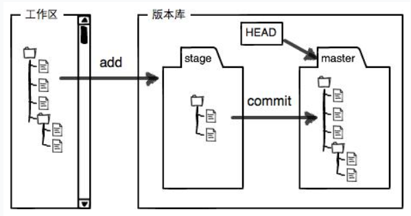
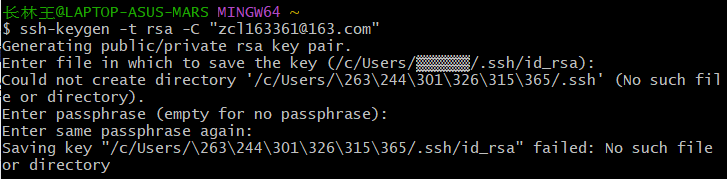
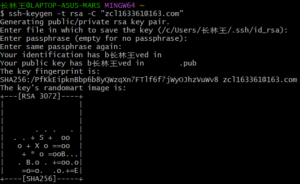
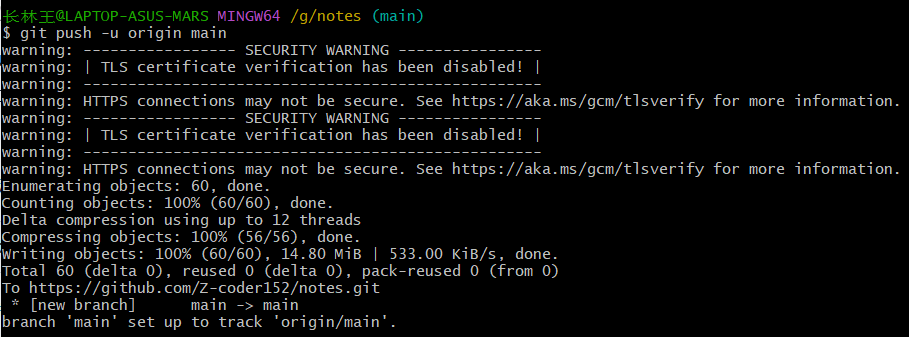
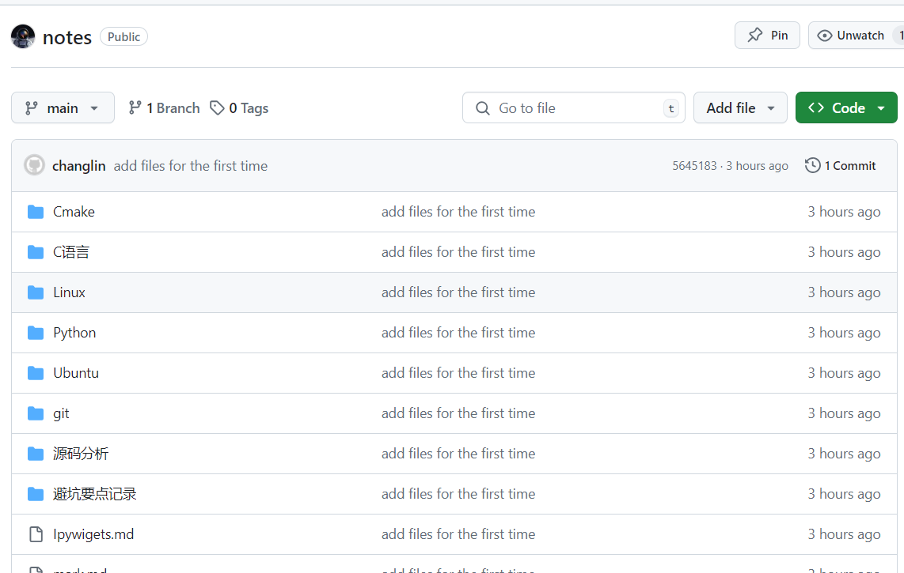

#### 一、本地电脑操作

##### 1、安装后进行设置

```bash
$ git config --global user.name "Your Name"
$ git config --global user.email "email@example.com"
```

##### 2、创建版本库(Repository)

首先通过路径，进入目标文件夹

```bash
$ cd C:/Users/user/my_project
```

键入

```bash
$ git init
```

从而创建`.git`文件

##### 3、添加文件到Git库

​	对单个文件，使用命令：

```bash
$ git add <file>
```

来添加文件；

​	对整个文件夹：

```bash
$ git add .
```

##### 4、提交文件

```bash
$ git commit -m <message>
```

##### 5、查看仓库状态

```bash
$ git status
$ git diff <file_name>
```

##### 6、查看提交日志

```bash
$ git log
```

##### 7、版本回退与后退

首先，Git必须知道当前版本是哪个版本，在Git中，用`HEAD`表示当前版本，也就是最新的提交`1094adb...`（注意我的提交ID和你的肯定不一样），上一个版本就是`HEAD^`，上上一个版本就是`HEAD^^`，当然往上100个版本写100个`^`比较容易数不过来，所以写成`HEAD~100`

版本回退：

```bash
$ git reset --hard HEAD^
```

版本后退（需要知道版本号）：

```bash
$ git reset --hard 1094a
```

注：`1094a`是版本号的前几位，不必写全，可通过`git log`命令查看

##### 8、关于暂存区

首先，工作区就是电脑里能够看到的目录，工作区中的`.git`目录是Git的版本库。

Git的版本库里存了很多东西，其中最重要的就是称为==stage（或者叫index）的暂存区==，还有Git为我们自动创建的第一个分支`master`，以及指向`master`的一个指针叫`HEAD`。

前面讲了我们把文件往Git版本库里添加的时候，是分两步执行的：

第一步是用`git add`把文件添加进去，实际上就是把文件修改添加到暂存区；

第二步是用`git commit`提交更改，实际上就是把暂存区的所有内容提交到当前分支。



即：==需要提交的文件修改通通放到暂存区，然后，一次性提交暂存区的所有修改。==

------

#### 二、远程仓库

##### 1、创建SSH Key

```bash
$ ssh-keygen -t rsa -C "youremail@example.com"
```

注：这一步会出现以下问题



解决方法：
需要修改文件路径，将上图中白色块部分补充完整即可（如下图）



出现的乱码可能原因是，路径中包含中文

##### 2、在Github中添加SSH Key

略（可参考[远程仓库 - Git教程 - 廖雪峰的官方网站 (liaoxuefeng.com)](https://liaoxuefeng.com/books/git/remote/index.html)）

##### 3、将本地仓库Push到远程仓库

前提：远程已经建好空仓库

```bash
$ git remote add origin https://github.com/Z-coder152/notes.git
$ git branch -M main
$ git push -u origin main
```





从现在起，只要本地作了提交，就可以通过命令：

```bash
$ git push origin main
```

把本地`main`分支的最新修改推送至GitHub；


------

==在虚拟机的情况下==

要将代码从虚拟机（Linux）推送到 GitHub 仓库，以下是每一步的详细操作步骤。

### 步骤 1: 安装 Git（如果没有安装）

首先，确保你的虚拟机上已安装 `git`。如果没有安装，可以使用以下命令安装：

```bash
# 对于 Ubuntu/Debian 系统
sudo apt update
sudo apt install git

# 对于 CentOS/RHEL 系统
sudo yum install git
```

### 步骤 2: 配置 Git 用户信息

如果你之前没有配置过 Git 用户信息（用户名和邮箱），需要先设置它们。执行以下命令进行配置：

```bash
git config --global user.name "Your Name"
git config --global user.email "your_email@example.com"
```

这将配置你的 Git 提交的用户名和电子邮件。

### 步骤 3: 创建一个新的 GitHub 仓库

1. 打开 GitHub 网站：[https://github.com](https://github.com/)。
2. 登录到你的 GitHub 账号。
3. 在右上角点击 "+"，然后选择 **"New repository"**。
4. 在新页面上，为你的仓库命名并填写描述（可以留空）。
5. 选择 **"Public"** 或 **"Private"**，决定仓库的可见性。
6. 点击 **"Create repository"** 创建仓库。

### 步骤 4: 初始化本地 Git 仓库

在虚拟机中，进入你希望推送的项目文件夹：

```bash
cd /path/to/your/project
```

然后，初始化 Git 仓库：

```bash
git init
```

### 步骤 5: 添加文件到 Git 仓库

将所有代码添加到 Git 版本控制：

```bash
git add .
```

你也可以选择只添加特定的文件，例如：

```bash
git add file1 file2
```

### 步骤 6: 提交文件

现在，提交文件并为提交添加注释：

```bash
git commit -m "Initial commit"
```

### 步骤 7: 连接到 GitHub 仓库

返回 GitHub 上你创建的仓库页面，找到远程仓库的 URL。例如：

```bash
https://github.com/your-username/your-repository.git
```

将这个 URL 作为远程仓库添加到本地 Git 配置中：

```bash
git remote add origin https://github.com/your-username/your-repository.git
```

### 步骤 8: 推送代码到 GitHub

最后，将你的代码推送到 GitHub 仓库：

```bash
git push -u origin master
```

或者，如果你使用的是 Git 的默认分支 `main`，而不是 `master`，则需要推送到 `main` 分支：

```bash
git push -u origin main
```

### 步骤 9: 输入 GitHub 用户名和密码（如果需要）

在推送时，Git 会提示你输入 GitHub 的用户名和密码。如果你启用了 **GitHub 双重认证**，则需要使用 **Personal Access Token** 代替密码。可以在 GitHub 中创建一个 **Personal Access Token**，并在输入密码时使用它。

#### 创建 GitHub Personal Access Token：

1. 登录到 GitHub。
2. 点击右上角的头像，选择 **Settings**。
3. 在侧边栏选择 **Developer settings**。
4. 在左侧选择 **Personal access tokens**。
5. 点击 **Generate new token**，并选择需要的权限。
6. 生成并复制 Token，在 Git 推送时使用它。

### 步骤 10: 完成

完成推送后，你的代码应该已经成功上传到 GitHub 仓库。你可以刷新 GitHub 页面查看你的代码是否已经出现在仓库中。

------

### 总结：

1. 安装 Git 并配置用户名和邮箱。
2. 在 GitHub 上创建一个新仓库。
3. 在本地项目文件夹中初始化 Git 仓库并提交文件。
4. 将本地仓库连接到 GitHub 仓库并推送代码。

这样就能成功地将本地代码推送到 GitHub 仓库了。如果你有其他问题，随时告诉我！