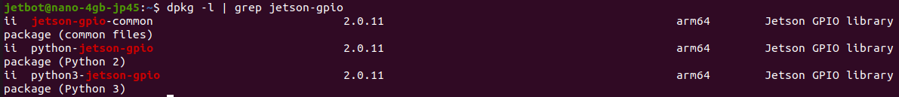
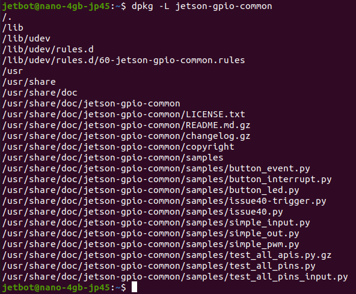

##### 1、查看jetpack版本

命令：`head -n 1 /etc/nv_tegra_release`

详细的支持功能包列表：`https://repo.download.nvidia.com/jetson/`

##### 2、列出与搜索关键词相关的所有安装包

命令：`dpkg -l | grep jetson-gpio`

##### 3、列出所有安装文件的位置

命令：`dpkg -L jetson-gpio-common`

输出解释：命令的输出是指定软件包在系统中的所有文件和目录的列表

##### 