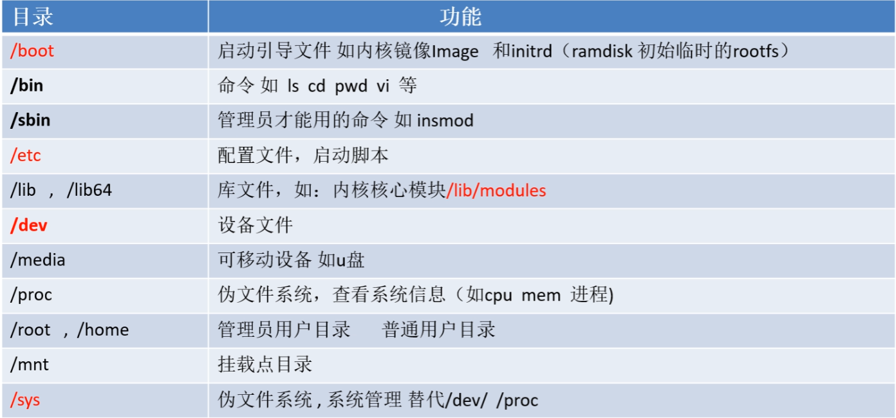
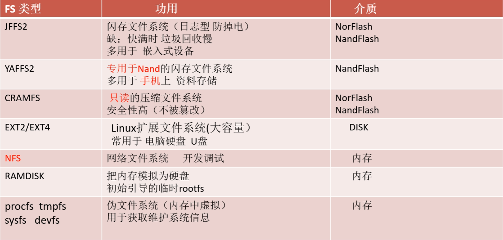

#### 1.基本概念

##### 1.1 根文件系统

文件系统：本质是数据的管理

根文件系统：最顶层的文件系统




**数据 + 程序**


##### 1.2 文件系统类型




#### 2、最简根文件系统制作

- 下载`Busybox`源代码

  ```bash
  $ wget https://busybox.net/downloads/busybox-1.34.1.tar.bz2 //最新稳定版
  $ tar -xvf 	busybox-1.34.1.tar.bz2
  ```

- 编译+安装

  ```bash
  cd busybox-1.34.1
  $ make menuconfig
   Setting
    [*] Build static binary (no shared libs)
     (aarch64-linux-gnu-) Cross compiler prefix  //注意 一定要指定交叉编译工具
  $ make
  $ make install //安装，默认安装路径为_install
  $ cd _install
  $ ls
    bin  linuxrc  sbin  usr
  ```

- 安装后，填充各个文件目录的内容

  ```bash
  mkdir dev etc var proc tmp home root mnt sys //创建需要的目录
  $ cp -rf ../examples/bootfloppy/etc/* etc/    拷贝最简示例配置,*/
  $ cp /home/yhai/store/gcc-linaro-7.3.1-2018.05-x86_64_aarch64-linux-gnu/aarch64-linux-gnu/libc/lib/  . -a   //拷贝编译工具链里的库
  $ sudo mknod dev/null c 1 3
  $ sudo mknod   dev/console  c  5  1
  ```


#### 3、网络文件系统（NFS）挂载

##### 3.1 关于NFS

NFS是Network File System的缩写即网络文件系统。主要功能是通过局域网络让不同的主机系统之间可以共享文件或目录；

**在嵌入式开发中，避免频繁地对存储介质进行读写，减少时间的同时保证了存储介质的寿命**

##### 3.2 安装NFS服务

```bash
$ sudo apt install nfs-kernel-server
$ sudo systemctl status nfs-server  /*查看服务启动否
$ sudo mkdir /nfs
$ cp _install -rf   /nfs/rootfs
$ sudo chmod 777 -R /nfs

$ sudo vi /etc/exports  /*修改配置文件，指定共享目录位置
在末尾追加
 /nfs/rootfs *(rw,sync,no_subtree_check)

rw 允许读写
sync 文件同时写入硬盘和内存
no_subtree_check 即使输出目录是一个子目录，nfs服务器也不检查其父目录的权限，这样可以提高效率
 */
$ sudo systemctl restart nfs-server  //重启服务(使得前面配置修改生效)
$ sudo mount -t nfs localhost:/nfs/rootfs/  /mnt/  //测试nfs服务是否安装成功。
$ ls /mnt/  /*如果其中的内容和/nfs/rootfs中一致。 表示有挂载成功
 如显示下面内容，表示成功
    bin  dev  etc  lib  linuxrc  mnt  proc  root  sbin  sys  tmp  usr  var
	*/
$ sudo umount /mnt
```

##### 3.3 板子从NFS启动

```bash
$ setenv bootargs  root=/dev/nfs rw nfsroot=192.168.9.119:/nfs/rootfs console=ttyS0,115200 init=/linuxrc ip=192.168.9.9 /*
	bootargs 启动参数，传递给内核的
	root=/dev/nfs  指定rootfs所在的设备 是NFSS
	nfsroot=192.168.9.119:/nfs/rootfs 指定nfs rootfs的位置 （是在ip 是192.168.9.120的机器上 ，的/nfs/rootfs目录下）. 注意/nfs/rootfs必须和前面NFS服务配置文件设置一致
	console=ttyS0,115200  指定内核启动后串口信息从串口0输出，波特率115200 (设置错，将导致没有内核信息输出) 
	init=/linuxrc 指定第一个应用程序
  ip=192.168.9.9  需设置为板子u-boot自己的IP
*/
$ pci enum;pci //激活网卡

$ fstype mmc 1:1 //查看emmc设备（flash)  1号设备的1号分区
$ ext4ls mmc 1:1 //查看emmc设备的目录和文件信息
$ ext4load mmc 1:1 0x84000000  /boot/Image  //读ext 文件系统中的 /boot/Image 到内存 0x84000000
$ ext4load mmc 1:1 83100000   /boot/tegra210-p3448-0002-p3449-0000-b00.dtb
$ booti 0x84000000 - 83100000	  /*启动Image格式的内核
booti，引导ARM64 kernel image----Image；
```